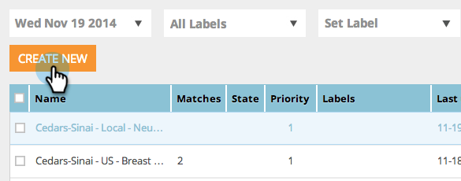

# Creare un segmento utilizzando un elenco di account {#create-a-segment-using-an-account-list}

Ecco come creare un segmento utilizzando un Elenco account.

>[!PREREQUISITES]
>
>[Crea un nuovo elenco account](/help/marketo/product-docs/target-account-management/target/account-lists.md)

>[!NOTE]
>
>La possibilità di visualizzare gli elenchi di account in Web Personalization richiede un modulo aggiuntivo denominato &quot;Web ABM&quot;. Se non vedi gli Elenchi di account come opzione, rivolgiti al Team account di Adobe (il tuo account manager) per assistenza.

1. Passa a **[!UICONTROL Segments]**.

   

1. Fai clic su **[!UICONTROL Create New]**.

   

1. Immetti un nome per il segmento. Trascinare **[!UICONTROL Account Lists]** dalla sezione **[!UICONTROL Firmographics]**.

   

1. Seleziona un Elenco account dall’elenco degli account denominati che hai caricato. Il numero tra parentesi accanto al nome dell’elenco account è l’ID dell’elenco come riferimento API.

   

   >[!NOTE]
   >
   >Gli elenchi account vengono sincronizzati da ABM a Web Personalization per l’utilizzo in Segmentazione. Selezionali dal menu a discesa. La sincronizzazione può richiedere fino a cinque minuti. Verrà sincronizzato solo se nell&#39;elenco account sono presenti uno o più account denominati.

1. Fare clic su **[!UICONTROL Save]** oppure su **[!UICONTROL Save & Define Campaign]** per passare alla pagina Campagne.

   

Congratulazioni! Ora hai impostato un segmento che esegue il targeting di un elenco di account.
