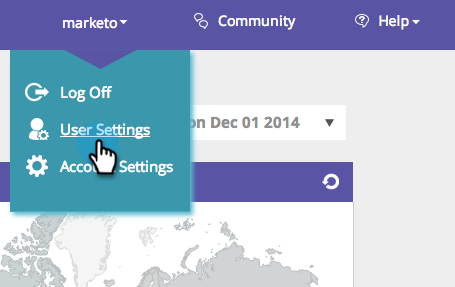

# [!UICONTROL Edit Regions] {#edit-regions}

Vuoi modificare le impostazioni internazionali dell’utente per visualizzare solo i dati per la tua area geografica specifica?

1. Passa a **[!UICONTROL User Settings]**.

   

1. Fai clic su **[!UICONTROL Edit Regions]**.

   

1. Controlla i tuoi paesi o stati correlati alla tua area geografica.

>[!NOTE]
>
>Selezionando Stati Uniti, si aprirà nella parte inferiore della pagina tutte le opzioni degli Stati Uniti da selezionare.
