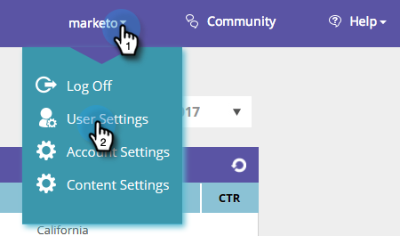

# Impostazioni utente {#user-settings}

Modifica impostazioni come fuso orario o rapporti e-mail di personalizzazione web.

## Profilo utente / Password / Fusi orari {#user-profile-passwords-time-zones}

1. Fai clic sul nome e seleziona **Impostazioni utente**.

   

1. Viene visualizzata la pagina Impostazioni utente.

   

   Nella pagina Impostazioni utente è possibile:

   * Modificare l&#39;indirizzo e-mail
   * Aggiungi dati personali (nome e cognome, numero mobile e fuso orario)
   * Seleziona il numero di righe da esportare durante l’esportazione di tabelle nella piattaforma. Campo: &quot;Numero massimo di righe nell’esportazione Excel (limitato a 10.000)&quot;
   * Seleziona le notifiche mobile per una nuova persona o un elenco di orologi relativo all’app mobile
   * Regolare le impostazioni dell&#39;area personale facendo clic su **Modifica aree**.
   * Modificare la password
   * Seleziona le impostazioni di notifica per i rapporti e-mail su organizzazioni, persone, campagne e prestazioni delle risorse

   Fai clic su **Salva** dopo aver apportato eventuali modifiche.

   >[!NOTE]
   >
   >Selezionando la propria area geografica verranno visualizzati solo i dati e inviati rapporti e-mail relativi a organizzazioni e persone provenienti dalla regione definita.

## Selezionare Report e-mail {#select-email-reports}

Seleziona quale [rapporto e-mail](/help/marketo/product-docs/web-personalization/reporting-for-web-personalization/email-reports.md) da associare all’utente e alla frequenza (giornaliera, settimanale o trimestrale) dell’invio del rapporto.

>[!NOTE]
>
>Clic **Salva** non ti uscirà da Impostazioni utente. Per uscire, fai clic sul logo Marketo in alto a sinistra e seleziona la destinazione.

>[!MORELIKETHIS]
>
>[Modifica aree](/help/marketo/product-docs/web-personalization/getting-started/edit-regions.md)
