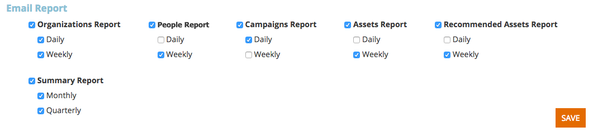

# Impostazioni utente {#user-settings}

Modifica impostazioni quali fuso orario o report e-mail Web Personalization.

## Profilo utente/Password/Fusi orari {#user-profile-passwords-time-zones}

1. Fai clic sul tuo nome e seleziona **Impostazioni utente**.

   

1. Viene visualizzata la pagina Impostazioni utente.

   

   Nella pagina Impostazioni utente puoi effettuare le seguenti operazioni:

   * Cambia il tuo indirizzo email
   * Aggiungi i dati personali (nome e cognome, numero di cellulare e fuso orario)
   * Seleziona il numero di righe da esportare durante l’esportazione di tabelle nella piattaforma. Vedi il campo: &quot;Numero massimo di righe nell’esportazione Excel (limitato a 10.000)&quot;
   * Seleziona le notifiche per dispositivi mobili per una nuova persona o un elenco di controllo relativo all’app mobile
   * Modificare le impostazioni dell&#39;area personale facendo clic su **Modifica aree**.
   * Cambia la password
   * Seleziona le impostazioni di notifica dei rapporti e-mail per i rapporti e-mail su organizzazioni, persone, prestazioni di campagne e risorse

   Fai clic su **Salva** dopo aver apportato eventuali modifiche.

   >[!NOTE]
   >
   >Selezionando la tua area geografica, verranno visualizzati solo i dati e verranno inviati report e-mail relativi a organizzazioni e persone dell’area definita.

## Seleziona i report e-mail {#select-email-reports}

Seleziona il [report e-mail](/help/marketo/product-docs/web-personalization/reporting-for-web-personalization/email-reports.md) da associare all&#39;utente e la frequenza (giornaliera, settimanale o trimestrale) di invio del report.

>[!NOTE]
>
>Se fai clic su **Salva** non potrai uscire da Impostazioni utente. Per uscire, fai clic sul logo Marketo in alto a sinistra e seleziona la destinazione.

>[!MORELIKETHIS]
>
>[Modifica aree](/help/marketo/product-docs/web-personalization/getting-started/edit-regions.md)
