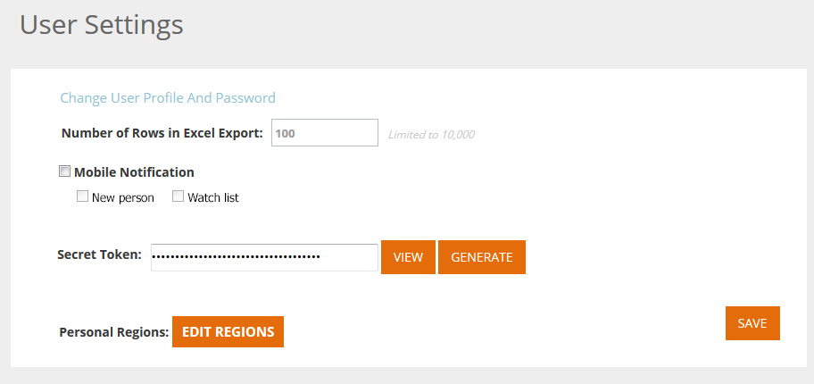

# Impostazioni utente {#user-settings}

Modificare le impostazioni come il fuso orario o i rapporti e-mail sulla personalizzazione Web.

## Profilo Utente / Password / Fusi orari {#user-profile-passwords-time-zones}

1. Fate clic sul vostro nome e selezionate Impostazioni **utente.**

   

1. Viene visualizzata la pagina Impostazioni utente.

   

   Nella pagina Impostazioni utente potete:

   * 

      * Modificare l&#39;indirizzo e-mail
      * Aggiungi dati personali (nome e cognome, numero mobile e fuso orario)
      * Selezionare il numero di righe che si desidera esportare durante l&#39;esportazione delle tabelle nella piattaforma. Vedere campo: &quot;Numero massimo di righe nell&#39;esportazione Excel (limitato a 10.000)&quot;
      * Seleziona le notifiche per dispositivi mobili per una nuova persona o un elenco di orologi correlato all’applicazione mobile
      * Regolate le impostazioni dell’area personale facendo clic su **Modifica aree**.
      * Modificare la password
      * Seleziona le impostazioni di notifica Rapporto e-mail per i rapporti e-mail su Organizzazioni, Persone, Campaign e Prestazioni risorsa

   Dopo aver apportato le modifiche, fate clic su **Salva** .

   >[!NOTE]
   >
   >Quando si seleziona la propria area geografica, vengono visualizzati solo i dati e inviati rapporti e-mail relativi a organizzazioni e persone provenienti dalla regione definita.

## Seleziona rapporti e-mail {#select-email-reports}

Selezionate il rapporto [e-](../../../product-docs/web-personalization/reporting-for-web-personalization/email-reports.md) mail da associare all’utente e la frequenza (giornaliera, settimanale o trimestrale) alla quale verrà inviato il rapporto.

>[!NOTE]
>
>Facendo clic su **Salva** non verrai escluso dalle Impostazioni utente. Per uscire, fai clic sul logo Marketo in alto a sinistra e seleziona la destinazione.

>[!MORELIKETHIS]
>
>* [Modifica aree](edit-regions.md)

>

