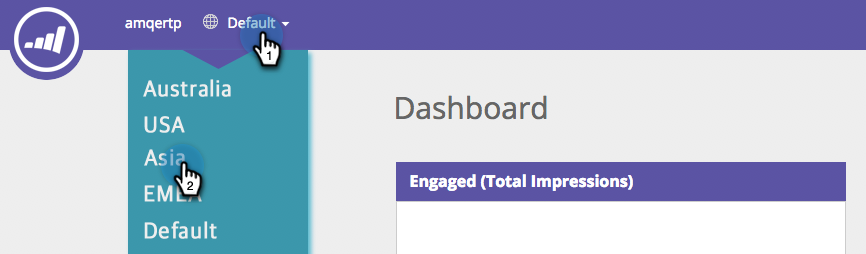

# Aree di lavoro in [!UICONTROL Web Personalization] {#workspaces-in-web-personalization}

[!UICONTROL Web Personalization] supporta più aree di lavoro per campagne web e segmenti web.

## Cambia aree di lavoro {#switch-workspaces}

Per passare da un’area di lavoro all’altra nella personalizzazione web, fai clic sull’icona del globo in alto a sinistra e scegli un’area di lavoro diversa dal menu a discesa.

## Modificare il Workspace di un segmento {#change-a-segments-workspace}

1. Vai alla pagina **[!UICONTROL Segments]**, seleziona un segmento e fai clic sull&#39;icona Modifica.

   

1. Selezionare un&#39;area di lavoro diversa dal menu a discesa **[!UICONTROL Workspace]**.

   

   

>[!NOTE]
>
>Gli utenti potranno visualizzare solo le campagne web e i segmenti associati alle aree di lavoro a cui hanno accesso. Ecco come [concedere a un utente l&#39;accesso a una o più aree di lavoro](/help/marketo/product-docs/administration/workspaces-and-person-partitions/allow-user-access-to-a-workspace.md).
