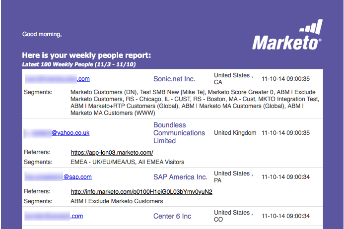

# Report e-mail {#email-reports}

Per personalizzare il rapporto e-mail automatico ricevuto dall’utente, consulta la sezione  [Sezione Impostazioni utente](/help/marketo/product-docs/web-personalization/getting-started/user-settings.md).

## Rapporti e-mail per la personalizzazione web {#web-personalization-email-reports}

I rapporti e-mail giornalieri o settimanali vengono inviati all’indirizzo e-mail dell’utente fornendo i dati più recenti sulle prestazioni di organizzazione, persona, campagna e risorse.

Sono disponibili i seguenti rapporti:

## Rapporto Organizzazioni giornaliere/settimanali {#daily-weekly-organizations-report}

Il rapporto giornaliero/settimanale invia all’utente un’e-mail delle prime 50 organizzazioni in visita, tra cui il nome dell’organizzazione, la posizione, il numero di visite, le visualizzazioni di pagina e il sito di riferimento o il termine di ricerca utilizzato.

## Rapporto Persone giornaliere/settimanali {#daily-weekly-people-report}

Il rapporto giornaliero/settimanale sulle persone invia all&#39;utente un&#39;e-mail delle ultime 100 persone dal sito web in base a: indirizzo e-mail, nome dell’organizzazione, posizione, stato, data dell’acquisizione da parte della persona e dei segmenti a cui la persona appartiene.

## Campagne in tempo reale dalle prestazioni migliori {#top-performing-real-time-campaigns}

Il rapporto Campagne in tempo reale con prestazioni migliori invia all’utente un’e-mail delle campagne in tempo reale con prestazioni migliori, che mostra il nome della campagna, le impression, i clic, il segmento a cui la campagna ha reagito e il tasso di conversione della campagna.

## Rapporto sulle risorse con le prestazioni migliori {#top-performing-assets-report}

Il rapporto Migliori prestazioni delle risorse invia all’utente un’e-mail delle risorse di contenuto con le prestazioni migliori, con il nome della risorsa e la percentuale di corrispondenze rispetto ad altre risorse.

## Rapporto sulle risorse consigliate {#recommended-assets-report}

Il rapporto sulle risorse consigliate invia all’utente un’e-mail con tutti i contenuti e il numero di clic provenienti dalla visualizzazione del contenuto nel motore di raccomandazione del contenuto.

## Rapporto di riepilogo {#summary-report}

Il rapporto di riepilogo invia all’utente un’e-mail (mensile o trimestrale) di tutte le campagne e delle prestazioni di contenuto consigliate in base al numero di clic e al numero di persone (dirette o assistite) coinvolte nella campagna personalizzata o nel contenuto consigliato e quindi diventate una persona nota. Il rapporto confronta i risultati con il mese o il trimestre precedente.

>[!NOTE]
>
>**Definizioni**
>
>**Conversione diretta**: Un visitatore web che fa clic su una campagna personalizzata o su una risorsa di contenuto consigliato e nella stessa sessione di visita continua a compilare un modulo sul sito web con il proprio indirizzo e-mail.
>
>**Conversione assistita**: Un visitatore web che compila un modulo sul sito web e lascia il proprio indirizzo e-mail, mentre in una visita precedente (negli ultimi 6 mesi) ha fatto clic su una campagna personalizzata o su una risorsa di contenuto consigliata.

>[!NOTE]
>
>Marketo Web Personalization acquisisce l’indirizzo e-mail del visitatore web per qualsiasi modulo compilato sul sito web. Viene visualizzato nella pagina Persone di personalizzazione Web e corrisponde alla persona utilizzata nel rapporto di riepilogo.

Per personalizzare il rapporto e-mail automatico ricevuto dall’utente, consulta la sezione [Sezione Impostazioni utente](/help/marketo/product-docs/web-personalization/getting-started/user-settings.md).
