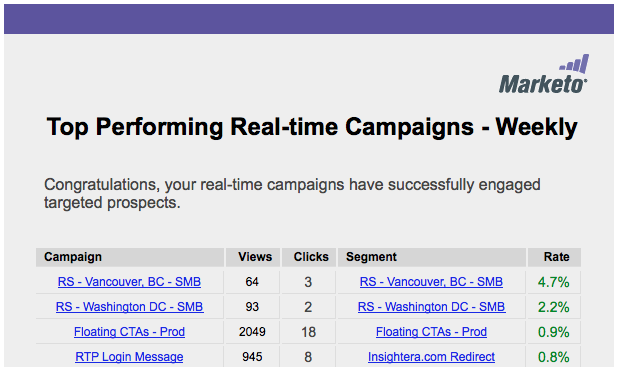

# Report e-mail {#email-reports}

Per personalizzare il rapporto e-mail automatico ricevuto dall’utente, consulta la sezione  [Sezione Impostazioni utente](/help/marketo/product-docs/web-personalization/getting-started/user-settings.md).

## Rapporti e-mail per personalizzazione web {#web-personalization-email-reports}

I rapporti e-mail giornalieri o settimanali vengono inviati all’indirizzo e-mail dell’utente, fornendo i dati più recenti sulle prestazioni di organizzazioni, persone, campagne e risorse.

Sono disponibili i seguenti rapporti:

## Rapporto Organizzazioni giornaliere/settimanali {#daily-weekly-organizations-report}

Il rapporto giornaliero/settimanale invia all’utente un’e-mail delle prime 50 organizzazioni visitatrici, tra cui il nome dell’organizzazione, la posizione, il numero di visite, le visualizzazioni di pagina e il sito di riferimento o il termine di ricerca utilizzato.

## Rapporto Persone giornaliero/settimanale {#daily-weekly-people-report}

Il Rapporto Persone giornaliero/settimanale invia all’utente un’e-mail delle ultime 100 persone dal sito web in base a: indirizzo e-mail della persona, nome dell’organizzazione, posizione, stato, data di acquisizione della persona e segmenti a cui la persona appartiene.

## Campagne in tempo reale con prestazioni migliori {#top-performing-real-time-campaigns}

Il rapporto sulle campagne in tempo reale con prestazioni migliori invia all’utente un’e-mail delle campagne in tempo reale con le prestazioni migliori, mostrando il nome della campagna, le impression, i clic, il segmento di reazione della campagna e il tasso di conversione della campagna.

## Rapporto sulle risorse con prestazioni migliori {#top-performing-assets-report}

Il rapporto Risorse con prestazioni migliori invia all’utente un’e-mail con le risorse di contenuto con le prestazioni migliori, mostrando il nome della risorsa e la percentuale di corrispondenze rispetto ad altre risorse.

## Rapporto risorse consigliate {#recommended-assets-report}

Il rapporto Risorse consigliate invia all’utente un’e-mail di tutto il contenuto e il numero di clic derivanti dal contenuto visualizzato nel motore di consigli dei contenuti.

## Rapporto di riepilogo {#summary-report}

Il rapporto di Riepilogo invia all’utente un’e-mail (mensile o trimestrale) di tutte le campagne e delle prestazioni dei contenuti consigliati in base al numero di clic e al numero di persone (dirette o assistite) coinvolte nella campagna personalizzata o nel contenuto consigliato che sono poi diventate persone note. Il rapporto confronta i risultati con il mese o trimestre precedente.

>[!NOTE]
>
>**Definizioni**
>
>**Conversione diretta**: un visitatore web che fa clic su una campagna personalizzata o una risorsa di contenuto consigliato e nella stessa sessione di visita procede alla compilazione di qualsiasi modulo sul sito web con il proprio indirizzo e-mail.
>
>**Conversione assistita**: visitatore web che compila un modulo sul sito web e lascia il proprio indirizzo e-mail, mentre in una visita precedente (negli ultimi 6 mesi) ha fatto clic su una campagna personalizzata o su una risorsa di contenuti consigliata.

>[!NOTE]
>
>Marketo Web Personalization acquisisce l’indirizzo e-mail del visitatore web per qualsiasi modulo completato sul sito web. Viene visualizzata nella pagina Persone personalizzazione web ed è la persona utilizzata nel rapporto di riepilogo.

Per personalizzare il rapporto e-mail automatico ricevuto dall’utente, consulta la sezione [Sezione Impostazioni utente](/help/marketo/product-docs/web-personalization/getting-started/user-settings.md).
