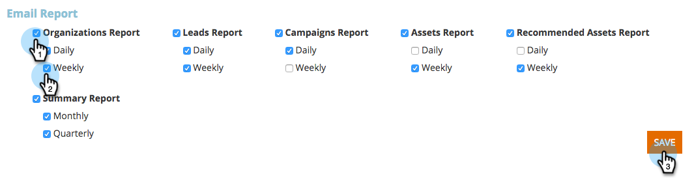

# Abilitare/disabilitare le sottoscrizioni ai rapporti {#enable-disable-report-subscriptions}

Web Personalization dispone di diversi utili rapporti che vengono inviati via e-mail. Ecco come registrarsi.

1. Accedi a Web Personalization. Sotto il nome di accesso, fate clic su Impostazioni **** utente.

   

1. Selezionate il rapporto a cui desiderate abbonarvi e la relativa frequenza. Fate clic su **Salva**.

   

   È tutto! Per annullare l’iscrizione al rapporto, è sufficiente deselezionare e fare clic su **Salva**.

