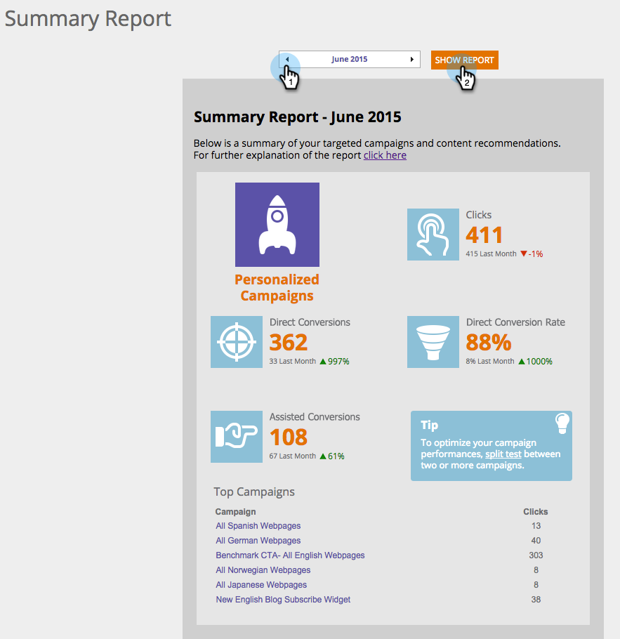

# Informazioni sul rapporto di riepilogo {#understanding-the-summary-report}

Il rapporto Riepilogo è una visualizzazione mensile di tutte le campagne e delle prestazioni di contenuto consigliate. Si basa sul numero di clic e di lead (diretti o assistiti) coinvolti nella campagna personalizzata o nei contenuti raccomandati e quindi diventati un lead noto. Il rapporto confronta i risultati con il mese precedente.

>[!NOTE]
>
>**Definizione**
>
>Conversione diretta: Un visitatore Web che fa clic su una campagna personalizzata o su una risorsa di contenuto consigliata e nella stessa sessione di visita continua a compilare qualsiasi modulo sul sito Web con il proprio indirizzo e-mail.
>
>Conversione assistita: Un visitatore Web che compila qualsiasi modulo sul sito Web e lascia il proprio indirizzo e-mail, che in una precedente visita (negli ultimi 6 mesi) ha fatto clic su una campagna personalizzata o su una risorsa contenuto consigliata.

In Web Personalization (Personalizzazione Web), andate a **Analytics** e **Summary Report**.

Selezionare **Mese** e fare clic su **Mostra rapporto**.

La prima parte del rapporto si riferisce alle campagne di personalizzazione del Web e visualizza:

* **Clic**  - tutti i clic su campagne di Web Personalization
* **Conversioni**  dirette: tutti i visitatori che hanno fatto clic su una campagna di Web Personalization durante la visita e hanno compilato un modulo
* **Tasso**  di conversione diretta: la percentuale di visitatori che sono diventati un lead diretto dopo aver fatto clic su una campagna di Web Personalization. Lead diretti divisi per clic
* **Conversioni**  assistite: tutti i visitatori che hanno compilato un modulo e hanno fatto clic su una campagna di Web Personalization in una visita precedente (negli ultimi 6 mesi)
* **Suggerimenti**  - suggerimenti per ottimizzare le prestazioni della campagna Web Personalization
* **Campagne**  principali: le campagne con le migliori prestazioni nel periodo di tempo selezionato, ordinate per numero di clic

La seconda parte del rapporto si riferisce al contenuto consigliato dal motore di raccomandazione del contenuto di Personalizzazione Web. Viene visualizzato:

* **Clic**  - tutti i clic sul contenuto consigliato di Web Personalization
* **Conversioni**  dirette: tutti i visitatori che hanno fatto clic sul contenuto raccomandato durante la visita e hanno compilato un modulo
* **Tasso**  di conversione diretta: la percentuale di visitatori che sono diventati un lead diretto dopo aver fatto clic sul contenuto consigliato. Lead diretti divisi per clic
* **Conversioni**  assistite: tutti i visitatori che hanno compilato un modulo e fatto clic sul contenuto consigliato in una visita precedente (negli ultimi 6 mesi)
* **Suggerimenti** : suggerimenti per l&#39;ottimizzazione con Content Recommendation Engine
* **Top Recommendations** : il contenuto consigliato dalle prestazioni migliori durante il periodo di tempo selezionato, ordinato per numero di clic

>[!NOTE]
>
>Marketing Web Personalization acquisisce l&#39;indirizzo e-mail del visitatore Web per qualsiasi modulo compilato sul sito Web. Viene visualizzato nella pagina Lead di personalizzazione Web ed è il lead utilizzato nel rapporto Riepilogo.
