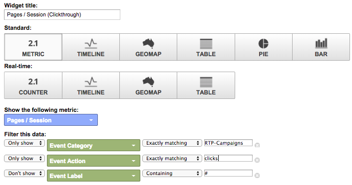
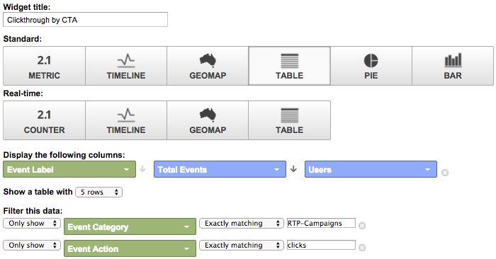

# Dashboard RTP personalizzati in Google Universal Analytics {#custom-rtp-dashboards-in-google-universal-analytics}

>[!PREREQUISITES]
>
>[Integrare RTP con Google Universal Analytics](/help/marketo/product-docs/web-personalization/reporting-for-web-personalization/web-analytics-integrations/integrate-rtp-with-google-universal-analytics.md)

Questo post spiega come impostare le dashboard RTP in Google Universal Analytics (GUA). I dati inviati da RTP a GUA possono essere impostati come due dashboard personalizzate distinte denominate:

* RTP B2B
* Coinvolgimento RTP

## Configurazione di un dashboard personalizzato {#setting-up-a-custom-dashboard}

1. Accedete alle Google Analytics. Fare clic su **Reporting** nel menu principale. Fare clic su **Dashboard** e **+Nuovo dashboard personalizzato**.

   

1. Selezionare **Blank Canvas**, aggiungere un **Nome dashboard** e fare clic su **Crea dashboard**.

1. Fare clic su **Aggiungi widget** per creare un nuovo widget.

   

## Dashboard RTP B2B {#rtp-b-b-dashboard}

Questo dashboard consente agli utenti di analizzare le prestazioni del sito Web dal punto di vista B2B.

Fornisce informazioni come il comportamento onsite e sorgente delle visite in base al settore, le entrate, le dimensioni, gli elenchi basati su account e i segmenti di target.

Il dashboard è costituito da 3 colonne

* Origine traffico
* Segmentazione
* Espansione istantanea

1. Create una nuova dashboard denominata **Dashboard RTP B2B** e definite i seguenti widget:

<table> 
 <thead> 
  <tr> 
   <th> 
    

      Colonna 1 - Sorgenti di traffico
    
</th> 
   <th> 
    
 <strong>Colonna 2 - Segmentazione</strong> 
    
</th> 
   <th> 
    
 <strong>Colonna 3 - Foratura Firmografica verso il basso</strong> 
    
</th> 
  </tr> 
 </thead> 
 <tbody> 
  <tr> 
   <td> 
    <ul> 
     <li>Nome: Sessioni per segmenti e canali</li> 
     <li>Tipo di widget: Barra </li> 
     <li>Create un grafico a barre che mostri: Sessione</li> 
     <li>Raggruppato da: Etichetta evento</li> 
     <li>Pivot di: Gruppo canale predefinito</li> 
     <li>Filtro:  Mostra solo | Categoria evento (contenente) Segmenti RTP</li> 
    </ul>

</td> 
   <td> 
    <ul> 
     <li>Nome: Numero di utenti Segmentati RTP</li> 
     <li>Tipo: 2.1 Metrica</li> 
     <li>Mostra la metrica seguente: Utenti </li> 
     <li>Filtro:  Mostra solo | Categoria evento (contenente) Segmenti RTP</li> 
    </ul>

</td> 
   <td> 
    <ul> 
     <li>Nome: Sessioni per settore</li> 
     <li>Tipo: Torta </li> 
     <li>Create un grafico a torta che mostri: Sessioni</li> 
     <li>Raggruppato da: RTP-Industry</li> 
    </ul>

</td> 
  </tr> 
  <tr> 
   <th> 
    <ul> 
     <li><strong>Nome: Sessioni per settore e canali</strong></li> 
     <li><strong>Tipo di widget: Barra</strong></li> 
     <li><strong>Create un grafico a barre che mostri: Sessione</strong></li> 
     <li><strong>Raggruppato da: RTP-Industry</strong></li> 
     <li><strong>Pivot di: Gruppo canale predefinito</strong> </li> 
    </ul></th> 
   <th> 
    <ul> 
     <li><strong>Nome: Sessioni segmentate per paese</strong></li> 
     <li><strong>Tipo: Geomap</strong></li> 
     <li><strong>Traccia metrica selezionata: Paese | Sessioni</strong></li> 
     <li><strong>Selezionare un'area: Il mondo</strong></li> 
     <li><strong>Filtro: Mostra solo | Categoria evento (contenente) Segmenti RTP</strong></li> 
    </ul>

</th> 
   <th> 
    <ul> 
     <li><strong>Nome: Sessioni per categoria RTP</strong></li> 
     <li><strong>Tipo: Torta</strong></li> 
     <li><strong>Create un grafico a torta che mostri: Sessioni</strong></li> 
     <li><strong>Raggruppato da: RTP-Category</strong></li> 
    </ul>

</th> 
  </tr> 
  <tr> 
   <th> </th> 
   <th> 
    <ul> 
     <li>Nome: Segmenti di destinazione principali</li> 
     <li>Tipo: Barra</li> 
     <li>Create un grafico a barre che mostri: Utenti</li> 
     <li>Raggruppato da: Azione evento</li> 
     <li>Filtro: Mostra solo | Categoria evento (contenente) Segmenti RTP</li> 
    </ul>

</th> 
   <th> 
    <ul> 
     <li>Nome: Sessioni per gruppi RTP</li> 
     <li>Tipo: Barra </li> 
     <li>Create un grafico a barre che mostri: Sessioni</li> 
     <li>Raggruppato da: RTP-Group</li> 
    </ul>
<strong></strong>
</th> 
  </tr> 
  <tr> 
   <th> </th> 
   <th> 
    <ul> 
     <li>Nome: Sessioni e obiettivi per segmenti principali</li> 
     <li>Tipo: Tabella </li> 
     <li>Visualizza le colonne seguenti:  Etichetta evento | Sessioni | Tasso di conversione obiettivo</li> 
     <li>Filtro:  Mostra solo | Categoria evento (contenente) Segmenti RTP</li> 
    </ul>
<strong></strong>
</th> 
   <th> </th> 
  </tr> 
 </tbody> 
</table>

## Pannello di coinvolgimento RTP {#rtp-engagement-dashboard}

Questo dashboard consente agli utenti di analizzare le prestazioni della campagna RTP e i coinvolgimento dei motori di raccomandazione. Fornisce il confronto tra media e media. durata della sessione e pagine per sessione tra:

* Non impegnato
* Coinvolto (impression e clic su una campagna personalizzata)
* Fate clic sul motore di raccomandazione e sul contenuto principale consigliato

Create una nuova dashboard denominata **Dashboard partecipazione RTP** e definite i seguenti widget:

<table> 
 <thead> 
  <tr> 
   <th> 
    
 <strong>Esposizione nella colonna 1 delle campagne</strong> 
    
</th> 
   <th> 
    
 <strong>Clic su Campagne nella colonna 2</strong> 
    
</th> 
   <th> 
    
 <strong>Motore di raccomandazione Colonna 3</strong> 
    
</th> 
  </tr> 
 </thead> 
 <tbody> 
  <tr> 
   <td> 
    <ul> 
     <li>Nome: <strong>CTA totale (coinvolgimento)</strong></li> 
     <li>Tipo: <strong>2.1 Metrica </strong></li> 
     <li>Mostra la metrica seguente: <strong>Eventi totali</strong></li> 
     <li>Filtri: <strong>[mostra solo] categoria evento (contiene): Azione evento RTP-Campaigns</strong> <strong>[mostra solo] (esattamente corrispondente): Etichetta evento Impression</strong><strong>[non mostrare] (contenente): #</strong></li> 
    </ul>
<strong></strong>
</td> 
   <td> 
    <ul> 
     <li>Nome: <strong>CTA totale (click-through)</strong></li> 
     <li>Tipo: <strong>2.1 Metrica </strong></li> 
     <li>Mostra la metrica seguente: <strong>Eventi totali</strong></li> 
     <li>Filtri: <strong>[mostra solo] categoria evento (contiene): Azione evento RTP-Campaigns</strong> <strong>[mostra solo] (esattamente corrispondente): Fate clic su</strong><strong>[non mostrare] Etichetta evento (contenente): #</strong></li> 
    </ul>
<strong></strong>
</td> 
   <td> 
    <ul> 
     <li>Nome: <strong>CRE - Clic totali</strong></li> 
     <li>Tipo: <strong>2.1 Metric</strong> </li> 
     <li>Mostra la metrica seguente: <strong>Pagevisepagine</strong></li> 
     <li>Filtro: <strong>[mostra solo] pagina (contenente): rcmd</strong></li> 
    </ul>

</td> 
  </tr> 
  <tr> 
   <td colspan="1"> 
    <ul> 
     <li>Nome: <strong>Media Durata sessione (coinvolgimento)</strong></li> 
     <li>Tipo: <strong>2.1 Metrica </strong></li> 
     <li>Mostra la metrica seguente: <strong>Media Durata sessione</strong></li> 
     <li>Filtri: <strong>[mostra solo] categoria evento (esattamente corrispondente): Azione evento RTP-Campaigns</strong> <strong>[mostra solo] (esattamente corrispondente): impression</strong><strong>[non mostrare] Etichetta evento (contenente): #</strong></li> 
    </ul>
<strong></strong>
</td> 
   <td colspan="1"> 
    <ul> 
     <li>Nome: <strong>Media Durata sessione (click-through)</strong></li> 
     <li>Tipo: <strong>2.1 Metrica </strong></li> 
     <li>Mostra la metrica seguente: <strong>Media Durata sessione</strong></li> 
     <li>Filtri: <strong>[mostra solo] categoria evento (esattamente corrispondente): Azione evento RTP-Campaigns</strong> <strong>[mostra solo] (esattamente corrispondente): Click</strong><strong>[non mostrare] Etichetta evento (contenente): #</strong></li> 
    </ul>
<strong></strong>
</td> 
   <td colspan="1"> 
    <ul> 
     <li>Nome: <strong>CRE - Contenuto consigliato principale</strong></li> 
     <li>Tipo: <strong>Tabella</strong> </li> 
     <li>Visualizza le colonne seguenti:  <strong>Titolo pagina | Pageviews</strong> </li> 
     <li>Filtri: Filtro: <strong>[mostra solo] pagina (contenente): rcmd</strong></li> 
    </ul>

</td> 
  </tr> 
  <tr> 
   <td> 
    <ul> 
     <li>Nome: <strong>Pagine / Sessione (coinvolgimento)</strong></li> 
     <li>Tipo: <strong>2.1 Metrica </strong></li> 
     <li>Mostra la metrica seguente: <strong>Pagine / Sessione</strong></li> 
     <li>Filtri: <strong>[mostra solo] categoria evento (esattamente corrispondente): RTP-Campaigns</strong></li> 
     <li><strong>[Mostra solo] Azione evento (esattamente corrispondente): impression</strong></li> 
     <li><strong>[non mostrare] Etichetta evento (contenente): #</strong></li> 
    </ul>

</td> 
   <td> 
    <ul> 
     <li>Nome: <strong>Pagine / Sessione (Clickthrough)</strong></li> 
     <li>Tipo: <strong>2.1 Metrica </strong></li> 
     <li>Mostra la metrica seguente: <strong>Pagine / Sessione</strong></li> 
     <li>Filtri: <strong>[mostra solo] categoria evento (esattamente corrispondente): RTP-Campaigns</strong></li> 
     <li><strong>[Mostra solo] Azione evento (esattamente corrispondente): click</strong></li> 
     <li><strong>[non mostrare] Etichetta evento (contenente): #</strong></li> 
    </ul>
<strong></strong>
</td> 
   <td> </td> 
  </tr> 
  <tr> 
   <td> 
    <ul> 
     <li>Nome: <strong>Impressioni di CTA</strong></li> 
     <li>Tipo: <strong>Tabella</strong></li> 
     <li>Visualizza le colonne seguenti: <strong>Etichetta evento | Totale eventi | Utenti</strong></li> 
     <li>Filtri: <strong>[mostra solo] categoria evento (esattamente corrispondente): Azione evento RTP-Campaigns</strong> <strong>[mostra solo] (esattamente corrispondente): impression</strong><strong>[non mostrare] Etichetta evento (contenente): #</strong></li> 
    </ul>

</td> 
   <td> 
    <ul> 
     <li>Nome: <strong>ClickThrough di CTA</strong></li> 
     <li>Tipo: <strong>Tabella</strong></li> 
     <li>Visualizza le colonne seguenti: <strong>Etichetta evento | Totale eventi | Utenti</strong></li> 
     <li>Filtri: <strong>[mostra solo] categoria evento (esattamente corrispondente): Azione evento RTP-Campaigns</strong> <strong>[mostra solo] (esattamente corrispondente): click</strong></li> 
    </ul>

</td> 
   <td> </td> 
  </tr> 
 </tbody> 
</table>

>[!MORELIKETHIS]
>
>[Integrare RTP con Google Universal Analytics](/help/marketo/product-docs/web-personalization/reporting-for-web-personalization/web-analytics-integrations/custom-rtp-reports-in-google-universal-analytics.md)
>
>[Report RTP personalizzati in Google Universal Analytics](/help/marketo/product-docs/web-personalization/reporting-for-web-personalization/web-analytics-integrations/custom-rtp-reports-in-google-universal-analytics.md)
