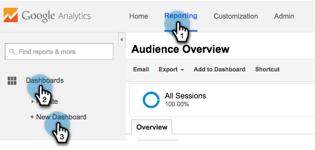

# Dashboard RTP personalizzati in Google Universal Analytics {#custom-rtp-dashboards-in-google-universal-analytics}

>[!PREREQUISITES]
>
>[Integrare RTP con Google Universal Analytics](/help/marketo/product-docs/web-personalization/reporting-for-web-personalization/web-analytics-integrations/integrate-rtp-with-google-universal-analytics.md)

Questo post spiega come impostare dashboard RTP in Google Universal Analytics (GUA). I dati inviati dall’RTP alla GUA possono essere impostati come due dashboard personalizzati separati denominati:

* RTP B2B
* Coinvolgimento RTP

## Impostazione di un dashboard personalizzato {#setting-up-a-custom-dashboard}

1. Accedi a Google Analytics. Fai clic su **[!UICONTROL Reporting]** nel menu principale. Fare clic su **[!UICONTROL Dashboards]** e **[!UICONTROL New Dashboard]**.

   

1. Seleziona **Area di lavoro vuota**, aggiungi **Nome dashboard** e fai clic su **[!UICONTROL Create Dashboard]**.

1. Fare clic su **[!UICONTROL Add Widget]** per creare un nuovo widget.

   

## Dashboard B2B RTP {#rtp-b-b-dashboard}

Questa dashboard consente agli utenti di analizzare le prestazioni del sito web dal punto di vista B2B.

Fornisce informazioni come il comportamento all’origine delle visite e sul sito per settore, ricavi, dimensioni, elenchi basati su account e segmenti di destinazione.

Il dashboard è costituito da 3 colonne

* Traffic source
* Segmentazione
* Drill-down firmografico

1. Crea un nuovo dashboard denominato **Dashboard B2B RTP** e definisci i seguenti widget:

<table> 
 <thead> 
  <tr> 
   <th> 
    

      Colonna 1 - Origini del traffico
    
</th> 
   <th> 
    
 <strong>Colonna 2 - Segmentazione</strong> 
    
</th> 
   <th> 
    
 <strong>Colonna 3 - Espansione firmware</strong> 
    
</th> 
  </tr> 
 </thead> 
 <tbody> 
  <tr> 
   <td> 
    <ul> 
     <li>Nome: sessioni per segmenti e canali</li> 
     <li>Tipo widget: Barra </li> 
     <li>Crea un grafico a barre : Sessione</li> 
     <li>Raggruppato per: Etichetta evento</li> 
     <li>Pivot di: Raggruppamento canali predefinito</li> 
     <li>Filtro:  Mostra solo | Categoria eventi (contenente) segmenti RTP</li> 
    </ul>

</td> 
   <td> 
    <ul> 
     <li>Nome: numero di utenti RTP segmentati</li> 
     <li>Tipo: 2.1 Metrica</li> 
     <li>Mostra la metrica seguente: Utenti </li> 
     <li>Filtro:  Mostra solo | Categoria eventi (contenente) segmenti RTP</li> 
    </ul>

</td> 
   <td> 
    <ul> 
     <li>Nome: sessioni per settore</li> 
     <li>Tipo: Torta </li> 
     <li>Crea un grafico a torta : Sessioni</li> 
     <li>Raggruppato per: RTP-Industry</li> 
    </ul>

</td> 
  </tr> 
  <tr> 
   <th> 
    <ul> 
     <li><strong>Nome: sessioni per settore e canali</strong></li> 
     <li><strong>Tipo widget: Barra</strong></li> 
     <li><strong>Crea un grafico a barre : Sessione</strong></li> 
     <li><strong>Raggruppato per: RTP-Industry</strong></li> 
     <li><strong>Pivot di: Raggruppamento canali predefinito</strong> </li> 
    </ul></th> 
   <th> 
    <ul> 
     <li><strong>Nome: sessioni segmentate per paese</strong></li> 
     <li><strong>Tipo: Geomap</strong></li> 
     <li><strong>Traccia la metrica selezionata: Paese | Sessioni</strong></li> 
     <li><strong>Seleziona una regione: Il mondo</strong></li> 
     <li><strong>Filtro: Mostra solo | Categoria eventi (contenente) segmenti RTP</strong></li> 
    </ul>

</th> 
   <th> 
    <ul> 
     <li><strong>Nome: sessioni per categoria RTP</strong></li> 
     <li><strong>Tipo: Torta</strong></li> 
     <li><strong>Crea un grafico a torta : Sessioni</strong></li> 
     <li><strong>Raggruppato per: Categoria-RTP</strong></li> 
    </ul>

</th> 
  </tr> 
  <tr> 
   <th> </th> 
   <th> 
    <ul> 
     <li>Nome: Segmenti di destinazione principali</li> 
     <li>Tipo: Barra</li> 
     <li>Crea un grafico a barre : Utenti</li> 
     <li>Raggruppato per: Azione evento</li> 
     <li>Filtro: Mostra solo | Categoria eventi (contenente) segmenti RTP</li> 
    </ul>

</th> 
   <th> 
    <ul> 
     <li>Nome: sessioni per gruppi RTP</li> 
     <li>Tipo: barra </li> 
     <li>Crea un grafico a barre che mostra: Sessioni</li> 
     <li>Raggruppato per: RTP-Group</li> 
    </ul>

</th> 
  </tr> 
  <tr> 
   <th> </th> 
   <th> 
    <ul> 
     <li>Nome: sessioni e obiettivi per segmenti principali</li> 
     <li>Tipo: tabella </li> 
     <li>Visualizza le colonne seguenti:  Etichetta evento | Sessioni | Tasso di conversione obiettivo</li> 
     <li>Filtro:  Mostra solo | Categoria evento (contenente) segmenti RTP</li> 
    </ul>

</th> 
   <th> </th> 
  </tr> 
 </tbody> 
</table>

## Dashboard del coinvolgimento RTP {#rtp-engagement-dashboard}

Questa dashboard consente agli utenti di analizzare le prestazioni della campagna RTP e il coinvolgimento con i motori di consigli. Fornisce un confronto tra media. durata della sessione e pagine per sessione tra:

* Non coinvolto
* Coinvolto (impression e clic su una campagna personalizzata)
* Fai clic sul motore di consigli e sui principali contenuti consigliati

Crea un nuovo dashboard denominato **Dashboard di coinvolgimento RTP** e definisci i seguenti widget:

<table> 
 <thead> 
  <tr> 
   <th> 
    
 <strong>Esposizione campagne colonna 1</strong> 
    
</th> 
   <th> 
    
 <strong>Clickthrough campagne colonna 2</strong> 
    
</th> 
   <th> 
    
 <strong>Motore di consigli colonna 3</strong> 
    
</th> 
  </tr> 
 </thead> 
 <tbody> 
  <tr> 
   <td> 
    <ul> 
     <li>Nome: <strong>CTA totale (coinvolgimento)</strong></li> 
     <li>Tipo: <strong>2.1 Metrica </strong></li> 
     <li>Mostra la metrica seguente: <strong>Eventi totali</strong></li> 
     <li>Filtri: <strong>[show only] Categoria evento (contiene): RTP-Campaigns</strong> <strong>[show only] Azione evento (corrispondenza esatta): Impression</strong>[don't show] Etichetta evento (contenente): #</li> 
    </ul>

</td> 
   <td> 
    <ul> 
     <li>Nome: <strong>Totale CTA (Clickthrough)</strong></li> 
     <li>Tipo: <strong>2.1 Metrica </strong></li> 
     <li>Mostra la metrica seguente: <strong>Eventi totali</strong></li> 
     <li>Filtri: <strong>[show only] Categoria evento (contiene): RTP-Campaigns</strong> <strong>[show only] Azione evento (esattamente corrispondente): Clic</strong><strong>[don't show] Etichetta evento (contenente): #</strong></li> 
    </ul>

</td> 
   <td> 
    <ul> 
     <li>Nome: <strong>CRE - Clic totali</strong></li> 
     <li>Tipo: <strong>2.1 Metrica</strong> </li> 
     <li>Mostra la metrica seguente: <strong>Visualizzazioni pagina</strong></li> 
     <li>Filtro: <strong>[mostra solo] Pagina (contenente): rcmd</strong></li> 
    </ul>

</td> 
  </tr> 
  <tr> 
   <td colspan="1"> 
    <ul> 
     <li>Nome: <strong>Media Durata sessione (coinvolgimento)</strong></li> 
     <li>Tipo: <strong>2.1 Metrica </strong></li> 
     <li>Mostra la metrica seguente: <strong>Media Durata sessione</strong></li> 
     <li>Filtri: <strong>[show only] Categoria evento (esattamente corrispondente): RTP-Campaigns</strong> <strong>[only show] Azione evento (esattamente corrispondente): impression</strong><strong>[don't show] Etichetta evento (contenente): #</strong></li> 
    </ul>

</td> 
   <td colspan="1"> 
    <ul> 
     <li>Nome: <strong>Media Durata sessione (clickthrough)</strong></li> 
     <li>Tipo: <strong>2.1 Metrica </strong></li> 
     <li>Mostra la metrica seguente: <strong>Media Durata sessione</strong></li> 
     <li>Filtri: <strong>[show only] Categoria evento (esattamente corrispondente): RTP-Campaigns</strong> <strong>[only show] Azione evento (esattamente corrispondente): clicks</strong><strong>[don't show] Etichetta evento (contenente): #</strong></li> 
    </ul>

</td> 
   <td colspan="1"> 
    <ul> 
     <li>Nome: <strong>CRE - Contenuto consigliato principale</strong></li> 
     <li>Tipo: <strong>Tabella</strong> </li> 
     <li>Visualizza le colonne seguenti:  <strong>Titolo pagina | Visualizzazioni pagina</strong> </li> 
     <li>Filtri: Filtro: <strong>[mostra solo] Pagina (contenente): rcmd</strong></li> 
    </ul>

</td> 
  </tr> 
  <tr> 
   <td> 
    <ul> 
     <li>Nome: <strong>Pagine/Sessione (Coinvolgimento)</strong></li> 
     <li>Tipo: <strong>2.1 Metrica </strong></li> 
     <li>Mostra la metrica seguente: <strong>Pagine / Sessione</strong></li> 
     <li>Filtri: <strong>[mostra solo] Categoria evento (corrisponde esattamente): RTP-Campaigns</strong></li> 
     <li><strong>[only show] Azione evento (esattamente corrispondente): impression</strong></li> 
     <li><strong>[non mostrare] Etichetta evento (contenente): #</strong></li> 
    </ul>

</td> 
   <td> 
    <ul> 
     <li>Nome: <strong>Pagine / Sessione (Clickthrough)</strong></li> 
     <li>Tipo: <strong>2.1 Metrica </strong></li> 
     <li>Mostra la metrica seguente: <strong>Pagine / Sessione</strong></li> 
     <li>Filtri: <strong>[show only] Categoria evento (esattamente corrispondente): RTP-Campaigns</strong></li> 
     <li><strong>[only show] Azione evento (esattamente corrispondente): clic</strong></li> 
     <li><strong>[do not show] Etichetta evento (contenente): #</strong></li> 
    </ul>

</td> 
   <td> </td> 
  </tr> 
  <tr> 
   <td> 
    <ul> 
     <li>Nome: <strong>Impression di CTA</strong></li> 
     <li>Tipo: <strong>Tabella</strong></li> 
     <li>Visualizza le colonne seguenti: <strong>Etichetta evento | Eventi totali | Utenti</strong></li> 
     <li>Filtri: <strong>[solo mostra] Categoria evento (esattamente corrispondente): RTP-Campaigns</strong> <strong>[solo mostra] Azione evento (esattamente corrispondente): impression</strong><strong>[non mostra] Etichetta evento (contenente): #</strong></li> 
    </ul>

</td> 
   <td> 
    <ul> 
     <li>Nome: <strong>Clickthrough da CTA</strong></li> 
     <li>Tipo: <strong>Tabella</strong></li> 
     <li>Visualizza le colonne seguenti: <strong>Etichetta evento | Eventi totali | Utenti</strong></li> 
     <li>Filtri: <strong>[mostra solo] Categoria evento (corrisponde esattamente): RTP-Campaigns</strong> <strong>[mostra solo] Azione evento (corrisponde esattamente): clic</strong></li> 
    </ul>

</td> 
   <td> </td> 
  </tr> 
 </tbody> 
</table>

>[!MORELIKETHIS]
>
>[Integrare RTP con Google Universal Analytics](/help/marketo/product-docs/web-personalization/reporting-for-web-personalization/web-analytics-integrations/custom-rtp-reports-in-google-universal-analytics.md)
>
>[Rapporti RTP personalizzati in Google Universal Analytics](/help/marketo/product-docs/web-personalization/reporting-for-web-personalization/web-analytics-integrations/custom-rtp-reports-in-google-universal-analytics.md)
