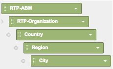

# Rapporti RTP personalizzati in Google Universal Analytics {#custom-rtp-reports-in-google-universal-analytics}

>[!PREREQUISITES]
>
>[Integrare RTP con Google Universal Analytics](/help/marketo/product-docs/web-personalization/reporting-for-web-personalization/web-analytics-integrations/integrate-rtp-with-google-universal-analytics.md)

Questo articolo spiega come impostare rapporti personalizzati RTP per Google Universal Analytics (GUA).  I dati inviati da RTP a GUA possono essere impostati come due rapporti personalizzati separati denominati:

* RTP B2B
* Coinvolgimento RTP

## Impostazione di un rapporto personalizzato {#setting-up-a-custom-report}

1. Accedi a Google Analytics.

1. Fai clic su **Personalizzazione** nel menu principale.

1. Fai clic su **+Nuovo rapporto personalizzato**.

## Rapporto B2B RTP {#rtp-b-b-report}

1. Denomina il report **Rapporto B2B RTP**.

1. Denomina la prima scheda **Industria**.

>[!NOTE]
>
>Sarà **Duplica questa scheda** e crearne altri simili - passaggio 5)

1. Seleziona la **Esplora risorse** tipo di report.

   

1. In **Gruppi di metriche** seleziona le metriche rilevanti per la tua attività.

   a) Si consiglia quanto segue:

   

1. Duplica questa scheda 4 volte e denominale:

   1. **Settore**
   1. **Gruppo**
   1. **Categoria**
   1. **ABM**
   1. **Organizzazioni**

   

1. In **Analisi a discesa dei Dimension** imposta le dimensioni rilevanti per ciascuna scheda come segue.

<table> 
 <thead> 
  <tr> 
   <th> 
    

      Nome scheda 
    
</th> 
   <th> 
    

      Analisi a discesa dei Dimension
    
</th> 
  </tr> 
 </thead> 
 <tbody> 
  <tr> 
   <td>Settore</td> 
   <td></td> 
  </tr> 
  <tr> 
   <td>Gruppo</td> 
   <td></td> 
  </tr> 
  <tr> 
   <td>Categoria</td> 
   <td></td> 
  </tr> 
  <tr> 
   <td>ABM</td> 
   <td></td> 
  </tr> 
  <tr> 
   <td>Organizzazioni</td> 
   <td></td> 
  </tr> 
 </tbody> 
</table>

1. Non impostare filtri e imposta il rapporto come disponibile per **Tutti i dati del sito Web** (o cambia se pertinente per un account Analytics specifico).

1. Fai clic su **Salva**.

   

## Rapporto di coinvolgimento RTP {#rtp-engagement-report}

1. Denomina il report **Rapporto di coinvolgimento RTP**.

1. Imposta il nome della prima scheda su **Interazione completa**.

>[!NOTE]
>
>Duplicerai questa scheda e creerai altri simili - passaggio 5)

1. Seleziona la **Esplora risorse** tipo di report.

   

1. Nella sezione Gruppi di metriche , seleziona le metriche rilevanti per la tua attività. Ecco una raccomandazione:

   

1. Duplica questa scheda 4 volte e denominale:

   1. **Interazione completa**
   1. **Coinvolgimento per settore**
   1. **Coinvolgimento per gruppo**
   1. **Coinvolgimento per categoria**
   1. **Coinvolgimento di ABM**

   

1. In **Analisi a discesa dei Dimension** imposta le dimensioni pertinenti per ciascuna scheda come segue:

<table> 
 <thead> 
  <tr> 
   <th> 
    

      Nome scheda 
    
</th> 
   <th> 
    

      Analisi a discesa dei Dimension 
    
</th> 
  </tr> 
 </thead> 
 <tbody> 
  <tr> 
   <td>Interazione completa</td> 
   <td></td> 
  </tr> 
  <tr> 
   <td>Coinvolgimento di ABM</td> 
   <td></td> 
  </tr> 
  <tr> 
   <td>Coinvolgimento per categoria</td> 
   <td></td> 
  </tr> 
  <tr> 
   <td>Coinvolgimento per gruppo</td> 
   <td></td> 
  </tr> 
  <tr> 
   <td>Coinvolgimento per settore</td> 
   <td></td> 
  </tr> 
 </tbody> 
</table>

1. Imposta i seguenti filtri:

<table> 
 <thead> 
  <tr> 
   <th> 
    

      Inc. 
    
</th> 
   <th> 
    

      Campo 
    
</th> 
   <th> 
    

      Tipo di corrispondenza 
    
</th> 
   <th> 
    

      Valori 
    
</th> 
   <th colspan="1"> 
    

      Commenti 
    
</th> 
  </tr> 
 </thead> 
 <tbody> 
  <tr> 
   <td>
Includi
</td> 
   <td>
Categoria evento
</td> 
   <td>Regex</td> 
   <td>RTP-Campaigns|RTP-Recommendations|RTP-Segmenti</td> 
   <td colspan="1">Filtrerà tutti gli altri eventi personalizzati non correlati a RTP</td> 
  </tr> 
  <tr> 
   <td>Escludi</td> 
   <td>Etichetta evento</td> 
   <td>Regex</td> 
   <td>#</td> 
   <td colspan="1">Consente di filtrare dalla campagna di rapporti utilizzando # nel nome della campagna</td> 
  </tr> 
 </tbody> 
</table>

1. Imposta questo rapporto come disponibile per **Tutti i dati del sito Web** (o eventualmente modificare).

   

1. Fai clic su **Salva**.

>[!MORELIKETHIS]
>
>[Integrare RTP con Google Universal Analytics](/help/marketo/product-docs/web-personalization/reporting-for-web-personalization/web-analytics-integrations/integrate-rtp-with-google-universal-analytics.md)
>
>[Dashboard RTP personalizzati in Google Universal Analytics](/help/marketo/product-docs/web-personalization/reporting-for-web-personalization/web-analytics-integrations/custom-rtp-dashboards-in-google-universal-analytics.md)
