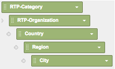

# Report RTP personalizzati in Google Universal Analytics {#custom-rtp-reports-in-google-universal-analytics}

>[!PREREQUISITES]
>
>[Integrare RTP con Google Universal Analytics](integrate-rtp-with-google-universal-analytics.md)

Questo post spiega come impostare i rapporti personalizzati RTP per Google Universal Analytics (GUA).  I dati inviati da RTP a GUA possono essere impostati come due rapporti personalizzati separati, denominati:

* RTP B2B
* Coinvolgimento RTP

## Impostazione di un report personalizzato {#setting-up-a-custom-report}

1. Accedete alle Google Analytics.
1. Fare clic su **Customization **nel menu superiore.
1. Fate clic su **+Nuovo rapporto personalizzato.**

** 

**

## Report RTP B2B {#rtp-b-b-report}

1. Denominate il report **RTP B2B Report**.
1. Nome della prima scheda **Industria **

   1. (Nota: si **duplica questa scheda** e ne si creano altre simili - passaggio 5)

1. Selezionare il tipo di rapporto** Explorer*.\
   ** 

   **

1. Nella sezione Gruppi **** metriche, seleziona le metriche rilevanti per la tua attività.

   1. Consigliamo quanto segue:\
      ** 

      **

1. Duplica questa scheda 4 volte e denominale:

   1. **Industria**
   1. **Gruppo**
   1. **Categoria**
   1. **ABM**
   1. **Organizzazioni**

   

1. Nella sezione **Dimension a discesa** impostare le dimensioni rilevanti per ciascuna scheda come segue.

<table> 
 <thead> 
  <tr> 
   <th> 
    

      Nome scheda 
    
</th> 
   <th> 
    

      Dimension Drill down 
    
</th> 
  </tr> 
 </thead> 
 <tbody> 
  <tr> 
   <td>Industria</td> 
   <td></td> 
  </tr> 
  <tr> 
   <td>Gruppo</td> 
   <td></td> 
  </tr> 
  <tr> 
   <td>Categoria</td> 
   <td></td> 
  </tr> 
  <tr> 
   <td>ABM</td> 
   <td></td> 
  </tr> 
  <tr> 
   <td>Organizzazioni</td> 
   <td></td> 
  </tr> 
 </tbody> 
</table>

1. Non impostare filtri e impostare il rapporto in modo che sia disponibile per **Tutti i dati del sito Web **(o modificare se pertinente per un account Analytics specifico).
1. Fate clic su **Salva**.\
   

## Report Coinvolgimento RTP {#rtp-engagement-report}

1. Denominate il rapporto di coinvolgimento **RTP del rapporto.**
1. Impostate il nome della prima scheda su **Tutti i partecipanti**

   1. (Nota: duplicare questa scheda e crearne altre simili - passaggio 5)

1. Selezionare il tipo di rapporto **Explorer** .\
   

1. Nella sezione Gruppi di metriche, seleziona le metriche rilevanti per la tua attività. Di seguito è riportata una raccomandazione:\
   

1. Duplica questa scheda 4 volte e denominale:

   1. **Tutto il coinvolgimento**
   1. **Coinvolgimento per settore**
   1. **Coinvolgimento per gruppo**
   1. **Coinvolgimento per categoria**
   1. **Engagement by ABM**

   ** \**

1. Nella sezione **Dimension a discesa** impostare le dimensioni rilevanti per ciascuna scheda come segue:

<table> 
 <thead> 
  <tr> 
   <th> 
    

      Nome scheda 
    
</th> 
   <th> 
    

      Dimension Drill down 
    
</th> 
  </tr> 
 </thead> 
 <tbody> 
  <tr> 
   <td>Tutto il coinvolgimento</td> 
   <td></td> 
  </tr> 
  <tr> 
   <td>Engagement by ABM</td> 
   <td></td> 
  </tr> 
  <tr> 
   <td>Coinvolgimento per categoria</td> 
   <td></td> 
  </tr> 
  <tr> 
   <td>Coinvolgimento per gruppo</td> 
   <td></td> 
  </tr> 
  <tr> 
   <td>Coinvolgimento per settore</td> 
   <td></td> 
  </tr> 
 </tbody> 
</table>

1. Impostate i seguenti filtri:
1. 

<table> 
 <thead> 
  <tr> 
   <th> 
    

      Inc/Exc 
    
</th> 
   <th> 
    

      Field 
    
</th> 
   <th> 
    

      Tipo corrispondenza 
    
</th> 
   <th> 
    

      Valori 
    
</th> 
   <th colspan="1"> 
    

      Commenti 
    
</th> 
  </tr> 
 </thead> 
 <tbody> 
  <tr> 
   <td>
Includi
</td> 
   <td>
Categoria evento
</td> 
   <td>Regex</td> 
   <td>RTP-Campaigns|RTP-Recommendations|RTP-Segments</td> 
   <td colspan="1">Filtrerà tutti gli altri eventi personalizzati non correlati a RTP</td> 
  </tr> 
  <tr> 
   <td>Escludi</td> 
   <td>Etichetta evento</td> 
   <td>Regex</td> 
   <td>#</td> 
   <td colspan="1">Consente di filtrare dalla campagna di report utilizzando # nel nome della campagna</td> 
  </tr> 
 </tbody> 
</table>

1. Imposta questo rapporto come disponibile per **Tutti i dati del sito Web **(o modifica se necessario)

   

1. Fate clic su **Salva**.

>[!NOTE]
>
>**Articoli correlati**
>
>[Integrare RTP con Google Universal Analytics](integrate-rtp-with-google-universal-analytics.md)
>
>[Dashboard RTP personalizzati in Google Universal Analytics](custom-rtp-dashboards-in-google-universal-analytics.md)

