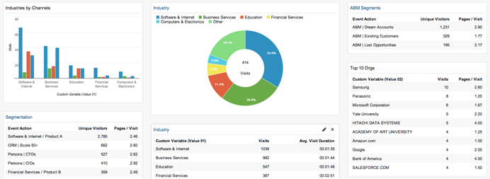
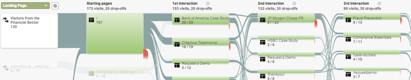
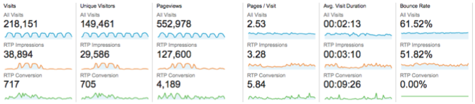
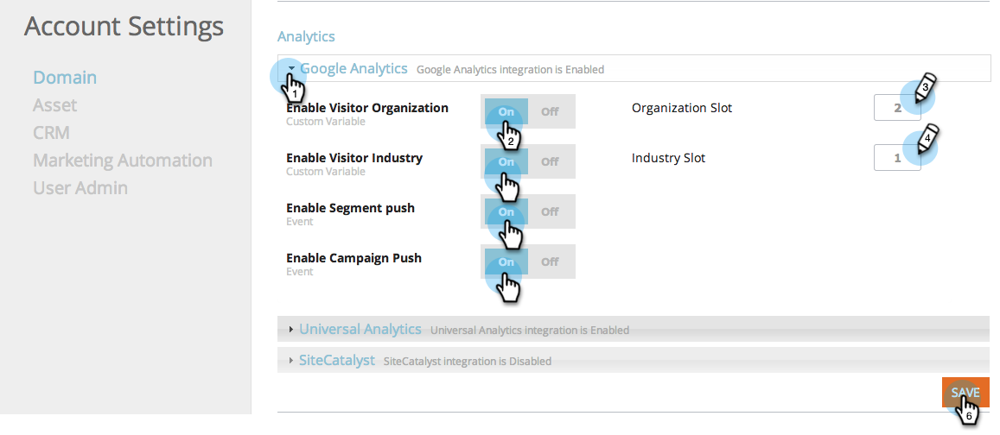

# Integrare RTP con Google Analytics {#integrate-rtp-with-google-analytics}

>[!NOTE]
>
>Universal Analytics è ora lo standard operativo e tutte le proprietà in Google sono state aggiornate a Universal Analytics.
>
>Questo articolo illustra come utilizzare il vecchio Google Standard Analytics, ma si consiglia di passare a Universal Analytics.
>
>Se non utilizzi già il [codice di tracciamento analytics.js](https://developers.google.com/analytics/devguides/collection/analyticsjs/), Google consiglia vivamente di rinominare il sito per utilizzarlo. I seguenti elementi sono diventati obsoleti da Google:
>
>* ga.js
>* urchin.js
>* WAP/snippet lato server
>* YT/MO
>* Variabili personalizzate
>* Variabili definite dall&#39;utente
>
>Scopri come integrare [Web Personalization con Universal Analytics](/help/marketo/product-docs/web-personalization/reporting-for-web-personalization/web-analytics-integrations/integrate-rtp-with-google-universal-analytics.md)

## Introduzione {#introduction}

Analizza le analisi web da una nuova angolazione utilizzando il flusso diretto di dati da Marketo Real-Time Personalization (RTP) all’account Google Analytics (GA). Misura le visite web in GA in base a organizzazioni, settori e campagne RTP. Visualizza metriche quali i tipi di settori o di segmenti RTP in GA e il modo in cui eseguono e generano lead in base alle diverse origini di traffico (social, pagato, organico), analizzando i tassi di click-through sulle campagne e misurando l’impatto delle campagne di personalizzazione sul tuo sito web. Sfrutta questa possibilità per ottenere il massimo vantaggio dal tuo account RTP

**Audience Analytics RTP**

Con l’integrazione, hai una nuova dimensione nel tuo account GA. RTP migliora automaticamente le dashboard con:

1. Organizzazioni e industrie
1. Segmenti personalizzati in RTP
1. Elenchi Account-Based Marketing

Concentrati sui tuoi potenziali clienti B2B chiave. Analizza i canali per settori e segmenti mirati.

## Rapporto canale {#channel-report}

Il dashboard B2B RTP ti aiuta a comprendere il raggruppamento dei visitatori in base ai segmenti verticali e RTP. Puoi vedere le prestazioni dei visitatori in base al settore finanziario e a diverse campagne di marketing (a pagamento, organiche, sociali). La dashboard fornisce inoltre una panoramica di alto livello delle prestazioni dei segmenti RTP ed esegue l’espansione per mostrare le principali organizzazioni che visitano il sito.

## Flusso comportamentale {#behavioral-flow}

Il rapporto di flusso del comportamento (vedi immagine) visualizza il percorso che i visitatori percorrono da una pagina o un evento all’altra. L’esempio dell’immagine mostra il percorso di tutti i visitatori del settore finanziario. Questo rapporto può aiutarti a scoprire quale contenuto mantiene i visitatori coinvolti con il tuo sito.

## Prestazioni RTP {#rtp-performance}

Misura le campagne RTP e le correla alla media complessiva del sito. Scopri in che modo queste campagne influiscono sulle metriche del sito web e utilizza questi dati per concentrare le tue attività di personalizzazione sui target giusti. Genera rapporti personalizzati per comprendere meglio le prestazioni delle campagne di personalizzazione.

## Configurazione di RTP con Google Analytics {#setting-up-rtp-with-google-analytics}

1. Aggiungere l&#39;e-mail <rtp.ga2@gmail.com> come utente Read &amp; Analyze al proprio account GA. Per ulteriori dettagli, consulta [qui](https://support.google.com/analytics/answer/2884495?hl=en).

1. Nel tuo account RTP. Passa a **[!UICONTROL Account Settings]**.

   

1. In **[!UICONTROL Account Settings]**, **[!UICONTROL Domain]** e **[!UICONTROL Analytics]**.

1. Fai clic su **Google Analytics**.

1. Attiva le **Variabili personalizzate** e **Eventi** pertinenti per aggiungere questi dati da RTP a Google Analytics.

1. Immetti il numero **Slot** per inviare dati di variabile personalizzati (il valore predefinito è 1,2).

1. Fai clic su **[!UICONTROL Save]**.

>[!NOTE]
>
>Per inviare i dati del segmento a GA, nella pagina [[!UICONTROL Edit Segment]](/help/marketo/product-docs/web-personalization/using-web-segments/create-a-basic-web-segment.md) della piattaforma RTP selezionare la casella di controllo **[!UICONTROL Send Event to Google Analytics on Segment Match]**.

## Configurazione dei rapporti Google Analytics con i dati RTP {#setting-up-google-analytics-reports-with-rtp-data}

In Google Analytics puoi utilizzare dashboard, segmentazione GA e reporting per visualizzare i dati RTP:

* [I dashboard](https://support.google.com/analytics/answer/1068216?hl=en) forniscono una panoramica delle prestazioni del sito Web.
* Un segmento GA ha lo scopo di filtrare i visitatori nell’interfaccia GA e visualizzare il traffico per segmento. Scopri come creare un segmento [qui](https://support.google.com/analytics/answer/3124493?hl=en).
* Creazione di [report personalizzati](https://support.google.com/analytics/answer/1033013?hl=en) per visualizzare e/o configurare le e-mail pianificate. Vedere in **[!UICONTROL Customization]** > **[!UICONTROL New Custom Report]**.
