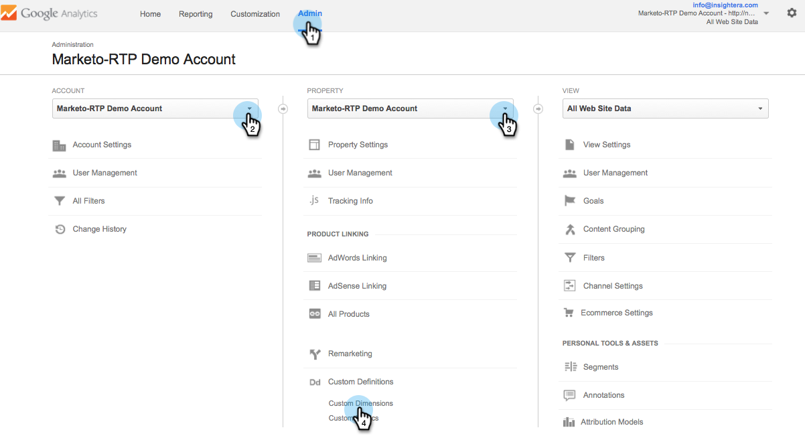
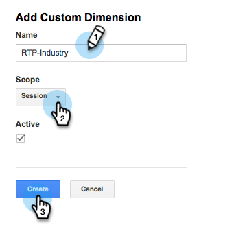
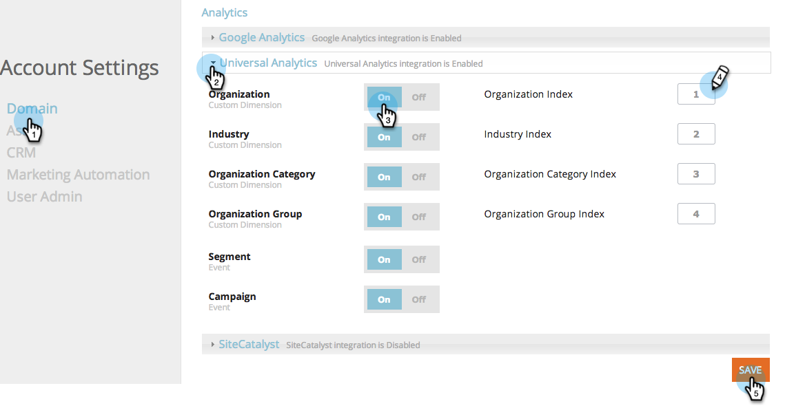

# Integrare RTP con [!DNL Google Universal Analytics] {#integrate-rtp-with-google-universal-analytics}

## Introduzione {#intro}

Sfrutta [!DNL Google Universal Analytics] (GUA) con i dati firmografici e di personalizzazione di [!DNL Marketo Real-Time Personalization] (RTP) per misurare e analizzare meglio le tue attività di marketing online.

Questo post spiega come configurare e integrare la piattaforma [!DNL Marketo Real-Time Personalization] (RTP) con gli account [!DNL Google Universal Analytics] (GUA). I dati RTP possono essere aggiunti al tuo account GUA per visualizzare e vedere le prestazioni di organizzazioni, settori, firmografica e segmenti RTP che visitano il tuo sito web.

**[!DNL Google Universal Analytics]**

[!DNL Google Universal Analytics] con i dati di RTP ti consente di comprendere meglio come gli utenti B2B interagiscono con i tuoi contenuti online e di misurare e ottenere risultati migliori dalle campagne di personalizzazione. [Ulteriori informazioni su [!DNL Google Universal Analytics]](https://support.google.com/analytics/answer/2790010/?hl=en&authuser=1).

>[!NOTE]
>
>**Solo Per Utenti Di Google Tag Manager**
>
>Non è necessario eseguire alcuna codifica o configurazione speciale. Assicurati di completare il seguente elenco di controllo:
>
>* Le dimensioni RTP vengono create in [!DNL Google Universal Analytics]
>* [Il tag RTP è installato correttamente in Google Tag Manager](https://docs.marketo.com/display/public/DOCS/Implementing+RTP+using+Google+Tag+Manager)
>* L&#39;integrazione di [!DNL Google Universal Analytics] è abilitata nelle impostazioni account dell&#39;RTP
>* [[!DNL Google Universal Analytics] tag è configurato correttamente in Google Tag Manager](https://support.google.com/tagmanager/answer/6107124?hl=en)
>* [Il tag di Google Tag Manager è installato correttamente nel tuo sito Web](https://developers.google.com/tag-manager/quickstart)

## Impostare dimensioni personalizzate in GUA {#set-up-custom-dimensions-in-gua}

1. In Google Analytics,

   1. Vai a **[!UICONTROL Admin]**
   1. Seleziona **[!UICONTROL Account].**
   1. Seleziona **[!UICONTROL Property].**
   1. Selezionare **[!UICONTROL Custom Definitions]** e **[!UICONTROL Custom Dimensions]**.
      

1. Aggiungi una nuova dimensione personalizzata. Fai clic su **[!UICONTROL +New Custom Dimension]**.

   

1. Aggiungi **[!UICONTROL Custom Dimensions]:**

<table>
 <tbody>
  <tr>
   <td>
<strong>Nome Dimension personalizzato</strong>
</td>
   <td>
<strong>Ambito</strong>
</td>
   <td>
<strong>Attivo</strong>
</td>
  </tr>
  <tr>
   <td>
<strong>Organizzazione RTP</strong>
</td>
   <td>
Session
</td>
   <td>
✓
</td>
  </tr>
  <tr>
   <td>
<strong>RTP-Industry</strong>
</td>
   <td>
Session
</td>
   <td>
✓
</td>
  </tr>
  <tr>
   <td>
<strong>Categoria RTP</strong>
</td>
   <td>
Session
</td>
   <td>
✓
</td>
  </tr>
  <tr>
   <td>
<strong>Gruppo RTP</strong>
</td>
   <td>
Session
</td>
   <td>
✓
</td>
  </tr>
 </tbody>
</table>

>[!NOTE]
>
>**I nomi dei Dimension personalizzati** devono essere esattamente come definiti nella tabella precedente (in caso contrario, le dashboard e i report RTP personalizzati non verranno visualizzati correttamente nella GUA)

1. Aggiungi **[!UICONTROL Name]**. Selezionare l&#39;ambito come **[!UICONTROL Session]**. Fai clic su **[!UICONTROL Create]**.

   

L&#39;elenco Dimension personalizzato deve essere simile al seguente.

Dopo aver attivato le dimensioni personalizzate nella GUA, passa alla piattaforma RTP per abilitarle all’interno di RTP.

## Attivare l’integrazione GUA nell’account RTP {#activate-the-gua-integration-in-your-rtp-account}

1. Nella piattaforma RTP, passa a **[!UICONTROL Account Settings].**

   

1. In **[!UICONTROL Account Settings]**, fare clic su **[!UICONTROL Domain]**.
1. In **[!UICONTROL Analytics]**, fare clic su **[!UICONTROL Google Universal Analytics]**.
1. Girare **[!UICONTROL On]** le dimensioni e gli eventi personalizzati pertinenti per aggiungere questi dati da RTP a [!DNL Google Universal Analytics].
1. Immettere **[!UICONTROL Index number]** della dimensione allineata con il numero di indice in GUA.
1. Fai clic su **[!UICONTROL Save]**.

>[!NOTE]
>
>Il numero di indice per il Dimension personalizzato si trova in GUA in Dimensioni personalizzate.
>
>Esempio: il numero di indice RTP-Industry è uguale a 1, il numero di indice RTP-Organization è uguale a 2.

## Rimuovere i dashboard obsoleti in Google Analytics {#remove-old-dashboards-in-google-analytics}

1. In Google Analytics. Vai a **[!UICONTROL Reporting].**
1. Fai clic su **[!UICONTROL Dashboards].**
1. Selezionare un **[!UICONTROL Dashboard]** (prestazioni RTP B2B o RTP)
1. Fai clic su **[!UICONTROL Delete Dashboard]**.

