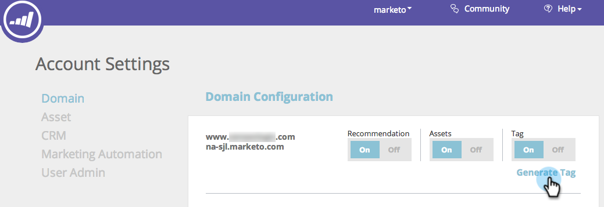

# Distribuire il JavaScript RTP {#deploy-the-rtp-javascript}

Per generare e configurare il tag RTP, seguire le istruzioni di installazione riportate di seguito

## Genera tag {#generate-tag}

1. Accedi al tuo account RTP. Vai a **Impostazioni account**.

   

1. In entrata **Dominio** e **Configurazione del dominio**, individua il dominio pertinente e fai clic su **Genera tag**.

   

1. Copia e incolla il tag di personalizzazione web (RTP) nel tuo sito web.

   

   >[!NOTE]
   >
   >Copia il tag JavaScript RTP e incollalo come primo script nell’intestazione delle pagine, tra `<head> </head>` tag.

   Assicurati che il tag venga visualizzato su tutte le pagine, incluse le pagine di destinazione e i sottodomini. Per verificarlo, fai clic con il pulsante destro del mouse sulla pagina del tuo sito web. Vai a Visualizza origine pagina in un browser Web. Ricerca: &quot;RTP&quot;.

1. Cambia tag impostato su **ATTIVATO**.

   Verificare che l&#39;opzione Tag sia impostata su ON. Dovresti iniziare a visualizzare il flusso di dati nella scheda dell’organizzazione.

   Ora hai impostato con il tag RTP e sei pronto per iniziare [creazione di segmenti](/help/marketo/product-docs/web-personalization/using-web-segments/create-a-basic-web-segment.md) e campagne in tempo reale!

1. Verifica che il tag sia su tutte le pagine.
