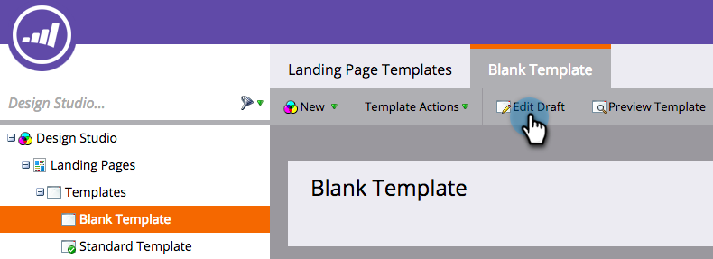
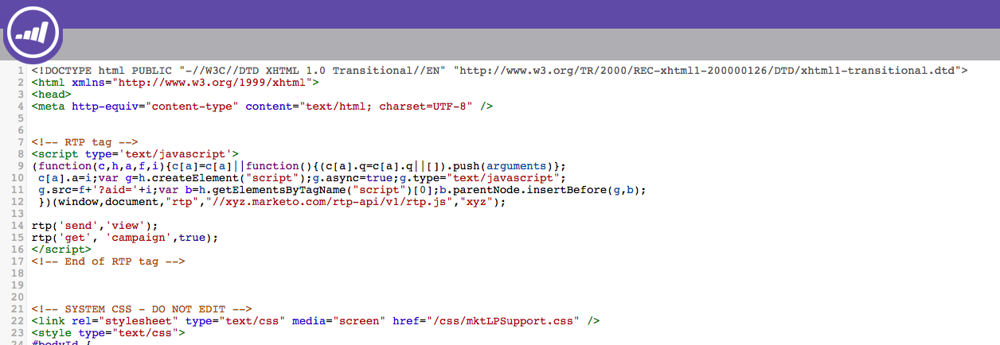
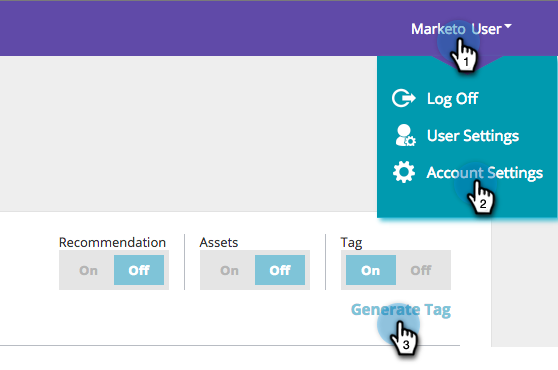

# Implementazione di RTP sulle pagine di destinazione Marketo {#implementing-rtp-on-marketo-landing-pages}

Per implementare il tag RTP, segui le istruzioni di installazione riportate di seguito:

1. Andate a **Design Studio.** Aprite l’elemento da modificare. Selezionare **Azioni modello**, selezionare **Modifica bozza**.

   

1. Apportate le modifiche necessarie al modello nella scheda **Sorgente HTML**.

   

1. Nel tuo account RTP, vai a **Impostazioni account**.

   a. Se avete già ricevuto il tag JavaScript dal supporto, continuate con il passaggio 5.

   

1. In Domain (Dominio), individua il dominio appropriato e fai clic su **Generate Tag**.

   

   

1. Copiate il tag JavaScript RTP e incollatelo in tutti i modelli della pagina di destinazione tra i tag **`<head> </head>`**.

1. Fare clic su **Salva** e **Chiudi** la finestra.

1. Tornare a **Design Studio**, approvare la pagina di destinazione da **Template Actions**, fare clic su **Approva**.

   

1. Infine, per rendere effettive le modifiche apportate al modello è necessario **approvare di nuovo** tutte le pagine di destinazione che utilizzano tale modello. Potete riapprovarle tutte contemporaneamente dalla sezione Pagine di destinazione principale.

   

1. Verifica che venga visualizzato su tutte le pagine, incluse le pagine di destinazione e i sottodomini.

   A tale scopo, fate clic con il pulsante destro del mouse sulla pagina del sito Web. Vai a **Visualizza origine pagina.** Cercate  **** RTPper individuare il tag.
