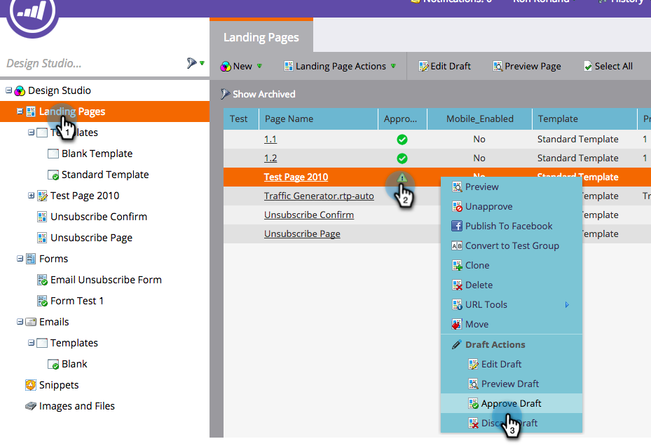

# Implementazione di RTP sulle pagine di destinazione di Marketo {#implementing-rtp-on-marketo-landing-pages}

Per implementare [!UICONTROL RTP tag], seguire le istruzioni di installazione riportate di seguito:

1. Passare a **[!UICONTROL Design Studio].** Aprire l&#39;elemento da modificare. Selezionare **[!UICONTROL Template Actions]**, selezionare **[!UICONTROL Edit Draft]**.

   

1. Apporta le modifiche al modello nella scheda **HTML Source**.

   

1. Nel tuo account RTP, vai a **[!UICONTROL Account Settings]**.

   a. Se hai già ricevuto il tag JavaScript dal Supporto tecnico - continua con il passaggio 5.

   

1. In [!UICONTROL Domain], individuare il dominio pertinente e fare clic su **[!UICONTROL Generate Tag]**.

   

   

1. Copiare il tag JavaScript RTP e incollarlo in tutti i modelli di pagina di destinazione tra i tag **`<head> </head>`**.

1. Fare clic su **[!UICONTROL Save]** e **[!UICONTROL Close]** nella finestra.

1. Tornando a **[!UICONTROL Design Studio]**, approva la pagina di destinazione da **[!UICONTROL Template Actions]**, fai clic su **[!UICONTROL Approve]**.

   

1. Infine, per rendere effettive le modifiche apportate al modello, **devi approvare nuovamente** le pagine di destinazione che utilizzano tale modello. È possibile approvarle nuovamente tutte contemporaneamente dalla sezione principale [!UICONTROL Landing Pages].

   

1. Verifica che venga visualizzato in tutte le pagine, incluse le pagine di destinazione e i sottodomini.

   A tale scopo, fai clic con il pulsante destro del mouse sulla pagina del sito web. Vai a **[!UICONTROL View Page Source].** Cerca **[!UICONTROL RTP]** per individuare il tag.
