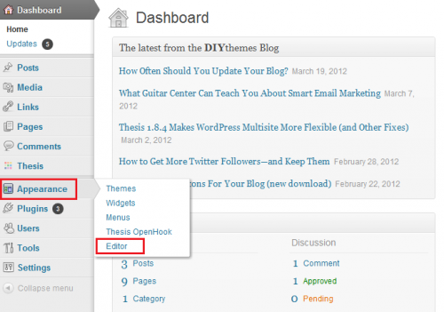

# Implementazione di RTP su Wordpress {#implementing-rtp-on-wordpress}

Per implementare il tag RTP, segui le istruzioni di installazione riportate di seguito:

1. Aprire il file **header.php** del **tema WordPress**.

   È possibile utilizzare un client FTP per accedere al server o modificare i file dei temi direttamente dal dashboard di WordPress. L&#39;editor file si trova nella scheda **Aspetto** del menu della barra laterale.

   

1. Nell&#39;elenco dei file modello a destra dell&#39;editor di testo, individuare **header.php** e aprirlo.

1. Vai a **Impostazioni account**.

   a. Se avete già ricevuto il tag JavaScript dal supporto, continuate con il passaggio 5.

   

1. In Domain (Dominio), individua il dominio appropriato e fai clic su **Generate Tag**.

   

1. Copiate il tag JavaScript RTP e incollatelo nei modelli del sito Web.

   a. Accertatevi che sia il primo script nell&#39;intestazione della pagina, tra i tag **`<head> </head>`**.

   

1. Fate clic su **Aggiorna file** per il file header.php.

1. Verifica che venga visualizzato su tutte le pagine, incluse le pagine di destinazione e i sottodomini.

   a. A tale scopo, fate clic con il pulsante destro del mouse sulla pagina del sito Web. Vai a **Visualizza origine pagina.** Cercate  **** RTPper individuare il tag.
