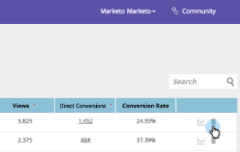

# Informazioni sull’analisi dei contenuti {#understanding-content-analytics}

La pagina di analisi dei contenuti mostra il contenuto esistente individuato (casi di studio, post di blog, video, comunicati stampa e così via) dal sito web. Mostra inoltre le prestazioni dei contenuti e le persone generate quando i visitatori interagiscono con loro.

## Visualizza analisi dei contenuti {#view-content-analytics}

Vai a **Analisi dei contenuti**.

Nella pagina Analisi dei contenuti puoi effettuare le seguenti operazioni:

* Filtra per ambito temporale (giorno, settimana e mese)
* Ricerca per titolo contenuto e URL contenuto
* Ordinare in ordine decrescente o crescente facendo clic sul titolo della colonna per Visualizzazioni, Conversioni dirette e Tasso di conversione.

Puoi anche esportare un file in formato CSV facendo clic sull’icona.

La tabella Analytics fornisce i seguenti dettagli:

<table> 
 <thead> 
  <tr> 
   <th colspan="1" rowspan="1">Nome</th> 
   <th colspan="1" rowspan="1">Descrizione</th> 
  </tr> 
 </thead> 
 <tbody> 
  <tr> 
   <td colspan="1" rowspan="1"><strong>Titolo</strong></td> 
   <td colspan="1" rowspan="1">Nome della risorsa di contenuto digitale. Clic <strong>Titolo</strong> per aprire l’URL del contenuto in una nuova scheda.</td> 
  </tr> 
  <tr> 
   <td colspan="1">
<strong>Consiglio </strong><strong>Icona</strong>

<strong></strong>
</td> 
   <td colspan="1">Indica se il contenuto è stato aggiunto per <a href="#">Recommendations dei contenuti</a>.</td> 
  </tr> 
  <tr> 
   <td colspan="1" rowspan="1">
<strong>Visualizzazioni</strong>
</td> 
   <td colspan="1" rowspan="1">
Il numero di visualizzazioni dalla risorsa del contenuto provenienti dai visitatori web. Il numero di volte in cui è stato visualizzato, aperto, guardato o scaricato. Fai clic sul numero di nella colonna Visualizzazioni per espandere e vedere chi ha visualizzato il contenuto
</td> 
  </tr> 
  <tr> 
   <td colspan="1" rowspan="1"><strong>Conversioni dirette</strong></td> 
   <td colspan="1" rowspan="1">Visitatori web che hanno visualizzato il contenuto e compilato un modulo nel corso della stessa visita</td> 
  </tr> 
  <tr> 
   <td colspan="1">
<strong>Icona Analytics</strong>

<strong></strong>
</td> 
   <td colspan="1">Ulteriori informazioni analitiche sul contenuto</td> 
  </tr> 
  <tr> 
   <td colspan="1">
<strong>Icona Elimina</strong>

</td> 
   <td colspan="1">Elimina il contenuto da Content Analytics</td> 
  </tr> 
 </tbody> 
</table>

## Visualizza analisi contenuto aggiuntiva {#view-additional-content-analytics}

Fai clic sull’icona Analytics di un contenuto.

Viene visualizzata una finestra di dialogo con analisi del contenuto aggiuntive per quel contenuto specifico.

L’analisi aggiuntiva dei contenuti include:

**Analytics**

* **Visualizzazioni**: visualizzazioni del contenuto per l’ambito temporale selezionato
* **Conversioni dirette**: visitatori web che hanno visualizzato il contenuto e compilato un modulo durante la stessa visita.
* **Tasso di conversione****:** Tasso di conversione percentuale calcolato per le conversioni dirette diviso per i clic

**Tendenze**

* A **Tendenze** grafico che mostra gli ultimi 30 giorni di visualizzazioni del contenuto specifico. Passa il puntatore del mouse sul grafico a linee per visualizzare il numero di visualizzazioni di contenuto da un giorno specifico

## Elimina contenuto {#delete-content}

Dalla pagina Analisi del contenuto, fai clic sull’icona Elimina del contenuto che desideri eliminare. Viene visualizzato un messaggio per confermare l’eliminazione del contenuto.

>[!MORELIKETHIS]
>
>* [Abilitare la barra dei consigli dei contenuti](/help/marketo/product-docs/predictive-content/enabling-predictive-content/enable-the-content-recommendation-bar.md)
>* [Abilitare il contenuto predittivo per i contenuti rich media web](/help/marketo/product-docs/predictive-content/enabling-predictive-content/enable-predictive-content-for-web-rich-media.md)
