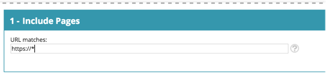

# Glossario di personalizzazione web {#web-personalization-glossary}

Approfondimenti sul mondo e sul linguaggio di Marketo Web Personalization.

| Termine | Definizione |
|---|---|
| **Visitatore anonimo** | Un visitatore web che non ha mai compilato un modulo o lasciato i propri dati sul sito web. |
| **Campagna web** | Una reazione personalizzata associata a un segmento specifico. Con la personalizzazione web, le campagne web includono finestre di dialogo, aree e widget. |
| **Clickstream** | L’attività e il percorso URL del visitatore sul sito e per quanto tempo ha visitato ogni pagina |
| **ISP** | Provider di servizi Internet |
| **Visitatore noto** | Un visitatore Web che ha completato un modulo e ha lasciato i propri dettagli (indirizzo e-mail) sul sito Web o ha fatto clic su un collegamento in un messaggio e-mail di Marketo. |
| **Elenco account** | Elenco di nomi di account/organizzazione chiave. Noto anche come elenco Account-Based Marketing (ABM). |
| **Segmenti** | Una raccolta di visitatori che soddisfano i criteri specificati definiti nella sezione [Pagina &quot;Imposta un segmento&quot;](/help/marketo/product-docs/web-personalization/using-web-segments/web-segments.md). |
| **Test di suddivisione** | Un esperimento di test con due o più varianti per misurare la differenza nei risultati. L’obiettivo è quello di identificare le modifiche alle pagine web che aumentano o massimizzano un risultato di interesse. |
| **Carattere jolly** | Un carattere jolly (&#42; viene utilizzato) prima o dopo una stringa per sostituire qualsiasi altro carattere o carattere in una stringa. Vedi gli esempi di seguito. |

## Esempi di caratteri jolly {#wildcard-examples}

Di seguito sono riportati tre modi in cui è possibile utilizzare un carattere jolly in Personalizzazione web.

Abbina tutti i visitatori sugli URL della pagina che terminano con il prezzo (ad esempio, `www.marketo.com/pricing`

Abbina tutti i visitatori negli URL della pagina che iniziano con https:// (ad esempio, `https://www.marketo.com`

Abbina tutti i visitatori negli URL della pagina che includono la parola backup (ad esempio, `https://www.marketo.com/backup/pricing.html`

