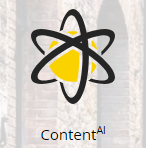

# Panoramica sulla personalizzazione web {#web-personalization-overview}

## Introduzione {#introduction}

Per i nuovi clienti di Marketo, la personalizzazione in tempo reale è divisa in quattro app, a cui si accede utilizzando le due sezioni seguenti: Personalizzazione web e ContentAI.

 

>[!NOTE]
>
>Web Personalization e ContentAI sono disponibili in tutte le lingue supportate da Marketo (inglese, francese, tedesco, giapponese, portoghese, spagnolo).

I clienti esistenti continuano ad accedere alle app tramite il riquadro Real-Time Personalization (Personalizzazione in tempo reale) fino al rinnovo, momento in cui utilizzeranno l’accesso riportato sopra.

Quando fai clic sul riquadro Personalizzazione web, viene visualizzata la pagina Dashboard. Fai clic sul riquadro ContentAI e accedi direttamente alla pagina Recommendations dei contenuti.

Le quattro app sono:

* Personalizzazione web
* Marketing Web basato su account
* Retargeting di siti web
* ContentAI

Il **Personalizzazione web** tile è il tuo punto di accesso per la creazione di campagne web personalizzate. Marketing web basato su account e retargeting web. Puoi aggiungere contenuti nella pagina di analisi dei contenuti.

**Marketing Web basato su account** funziona con la personalizzazione web e con le funzioni Account denominati. La pagina Account denominati fornisce informazioni grafiche sui clienti esistenti, sugli impegni totali e sulle tendenze organizzative, nonché un elenco degli account. Puoi anche creare nuovi account denominati.

**Retargeting di siti web** consente di reimmettere sul mercato tipi di pubblico segmentati. Puoi impostare i segmenti, ma non utilizzare Account denominati nel filtro.

**ContentAI** è il luogo in cui fornire consigli sui contenuti. Puoi aggiungere facilmente il contenuto alla pagina Recommendations dei contenuti.

>[!NOTE]
>
>Per accedere al Web marketing basato su account o al retargeting di siti web, fai clic sul riquadro Personalizzazione web anche se non disponi dell’app Personalizzazione web.

## Organismi {#organizations}

Nella scheda Organizzazioni vengono visualizzati tutti i dettagli (nome, posizione, attività e marca temporale) delle organizzazioni che hanno visitato il sito web durante un determinato periodo. La tabella può essere ordinata e organizzata in base all’ora, alla posizione, al dominio e tramite una ricerca a testo libero.

>[!TIP]
>
>&quot;Most Active&quot; (Più attivo) vs &quot;Latest&quot; (Più recente): la tabella è organizzata per organizzazioni identificate e quindi per provider di servizi Internet (identificati da un’icona ISP). Può essere ordinato in base a:
>
>* Più attive: le organizzazioni più attive nella tabella, in base al numero di visualizzazioni di pagina
>* Più recente: le organizzazioni più recenti nella tabella (impostazione predefinita)
>* Per informazioni preziose, filtra in base a più attivi

**Organizzazioni - Pannello di destra**

Il pannello di destra della pagina Organizations (Organizzazioni) offre le seguenti funzioni e informazioni:

<table> 
 <tbody> 
  <tr> 
   <td>
<strong>Icona Foglio di calcolo</strong>: nella parte in alto a destra del pannello, l’icona scarica la tabella Organizzazioni in formato CSV per l’utilizzo offline

<strong>Imposta avviso e-mail</strong>: invia un messaggio e-mail all'utente connesso ogni volta che l'organizzazione selezionata visita il sito Web

<strong>Lead</strong>: apre la tabella dei lead per l’organizzazione selezionata

<strong>Condividi</strong>: apre una finestra pop-up per inviare e-mail e condividere i dettagli dell’organizzazione che ha visitato la pagina web

<strong>Icona posizione</strong>: visualizza il paese e la città dell’organizzazione selezionata

<strong>Collegamenti</strong>: Jigsaw, Whois, Linkedin, Google, Twitter apre una nuova finestra con informazioni aggiuntive dalla rispettiva pagina web, per approfondire ulteriormente l’organizzazione selezionata

<strong>Ricerca</strong>: visualizza la parola chiave utilizzata se il visitatore è arrivato tramite un motore di ricerca

<strong>Riferimenti</strong>: mostra il collegamento URL della pagina che ha indirizzato il traffico al sito

<strong>Visitor</strong>: visualizza il numero di visite, il numero di pagine visualizzate dall’organizzazione selezionata e il relativo indirizzo e-mail (se ha completato un modulo di invio), nonché l’ora e la data dell’ultima visita

<strong>Clickstream</strong>: visualizza una tabella dell’attività utente e del percorso URL sul sito, indicando per quanto tempo ha visitato ogni pagina.
</td> 
   <td></td> 
  </tr> 
 </tbody> 
</table>

**Condividi organizzazioni**

Vuoi condividere le informazioni del visitatore del tuo sito web con un collega? Fai clic su un’organizzazione, quindi fai clic sul collegamento Condividi nel pannello a destra.

Attiva la sovrapposizione Condividi questa organizzazione, in cui puoi inviare un messaggio e-mail condividendo il nome e i dettagli dell’organizzazione che ha visitato il sito web.

## Visitor {#visitors}

Nella pagina Visitatori vengono visualizzati tutti i dettagli e il comportamento online di ogni visitatore che è arrivato sul sito entro il periodo di tempo specificato. La pagina offre informazioni approfondite sulle attività e sul comportamento online di ogni singolo visitatore. I dati dei visitatori nella tabella vengono aggiornati entro 24-48 ore.

Il pannello di destra della pagina Visitatori fornisce le seguenti informazioni:

<table> 
 <thead> 
  <tr> 
   <th colspan="1" rowspan="1">Nome</th> 
   <th colspan="1" rowspan="1">Descrizione</th> 
  </tr> 
 </thead> 
 <tbody> 
  <tr> 
   <td colspan="1" rowspan="1"><strong>Icona Foglio di calcolo</strong></td> 
   <td colspan="1" rowspan="1">Situata in alto a destra nel pannello, l’icona scarica la tabella Visitatori in formato CSV per l’utilizzo offline</td> 
  </tr> 
  <tr> 
   <td colspan="1" rowspan="1">
<strong>Nome organizzazione</strong>
</td> 
   <td colspan="1" rowspan="1"> </td> 
  </tr> 
  <tr> 
   <td colspan="1" rowspan="1"><strong>Imposta campagna</strong></td> 
   <td colspan="1" rowspan="1">Consente di impostare un CTA di Campaign associato al visitatore selezionato</td> 
  </tr> 
  <tr> 
   <td colspan="1"><strong>Posizione</strong></td> 
   <td colspan="1">Visualizza il paese, lo stato e la città del visitatore.</td> 
  </tr> 
  <tr> 
   <td colspan="1" rowspan="1"><strong>Clickstream</strong></td> 
   <td colspan="1" rowspan="1">Visualizza una tabella dell’attività e del percorso URL del visitatore sul sito, con indicazione di quanto tempo ha visitato ciascuna pagina.</td> 
  </tr> 
 </tbody> 
</table>

## Tempo reale {#real-time}

La pagina in tempo reale mostra i visitatori sul sito web in tempo reale, misurando l’attività nel momento in cui si verifica.

La pagina in tempo reale è suddivisa in 6 tabelle informative con i dettagli dei visitatori nel sito:

<table> 
 <thead> 
  <tr> 
   <th colspan="1" rowspan="1">Nome</th> 
   <th colspan="1" rowspan="1">Descrizione</th> 
  </tr> 
 </thead> 
 <tbody> 
  <tr> 
   <td colspan="1" rowspan="1"><strong>Visitor</strong></td> 
   <td colspan="1" rowspan="1"> Rappresenta il numero di visitatori attualmente presenti nel sito Web</td> 
  </tr> 
  <tr> 
   <td colspan="1" rowspan="1">
<strong>Clic al minuto</strong>
</td> 
   <td colspan="1" rowspan="1"> Un grafico a linee live che mostra il numero di clic sul sito al minuto</td> 
  </tr> 
  <tr> 
   <td colspan="1" rowspan="1"><strong>Organizzazioni principali</strong></td> 
   <td colspan="1" rowspan="1">Versione breve della tabella Organizzazioni</td> 
  </tr> 
  <tr> 
   <td colspan="1"><strong>Segmento in tempo reale</strong></td> 
   <td colspan="1">Il numero di visitatori attualmente nel sito che corrispondono ai segmenti designati</td> 
  </tr> 
  <tr> 
   <td colspan="1"><strong>Attualmente in navigazione</strong></td> 
   <td colspan="1">URL delle pagine attualmente visualizzate dai visitatori nel sito</td> 
  </tr> 
  <tr> 
   <td colspan="1" rowspan="1"><strong>Riferimenti principali</strong></td> 
   <td colspan="1" rowspan="1">URL di riferimento che ha portato il visitatore al sito</td> 
  </tr> 
 </tbody> 
</table>
