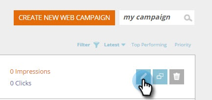

# Salva la campagna come modello {#save-your-campaign-as-a-template}

Hai mai dedicato del tempo alla creazione della perfetta campagna web? Ora puoi salvarlo come modello per un facile riutilizzo futuro.

1. Vai a **Campagne Web**.

   

1. Cercate la campagna da salvare come modello.

   

1. Fate clic sull’icona Modifica.

   

1. Selezionare Usa come modello e fare clic su **Salva**.

      

1. È tutto! La prossima volta che create una campagna e selezionate un modello, verificate i modelli personali nella pagina Imposta campagne per visualizzare i modelli salvati.

   
