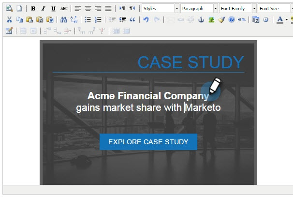

# Utilizzo dei modelli per creare campagne Web {#using-templates-to-create-web-campaigns}

Velocizzate e semplificate il processo di creazione delle campagne Web utilizzando i nostri modelli integrati o [salvando ](save-your-campaign-as-a-template.md).

>[!NOTE]
>
>I modelli sono ottimizzati per tutti i dispositivi e per tutte le esperienze di navigazione sia per desktop che per dispositivi mobili.

1. Vai a **Campagne Web**.

   

1. Fare clic su **Crea nuova campagna Web**.

   

1. Denominate la campagna.

   

1. Selezionate un segmento di Target.

   

1. Fare clic su **Templates**.

   

1. Selezionate l’area appropriata per la campagna e selezionate un modello che funzioni correttamente.

   >[!NOTE]
   >
   >Ci sono alcuni modelli interessanti tra cui scegliere, e aggiungeremo di più in futuro.

   

   >[!TIP]
   >
   >Per le campagne mobili, seleziona un modello dalla sezione **mobile**.

1. Personalizzare il modello.

   

1. Fare clic su **Salva**.

   

Ben fatto! Hai visto quanto tempo hai risparmiato utilizzando un modello?

>[!MORELIKETHIS]
>
>[Salva una campagna come modello](/help/marketo/product-docs/web-personalization/using-templates/save-your-campaign-as-a-template.md)
