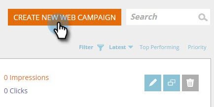
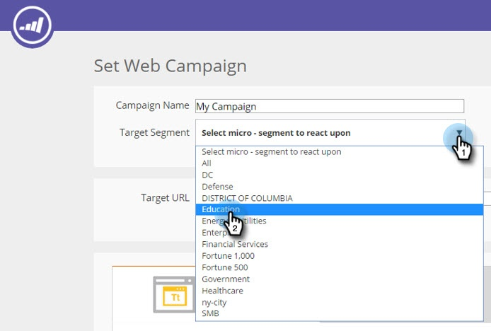

# Utilizzo dei modelli per creare campagne web {#using-templates-to-create-web-campaigns}

Accelera e semplifica il processo di creazione della campagna web utilizzando i nostri modelli incorporati o [salvando il tuo](save-your-campaign-as-a-template.md).

>[!NOTE]
>
>I modelli sono ottimizzati per tutti i dispositivi e le esperienze di navigazione sia per desktop che per dispositivi mobili.

1. Passa a **[!UICONTROL Web Campaigns]**.

   

1. Fai clic su **[!UICONTROL Create New Web Campaign]**.

   

1. Assegna un nome alla campagna.

   

1. Seleziona [!UICONTROL Target Segment].

   

1. Fai clic su **[!UICONTROL Templates]**.

   

1. Seleziona l’area appropriata per la campagna per visualizzare e selezionare un modello che funzioni per te.

   >[!NOTE]
   >
   >Ci sono alcuni modelli interessanti tra cui scegliere e ne aggiungeremo altri in futuro.

   

   >[!TIP]
   >
   >Per le campagne mobile, seleziona un modello dalla sezione **mobile**.

1. Personalizza il modello.

   

1. Fai clic su **[!UICONTROL Save]**.

   

Ben fatto! Hai visto quanto tempo hai risparmiato utilizzando un modello?

>[!MORELIKETHIS]
>
>[Salvare una campagna come modello](/help/marketo/product-docs/web-personalization/using-templates/save-your-campaign-as-a-template.md)
