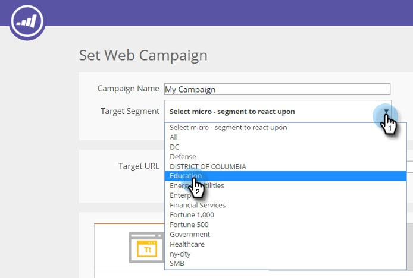

# Utilizzo di modelli per creare campagne web {#using-templates-to-create-web-campaigns}

Accelerare e semplificare il processo di creazione delle campagne web utilizzando i nostri modelli integrati o [salvare il proprio](save-your-campaign-as-a-template.md).

>[!NOTE]
>
>I modelli sono ottimizzati per tutti i dispositivi e le esperienze di navigazione sia per desktop che per dispositivi mobili.

1. Vai a **Campagne web**.

   

1. Fai clic su **Crea nuova campagna web**.

   

1. Denomina la campagna.

   

1. Seleziona un segmento di Target.

   

1. Fai clic su **Modelli**.

   

1. Seleziona l’area appropriata per la campagna da visualizzare e seleziona un modello adatto alle tue esigenze.

   >[!NOTE]
   >
   >Ci sono alcuni modelli interessanti tra cui scegliere, e aggiungeremo di più in futuro.

   

   >[!TIP]
   >
   >Per le campagne mobile, seleziona un modello dal **mobile** sezione .

1. Personalizza il modello.

   

1. Fai clic su **Salva**.

   

Ben fatto! Hai visto quanto tempo hai risparmiato utilizzando un modello?

>[!MORELIKETHIS]
>
>[Salvare una campagna come modello](/help/marketo/product-docs/web-personalization/using-templates/save-your-campaign-as-a-template.md)
