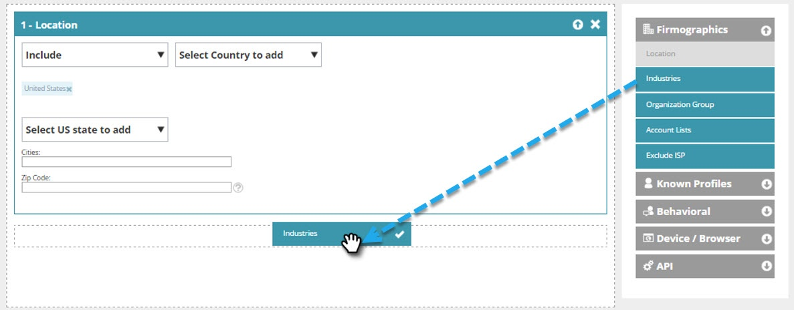

# Creare un segmento web di base {#create-a-basic-web-segment}

Creiamo un segmento di base destinato a tutti i visitatori web dagli Stati Uniti e dal settore dei servizi finanziari.

1. Passa a **[!UICONTROL Segments]**.

   

1. Fai clic su **[!UICONTROL Create New]**.

   

1. Inserisci il nome del segmento.

   

1. Trascina **[!UICONTROL Location]** dal menu di destra e rilascialo nell&#39;editor segmenti.

   

1. Seleziona un paese da aggiungere dal menu a discesa. Seleziona **Stati Uniti**.

   

   >[!NOTE]
   >
   >Il numero di città è limitato a 300 per segmento.

1. Trascina **[!UICONTROL Industries]** dal menu di destra e rilascialo nell&#39;editor segmenti.

   

1. Selezionare [!UICONTROL Industries] da aggiungere dal menu a discesa. Selezionare il settore **[!UICONTROL Financial Services]**.

   

   Ora hai impostato un segmento di base per tutti i potenziali clienti che visitano il tuo sito web dagli Stati Uniti e dal settore finanziario.

1. Fai clic su **[!UICONTROL Save]** per salvare il segmento o su **[!UICONTROL Save & Define Campaign]** per passare alla pagina Campagne.

   

Ora che hai segmentato i tuoi visitatori dagli Stati Uniti, vai avanti e aggiungi il settore dei servizi finanziari.

>[!MORELIKETHIS]
>
>[Segmenti Web](/help/marketo/product-docs/web-personalization/using-web-segments/web-segments.md)
