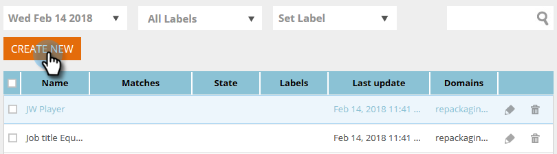
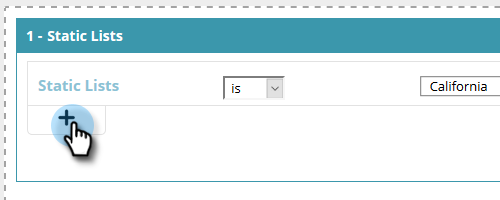

# Creare un segmento utilizzando un elenco statico {#create-a-segment-using-a-static-list}

Segmenta i visitatori Web noti quando visitano il tuo sito Web in base al fatto che si trovino o meno in uno dei tuoi [elenchi statici](/help/marketo/product-docs/core-marketo-concepts/smart-lists-and-static-lists/static-lists/understanding-static-lists.md) di Marketo.

1. Passa a **[!UICONTROL Segments]**.

   

1. Fai clic su **[!UICONTROL Create New]**.

   

1. Inserisci un Nome segmento.

   

1. In Lead noti trascinare **[!UICONTROL Static Lists]** nell&#39;area di lavoro.

   

1. Fare clic sull&#39;elenco a discesa per selezionare **[!UICONTROL is]** o **[!UICONTROL is not]** (a seconda di quello che si desidera) e digitare il nome dell&#39;elenco statico.

   

1. Per aggiungere più elenchi, è necessario creare una nuova riga per ciascuno di essi facendo clic su **+**. Se desideri un solo elenco, passa al [passaggio 8](#eight).

   

1. Per più elenchi (o più elenchi &quot;non è&quot;), ripetere i passaggi appresi in [Passaggio 5](#five).

   

   >[!NOTE]
   >
   >Il menu a discesa e/o è proprio questo. Fare clic per selezionare **[!UICONTROL and]**, **[!UICONTROL or]** o **[!UICONTROL and/or]**.

1. Fare clic su **[!UICONTROL Save]** per salvare il segmento o su **[!UICONTROL Save & Define Campaign]** per salvare e passare alla pagina [!UICONTROL Campaigns].

   
