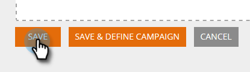

# Creare un segmento utilizzando un elenco statico {#create-a-segment-using-a-static-list}

Segmenta i visitatori web noti quando visitano il tuo sito web in base se si trovano o meno in uno dei tuoi Marketo [elenchi statici](/help/marketo/product-docs/core-marketo-concepts/smart-lists-and-static-lists/static-lists/understanding-static-lists.md).

1. Vai a **Segmenti**.

   

1. Fai clic su **Crea nuovo**.

   

1. Inserisci un nome per il segmento.

   

1. In Lead noti, trascina **Elenchi statici** verso l&#39;area di lavoro.

   

1. Fai clic sull’elenco a discesa per selezionare **è** o **non** (a seconda di cosa desideri), e digita il nome dell’elenco statico.

   

1. Per aggiungere più elenchi, è necessario creare una nuova riga per ciascuno di essi facendo clic sul pulsante **+**. Se desideri un solo elenco, passa a [Passaggio 8](#eight).

   

1. Per più elenchi (o più elenchi &quot;non è&quot;), ripeti i passaggi appresi in [Passaggio 5](#five).

   

   >[!NOTE]
   >
   >Il menu a discesa e/o è proprio questo. Fai clic su di esso per selezionarlo **e**, **o** oppure **e/o**.

1. Fai clic su **Salva** per salvare il segmento o **Salva e definisci campagna** per salvare e passare alla pagina Campagne .

   
