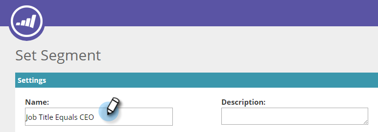

# Creare un segmento utilizzando dati di persona nota {#create-a-segment-using-known-person-data}

Ecco come creare un segmento utilizzando i valori Dati persona nota .

>[!PREREQUISITES]
>
>[Gestire i dati delle persone](/help/marketo/product-docs/web-personalization/using-web-segments/manage-person-data.md)

1. Vai a **Segmenti**.

   

1. Fai clic su **Crea nuovo**.

   

1. Inserisci un nome per il segmento.

   

1. In Segmentazione profilo, trascina **Database** verso l&#39;area di lavoro.

   

1. Seleziona un campo dati persona dal menu a discesa.

   

1. Immetti un valore Dati persona.

   

   Per ogni campo può essere presente un solo valore. Ad esempio, se si desidera aggiungere più valori per il campo del titolo del processo, è necessario creare una nuova riga con lo stesso nome di campo per ciascun valore. Assicurati di utilizzare il valore OR per assicurarsi che qualsiasi valore acquisisca una corrispondenza.

   

## Selezione di campi di dati a più persone {#selecting-multiple-person-data-fields}

1. Fai clic su **+** per aggiungere un altro campo dati persona.

   

1. Selezionare l’operatore AND/OR. Selezionare il campo da aggiungere. Selezionare un campo dati persona. Immettere il valore dei dati personali.

   

1. Fai clic su **Salva** per salvare il segmento o **Salva e definisci campagna** per salvare e passare alla pagina Campagne .

   

   Ora hai impostato un segmento che esegue il targeting dei dati della persona nota.
