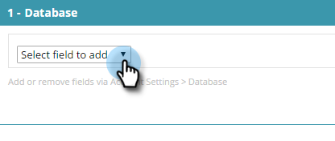
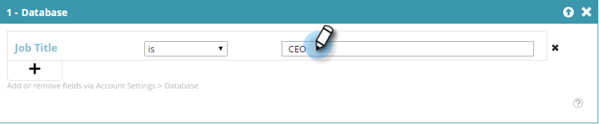

# Creare un segmento utilizzando i dati noti della persona {#create-a-segment-using-known-person-data}

Di seguito viene descritto come creare un segmento utilizzando i valori dei dati di persona noti.

>[!PREREQUISITES]
>
>[Gestisci dati persona](/help/marketo/product-docs/web-personalization/using-web-segments/manage-person-data.md)

1. Passa a **[!UICONTROL Segments]**.

   

1. Fai clic su **[!UICONTROL Create New]**.

   

1. Inserisci un Nome segmento.

   

1. In Segmentazione profilo, trascina **[!UICONTROL Database]** sull&#39;area di lavoro.

   

1. Seleziona un campo dati persona dal menu a discesa.

   

1. Immetti un valore per Dati persona.

   

   Può essere presente un solo valore per ogni campo. Ad esempio, se si desidera aggiungere più valori per il campo del titolo della mansione, è necessario creare una nuova riga con lo stesso nome di campo per ogni valore. Assicurati di utilizzare il valore OR per garantire che qualsiasi valore acquisisca una corrispondenza.

   

## Selezione di più campi dati persona {#selecting-multiple-person-data-fields}

1. Fare clic su **+** per aggiungere un altro campo dati persona.

   

1. Selezionare l&#39;operatore [!UICONTROL AND]/[!UICONTROL OR]. Seleziona il campo da aggiungere. Seleziona un campo dati persona. Immetti il valore dei dati della persona.

   

1. Fare clic su **[!UICONTROL Save]** per salvare il segmento o su **[!UICONTROL Save & Define Campaign]** per salvare e passare alla pagina [!UICONTROL Campaigns].

   

   Ora hai impostato un segmento che esegue il targeting dei dati di Persona nota.
