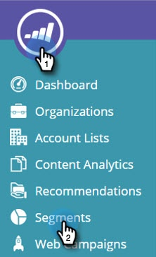
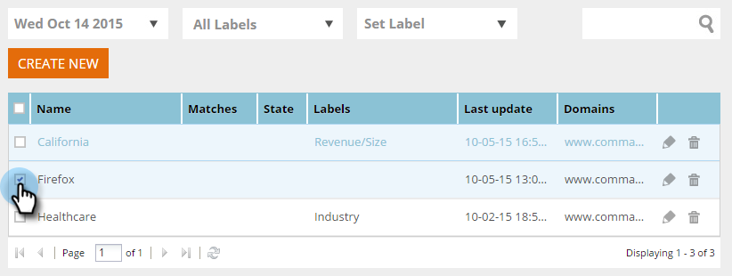
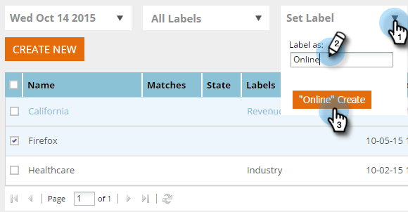

# Etichettare il segmento {#label-your-segment}

Hai così tanti segmenti che scorrere diventa complicato? Utilizza le etichette per assegnare tag ai segmenti in modo da poterli trovare rapidamente.

## Assegnare tag a un segmento {#tag-a-segment}

1. Accedere a [!DNL Web Personalization] e passare a **[!UICONTROL Segments]**.

   

1. Seleziona i segmenti ai quali desideri assegnare un tag con un’etichetta.

   

1. Per utilizzare un&#39;etichetta esistente, fare clic su **[!UICONTROL Set Label]**, selezionare una casella e fare clic su **[!UICONTROL Apply]**.

   

1. In alternativa, per creare una nuova etichetta, fare clic su **[!UICONTROL Set Label]**, immettere il nome della nuova etichetta e fare clic su **Crea nuova**.

   

   >[!NOTE]
   >
   >Il pulsante Crea nuovo mostra il nome della nuova etichetta. Se l’etichetta è troppo lunga, &quot;Crea nuovo&quot; potrebbe non essere visualizzato.

Fantastico! Ora sai come assegnare e creare etichette per i segmenti.
