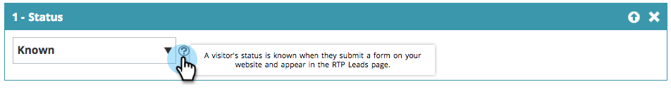
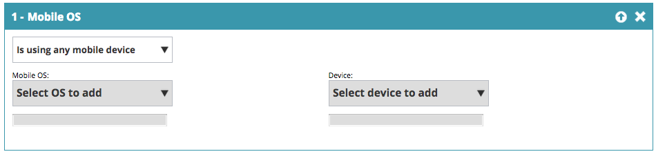

# Segmenti web {#web-segments}

## Visualizza segmento {#view-segment}

Nella scheda Segmenti vengono visualizzati tutti i segmenti personalizzati definiti in base a vari attributi.  **Un segmento è una raccolta di visitatori che soddisfano i criteri specificati nella pagina &quot;Imposta un segmento&quot;.**  Un segmento può essere costituito da visitatori di un settore, una posizione o un’attività nel sito specifici del visitatore.

In Personalizzazione web, un visitatore può far corrispondere più segmenti. Ad esempio, se è presente un segmento per i visitatori negli Stati Uniti e un segmento per le società di servizi finanziari, un visitatore Web di Bank of America corrisponderà a **entrambi** il segmento per il visitatore USA e il segmento per le società finanziarie.

**GRAFICO:**  La pagina Segmenti visualizza un grafico a barre dei segmenti selezionati in base al numero di visitatori dal segmento (asse y) e al nome del segmento (asse x).

<table> 
 <thead> 
  <tr> 
   <th colspan="1" rowspan="1">Nome</th> 
   <th colspan="1" rowspan="1">Descrizione</th> 
  </tr> 
 </thead> 
 <tbody> 
  <tr> 
   <td colspan="1" rowspan="1"><strong>Nome</strong></td> 
   <td colspan="1" rowspan="1">Titolo del segmento</td> 
  </tr> 
  <tr> 
   <td colspan="1" rowspan="1">
<strong>Corrisponde a</strong>
</td> 
   <td colspan="1" rowspan="1">Il numero di visitatori che soddisfano i criteri personalizzati e definiti del segmento</td> 
  </tr> 
  <tr> 
   <td colspan="1" rowspan="1"><strong>Imposta campagna</strong></td> 
   <td colspan="1" rowspan="1">Consente di impostare un CTA campagna associato al termine di ricerca selezionato</td> 
  </tr> 
  <tr> 
   <td colspan="1"><strong>Visitor</strong></td> 
   <td colspan="1">Anteprima della tabella dei visitatori associata al termine di ricerca selezionato</td> 
  </tr> 
  <tr> 
   <td colspan="1" rowspan="1"><strong>Clickstream</strong></td> 
   <td colspan="1" rowspan="1">Visualizza una tabella dell’attività e del percorso URL del visitatore sul sito, con indicazione di quanto tempo ha visitato ciascuna pagina. </td> 
  </tr> 
 </tbody> 
</table>

Consulta [come creare e visualizzare le etichette dei segmenti](/help/marketo/product-docs/web-personalization/using-web-segments/label-your-segment.md)

**Segmenti - Pannello di destra**

Selezionando un segmento nella tabella vengono visualizzati ulteriori dettagli sul segmento nel pannello di destra.

Tali dettagli includono:

* Nome del segmento
* Data di creazione del segmento
* Le campagne associate che mostrano le campagne che operano con il segmento. Facendo clic sul numero di reazioni si accede alla pagina delle campagne in cui viene visualizzato il CTA (invito all’azione) della campagna per il segmento
* Il numero di corrispondenze (numero di visitatori che hanno soddisfatto i criteri del segmento) per il segmento e il numero di visitatori distinti (univoci) che hanno soddisfatto il segmento. Facendo clic sul collegamento visitatore univoco si accede alla pagina del visitatore che mostra i risultati del segmento
* Proprietario/creatore utente del segmento
* I siti di dominio associati al segmento
* Breve riepilogo dei criteri selezionati per il segmento

## Attivare o disattivare un segmento {#enable-or-disable-a-segment}

Per abilitare o disabilitare un segmento, seleziona la casella di controllo di quel segmento nella tabella e nella casella a discesa &quot;Scegli azione&quot; nella parte inferiore della tabella seleziona l’azione &quot;Abilita&quot; o &quot;Disabilita&quot;. Quando un segmento è disattivato, nella colonna Stato viene visualizzata la parola &quot;disable&quot; (Disattiva).

## Creare segmenti {#create-segments}

Il segmento creato soddisfa i criteri specifici definiti nell&#39; **Imposta segmento** pagina. Puoi personalizzare i segmenti anche in base a una combinazione di criteri, con targeting per un pubblico specifico nella campagna.

Per creare un nuovo segmento

Dalla sezione **Segmenti** pagina, fai clic su **Crea nuovo** sotto il grafico. Viene visualizzata la seguente schermata.

Definisci i parametri generali per il segmento:

* **Nome:**  Denomina il segmento.
* **Descrizione:**  Fornisci una spiegazione più dettagliata dei criteri del segmento.
* **Domini:**  Seleziona i domini da includere nel segmento.
* **Logica della regola del segmento:**  Seleziona una logica AND/OR per generare ciascun attributo di segmentazione
* **Tempistica:** Definisci il livello di coinvolgimento dei visitatori desiderato nella campagna

   * **All&#39;entrata**: il coinvolgimento del visitatore arriva sul sito web
   * **Dopo il primo - nono clic**: coinvolgi il visitatore dopo una specifica quantità di clic sul sito web

>[!TIP]
>
>**Logica della regola del segmento**
>
>Sono disponibili tre opzioni di filtro:
>
>1. Usa tutti i filtri (1, 2 e 3...)
>1. Utilizza qualsiasi filtro (1, 2 o 3...)
>1. Filtri avanzati (utilizzando espressioni e/o)
>
>    I filtri avanzati ti consentono di controllare la condizione del segmento. Immettere i numeri di filtro separati da &quot;and&quot; e &quot;or&quot;.
>
>    * 1, 2 e 3
>    * 1, 2 o 3
>
>    La miscelazione di &quot;and&quot; e &quot;or&quot; richiede parentesi per chiarire l&#39;intenzione logica. ad esempio, &quot;1 o 2 e 3&quot; devono essere scritti in uno dei seguenti modi:
>
>    * 1 e 2 o 3
>    * (1 e 2) o 3
>
>    Le parentesi nidificate sono accettate per una logica più complicata.es.
>
>    * (1 e 2) o (3 e 4)
>    * 1 e (2 o (3 e 4))
>
>    Controlla la logica dopo qualsiasi operazione di inserimento, eliminazione o riordinamento.

Trascina e rilascia gli attributi del segmento dalla colonna di destra all’editor segmento sul lato sinistro:

### Firmografica {#firmographics}

**Posizione**

Trascina **Posizione** nell’editor segmento.

* Seleziona uno dei seguenti parametri:

   * **Includi** : seleziona se desideri che la campagna includa o escluda una posizione.
   * **Seleziona il paese da aggiungere** - Dall’elenco a discesa, seleziona il paese da includere nel segmento. Il nome del paese appare a destra. Puoi scegliere più paesi.

Una volta aggiunto il paese, puoi specificare anche lo stato, la città e il codice postale del segmento.

* **Seleziona Stato o Provincia da aggiungere** - Dall&#39;elenco a discesa, selezionare lo Stato degli Stati Uniti o la Provincia canadese che si desidera includere. Puoi effettuare più selezioni.
* **Codice postale** - Immetti il codice postale da includere nel segmento.
* **Città** - Immetti la città o le città da includere. Utilizzare un punto e virgola tra le città.

>[!TIP]
>
>**Quali condizioni di segmento scelgo? &quot;AND&quot; o &quot;OR&quot;?** O funziona come opzione aggiuntiva all’interno di ciascun campo. I potenziali clienti devono soddisfare solo uno dei criteri multipli selezionati all’interno di ciascun campo per qualificarsi per il segmento. Ad esempio, i clienti potenziali possono provenire da Stati Uniti, *o* dell&#39;industria della difesa). AND funge da parametro obbligatorio aggiuntivo che deve essere soddisfatto per questo segmento. (Ad esempio, le prospettive devono provenire sia dagli Stati Uniti che dall&#39;industria della Difesa). All’interno di ciascun profilo di segmentazione, ogni campo separato può funzionare come entrambi, sia come &quot;AND&quot; che come &quot;OR&quot; a seconda della Condizione del segmento selezionata.

**Settori** Sotto **Segmentazione del profilo** sezione, seleziona la casella accanto a **Settore**.

* Seleziona uno dei seguenti parametri:

   * **Include** : seleziona se desideri che il segmento includa o escluda un settore.
   * **Seleziona settori da aggiungere** - Seleziona il settore da includere nel segmento. Il settore viene visualizzato sotto la casella a discesa. Puoi scegliere tra più settori.

**Gruppo organizzazione**

Sotto **Segmentazione del profilo** sezione, seleziona la casella accanto a **Gruppo di organizzazioni.**

* Dalla casella di riepilogo a discesa, seleziona una delle seguenti opzioni:

   * Fortune 500 - Include solo le aziende Fortune 500 in questo segmento
   * Fortune 1000 - Include solo le aziende Fortune 1000 in questo segmento
   * Global 2000 - Include le aziende Global 2000 in questo segmento
   * Enterprise: include le organizzazioni con più di 1.000 dipendenti e ricavi superiori a 250 milioni di dollari
   * PMI: include solo le piccole e medie imprese in questo segmento

**-Account denominati-**

**Organismi**

* **Proviene da queste società (nomi specifici)**

   * Seleziona la società di destinazione dal menu a discesa &quot;Seleziona la società da aggiungere&quot;.
   * Puoi digitare il nome esatto dell’organizzazione di destinazione. *È _sempre_ Si consiglia di utilizzare Elenchi di account denominati invece di digitare i nomi manualmente per ottenere corrispondenze migliori (vedi sotto).

**Elenco account denominati**

Seleziona da un [Elenco account denominati](/help/marketo/product-docs/web-personalization/account-based-web-marketing/create-a-new-account-list.md) per segmentare i principali account target.

>[!NOTE]
>
>Il numero tra parentesi accanto al nome dell’elenco degli account denominati viene utilizzato come riferimento di indice per l’elenco per la personalizzazione web [API di lettura](https://developers.marketo.com/documentation/websites/rtp-js-api/).

**Escludi ISP**

Esclude i provider di servizi Internet (ISP) dal segmento.

### Persone note {#known-people}

**Database**

La personalizzazione web si integra con il tuo database Marketo, consentendoti di segmentare e personalizzare le campagne in base agli attributi e ai dati della persona nota.

Selezionare Database, quindi selezionare un campo dati persona dall&#39;elenco a discesa. Seleziona la **+** per aggiungere campi dal menu a discesa.

È possibile aggiungere o rimuovere campi dati persona da Impostazioni account > Database

>[!TIP]
>
>Crea i criteri di segmento in base a tutti i campi di dati relativi alle persone provenienti da Marketo, ad esempio Titolo mansione, Punteggio, Ruolo e così via.
>
>Esempio: &quot;Il titolo del lavoro è uguale a CMO&quot; e &quot;il punteggio è minore o uguale a 50&quot;

**Campagna e-mail Marketo** Segmenta e personalizza le campagne tramite riferimento e-mail da parte di un visitatore che fa clic su un’e-mail di Marketo e arriva sul sito. Segmentazione in base al nome del programma Marketo o al nome della campagna e continuazione della conversazione dall&#39;e-mail al Web. Seleziona il + per aggiungere campi dal menu a discesa.

**Stato**

Definisci il segmento in base allo stato di un potenziale cliente: noto o anonimo.

* Nota: seleziona questa opzione dall’elenco a discesa per i visitatori noti. Un visitatore è noto quando invia un modulo sul sito web e viene visualizzato nella pagina Persone per la personalizzazione web.
* Anonimo: seleziona questa opzione dall’elenco a discesa per i visitatori anonimi.

### Comportamento {#behavioral}

**Visite -** Definisci il segmento in base al comportamento o all’identificazione del visitatore.

* Numero di visite: seleziona questa opzione dalla casella a discesa per specificare il numero di visite per i potenziali clienti sul sito web.

   * Seleziona Uguale a, Uguale a o Maggiore di o Uguale a o Minore di dalla casella di riepilogo a discesa.

* Visite specifiche: seleziona questa opzione dalla casella a discesa per specificare un visitatore specifico.

   * Nella casella di testo a destra, immetti il numero del visitatore che desideri monitorare. Il numero di identificazione univoco del visitatore di Web Personalization si trova quando si fa clic su un visitatore (nella pagina dei visitatori) e si imposta Campaign sul pannello laterale destro. L’ID visitatore si trova nella sezione Impostazioni avanzate. L’ID visitatore si trova anche nell’URL (ad esempio VISITOR=JZZJIFJNUI60PZ8Y97BHTY9BL8PKWS).

**Termini di ricerca** - Definire un segmento in base ai termini di ricerca di un potenziale cliente.

* Il visitatore ha cercato: dall’elenco a discesa, seleziona i termini di cui vuoi tenere traccia dalla ricerca dei visitatori, oppure aggiungi i tuoi termini di ricerca. (Non è necessario utilizzare &#42; carattere jolly nei termini di ricerca poiché è impostato come predefinito per includere frasi che contengono il termine di ricerca).

**Riferimenti** : aggiungi gli URL di riferimento del visitatore.

* Seleziona i riferimenti da aggiungere: dall’elenco a discesa, seleziona i siti di riferimento di cui desideri tenere traccia o aggiungi un riferimento personalizzato. Una volta selezionati, i riferimenti verranno visualizzati nella casella sottostante. (utilizzando &#42; come carattere jolly è consentito)

**Includi pagine** : tieni traccia delle pagine specifiche potenziali visitate sul tuo sito web.

* Corrispondenze URL: aggiungi l’URL di specifiche pagine web di cui desideri tenere traccia. È possibile aggiungere più URL separandoli con un punto e virgola. (utilizzando &#42; come carattere jolly).

**Escludi pagine** : escludi le pagine specifiche alle quali non desideri far corrispondere i dati nel segmento. (utilizzando &#42; come carattere jolly).

* URL non corrispondente - Aggiungi l’URL di specifiche pagine web da escludere dal tracciamento. È possibile aggiungere più URL separandoli con un punto e virgola

### Dispositivo/Browser {#device-browser}

**Sistema operativo mobile**

Trascina e rilascia il sistema operativo Mobile nell’editor segmenti

* **Tipo di visitatore** 
  **Sistema operativo mobile** - Dall&#39;elenco a discesa, selezionare uno o più sistemi operativi mobili elencati. Il sistema operativo mobile selezionato viene visualizzato di seguito.

   * Il visitatore sta utilizzando un dispositivo mobile
   * Il visitatore sta utilizzando questo dispositivo/sistema operativo specifico
   * Il visitatore non utilizza alcun dispositivo mobile

* **Dispositivo**  - Dall’elenco a discesa, seleziona da uno o più dispositivi (Apple, Samsung, LG, HTC, Nexus, Blackberry, ecc.). I dispositivi selezionati vengono visualizzati di seguito.

**Browser**

Puoi indirizzare l’attività a visitatori che utilizzano tipi e/o versioni specifici del browser.

* Tipo di browser: dalla casella a discesa, seleziona uno o più browser Internet. I browser selezionati vengono visualizzati di seguito.
* Versione browser: immetti la versione del browser da aggiungere al segmento. Puoi selezionare più versioni separandole con una virgola. (utilizzando &#42; come carattere jolly).

### API {#api}

**Eventi dati** - Segmentare i visitatori che attivano eventi di dati personalizzati specifici

Aggiungi il valore Evento di destinazione. Ad esempio da fonti di dati di terze parti.

**API contesto utente**

Chiamata API di personalizzazione web  [ulteriori informazioni qui.](https://developers.marketo.com/documentation/websites/rtp-user-context-api/)

>[!TIP]
>
>**Utilizzo dei caratteri jolly -** Quando desideri includere un termine di ricerca o un URL che contenga qualcosa, ad esempio &quot;[google.com](https://google.com)&quot; o &quot;search term product&quot;, lo chiamiamo un carattere jolly e dovrebbe essere inserito un asterisco - questo piccolo ragazzo&#42; - su ciascuna estremità. Quindi tutto ciò che proviene da [google.com](https://google.com) deve essere immesso come &#42; [google.com](https://google.com)&#42;

## Modifica segmenti {#edit-segments}

Puoi modificare un segmento che è stato creato.

1. Per modificare un segmento, vai a **Segmenti**.

   

1. In **Segmenti** , fare clic sull&#39;icona di modifica ( ) del segmento che desideri modificare. Il **Imposta segmento** viene visualizzata la pagina con il segmento selezionato.
1. Applica al segmento le modifiche che desideri apportare.
1. Clic **Salva**.

## Eliminare segmenti {#delete-segments}

Puoi eliminare i segmenti creati.

1. Dalla sezione **Segmenti** nella pagina precedente, seleziona un segmento.
1. Fai clic sull’icona Elimina (  ) del segmento che desideri eliminare.
1. Viene visualizzato un messaggio di conferma che stai per eliminare **Segmento**.

>[!NOTE]
>
>Non puoi eliminare un segmento associato a una campagna. Devi innanzitutto eliminare la campagna e quindi il segmento.

Fantastico! Ora che conosci la sezione Segmenti, scopri le campagne.

>[!MORELIKETHIS]
>
>* [Creare un segmento web di base](/help/marketo/product-docs/web-personalization/using-web-segments/create-a-basic-web-segment.md)
>* [Creare una nuova campagna web per finestre di dialogo](/help/marketo/product-docs/web-personalization/working-with-web-campaigns/create-a-new-dialog-web-campaign.md)
>* [Crea una nuova campagna web nell’area](/help/marketo/product-docs/web-personalization/working-with-web-campaigns/create-a-new-in-zone-web-campaign.md)
>* [Crea una nuova campagna web widget](/help/marketo/product-docs/web-personalization/working-with-web-campaigns/create-a-new-widget-web-campaign.md)
