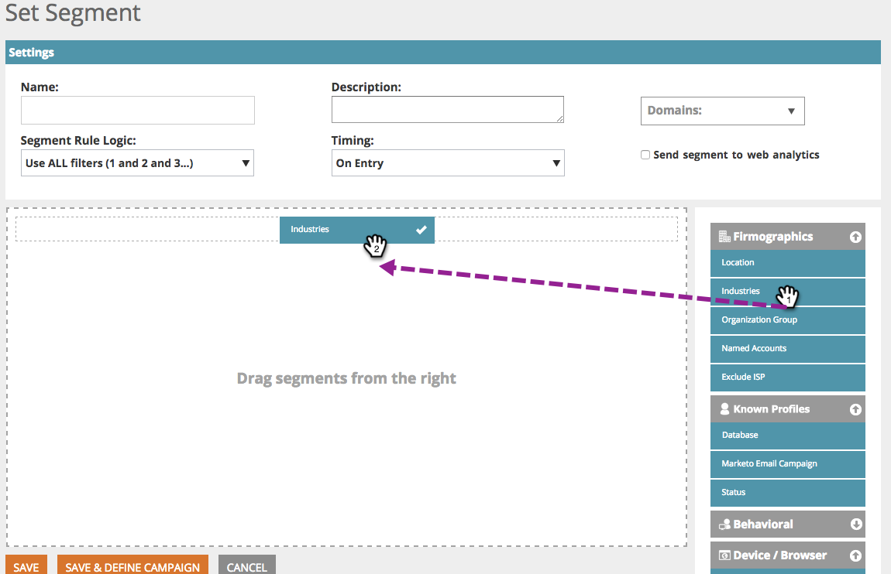

# Segmenti web {#web-segments}

## Visualizza segmento {#view-segment}

La scheda Segmenti visualizza tutti i segmenti definiti personalizzati che hai impostato in base a vari attributi.  **Un segmento è una raccolta di visitatori che soddisfano i criteri specificati definiti nella pagina &quot;Imposta un segmento&quot;.**  Un segmento può essere rappresentato da visitatori di un settore specifico, da una posizione o in base all’attività onsite del visitatore.

In Personalizzazione web, un visitatore può corrispondere a più segmenti. Ad esempio, se esiste un segmento per i visitatori degli Stati Uniti e un segmento per le società finanziarie, un visitatore web della Bank of America corrisponderebbe a **entrambi** il segmento per il visitatore USA e il segmento per le società finanziarie.

**GRAFICO:**  Nella pagina Segmenti viene visualizzato un grafico a barre dei segmenti selezionati in base al numero di visitatori del segmento (asse y) e al nome del segmento (asse x).

<table> 
 <thead> 
  <tr> 
   <th colspan="1" rowspan="1">Nome</th> 
   <th colspan="1" rowspan="1">Descrizione</th> 
  </tr> 
 </thead> 
 <tbody> 
  <tr> 
   <td colspan="1" rowspan="1"><strong>Nome</strong></td> 
   <td colspan="1" rowspan="1">Titolo del segmento</td> 
  </tr> 
  <tr> 
   <td colspan="1" rowspan="1">
<strong>Corrisponde</strong>
</td> 
   <td colspan="1" rowspan="1">Il numero di visitatori che soddisfano i criteri definiti e personalizzati del segmento</td> 
  </tr> 
  <tr> 
   <td colspan="1" rowspan="1"><strong>Imposta campagna</strong></td> 
   <td colspan="1" rowspan="1">Consente di impostare un CTA di campagna associato al termine di ricerca selezionato</td> 
  </tr> 
  <tr> 
   <td colspan="1"><strong>Visitatori</strong></td> 
   <td colspan="1">Anteprima della tabella dei visitatori associata al termine di ricerca selezionato</td> 
  </tr> 
  <tr> 
   <td colspan="1" rowspan="1"><strong>Clickstream</strong></td> 
   <td colspan="1" rowspan="1">Visualizza una tabella dell’attività e del percorso URL del visitatore sul sito e per quanto tempo ha visitato ogni pagina </td> 
  </tr> 
 </tbody> 
</table>

Vedi [come creare e visualizzare le etichette dei segmenti](/help/marketo/product-docs/web-personalization/using-web-segments/label-your-segment.md)

**Segmenti - Pannello a destra**

Quando si seleziona un segmento nella tabella, vengono visualizzati ulteriori dettagli sul segmento nel pannello a destra.

Tali dettagli includono:

* Nome del segmento
* Data di creazione del segmento
* Le campagne associate che mostrano le campagne che operano con il segmento. Fai clic sul numero di reazioni per passare alla pagina delle campagne in cui è visualizzato il CTA Campaign (Invito all’azione) per il segmento
* Il numero di corrispondenze (quantità di visitatori che soddisfano i criteri del segmento) per il segmento e il numero di visitatori distinti (univoci) che corrispondono al segmento. Facendo clic sul collegamento del visitatore univoco si passa alla pagina del visitatore in cui sono visualizzati i risultati del segmento
* Il proprietario/creatore utente del segmento
* I siti di dominio associati al segmento
* Breve riepilogo dei criteri selezionati per il segmento

## Attivare o disattivare un segmento {#enable-or-disable-a-segment}

Per abilitare o disabilitare un segmento, seleziona la casella di controllo di quel segmento nella tabella e nella casella a discesa &quot;Scegli azione&quot; in fondo alla tabella, seleziona l’azione &quot;Abilita&quot; o &quot;Disabilita&quot;. Quando un segmento è disabilitato, la parola &quot;disable&quot; viene visualizzata sotto la colonna Stato .

## Creare segmenti {#create-segments}

Il segmento creato soddisfa tutti i criteri specifici definiti nel **Imposta segmento** pagina. Puoi personalizzare i segmenti in base a una combinazione di criteri, eseguendo il targeting di un pubblico specifico nella tua campagna.

Per creare un nuovo segmento

Da **Segmenti** pagina, fai clic su **Crea nuovo** sotto il grafico. Viene visualizzata la seguente schermata.

Definisci i parametri generali del segmento:

* **Nome:**  Denomina il segmento.
* **Descrizione:**  Fornisci una spiegazione più dettagliata dei criteri del segmento.
* **Domini:**  Seleziona i domini da includere nel segmento.
* **Logica della regola del segmento:**  Selezionare una logica AND/OR per creare ogni attributo di segmentazione
* **Tempo:** Definire il livello di coinvolgimento del visitatore desiderato nella campagna

   * **All&#39;ingresso**: Il coinvolgimento del visitatore arriva sul sito web
   * **Dopo il 1° - 9° clic**: Coinvolgi il visitatore dopo una quantità specifica di clic sul sito web

>[!TIP]
>
>**Logica della regola del segmento**
>
>Sono disponibili tre opzioni di filtro:
>
>1. Usa tutti i filtri (1 e 2 e 3...)
>1. Usa eventuali filtri (1 o 2 o 3...)
>1. Filtri avanzati (tramite espressioni e/o )

   >
   >    I filtri avanzati consentono di controllare la condizione del segmento. Immettere i numeri del filtro separati da &quot;and&quot; e &quot;or&quot;.
   >
   >    * 1 e 2 e 3
   >    * 1 o 2 o 3

   >
   >    La miscelazione di &quot;e&quot; e &quot;o&quot; richiede una parentesi per chiarire le intenzioni logiche. ad esempio &quot;1 o 2 e 3&quot; deve essere scritto come segue:
   >
   >    * 1 e 2 o 3
   >    * (1 e 2) o 3

   >
   >    Le parentesi nidificate sono accettate per una logica più complessa, ad esempio
   >
   >    * (1 e 2) o (3 e 4)
   >    * 1 e 2 o 3 e 4)

   >
   >    Controlla la tua logica dopo qualsiasi inserimento, eliminazione o riordino.

Trascina gli attributi del segmento dalla colonna a destra nell’editor segmenti a sinistra:

### Firmografica {#firmographics}

**Posizione**

Trascinamento della selezione **Posizione** nell’editor dei segmenti.

* Seleziona uno dei seguenti parametri:

   * **Includi** - Seleziona se includere o escludere una posizione nella campagna.
   * **Selezionare il paese da aggiungere** - Dalla casella a discesa , seleziona il paese da includere nel segmento. Il nome del paese viene visualizzato a destra. È possibile scegliere più paesi.

Una volta aggiunto il paese, puoi specificare anche lo stato, la città e il codice postale del segmento.

* **Selezionare Stato o Provincia da aggiungere** - Dalla casella a discesa, selezionare lo stato degli Stati Uniti o la provincia canadese che si desidera includere. È possibile effettuare selezioni multiple.
* **Codice postale** - Inserisci il codice postale da includere nel segmento.
* **Città** - Entra nella città o nelle città che desideri includere. Usa un punto e virgola tra le città.

>[!TIP]
>
>**Quali sono le condizioni del segmento? &quot;AND&quot; o &quot;OR&quot;?** OR funziona come un’opzione aggiuntiva all’interno di ciascun campo. Per qualificarsi per il segmento, le prospettive devono soddisfare solo uno dei criteri multipli selezionati all’interno di ciascun campo. (Ad esempio, i potenziali clienti possono provenire dagli Stati Uniti *o* dall&#39;industria della difesa). E funziona come parametro obbligatorio aggiuntivo che deve essere soddisfatto per questo segmento. (Ad esempio, le prospettive devono essere sia dagli Stati Uniti che dall&#39;industria della difesa). All’interno di ciascun profilo di segmentazione, ogni campo separato può funzionare sia come &quot;AND&quot; che come &quot;OR&quot;, a seconda della condizione del segmento selezionata.

**Industrie** Sotto la **Segmentazione del profilo** , seleziona la casella accanto a **Industria**.

* Seleziona uno dei seguenti parametri:

   * **Include** - Seleziona se includere o escludere un settore nel segmento.
   * **Seleziona Settori da aggiungere** - Selezionare il settore da includere nel segmento. Il settore viene visualizzato sotto la casella a discesa. È possibile scegliere più settori.

**Gruppo di organizzazioni**

Sotto la **Segmentazione del profilo** , seleziona la casella accanto a **Gruppo di organizzazioni.**

* Dalla casella a discesa, seleziona una delle seguenti opzioni:

   * Fortune 500 - Include solo Fortune 500 aziende in questo segmento
   * Fortune 1000 - Include solo le aziende Fortune 1000 in questo segmento
   * Global 2000 - Comprende le 2000 aziende globali in questo segmento
   * Enterprise - Include organizzazioni con oltre 1.000 dipendenti e ricavi superiori a 250 milioni di dollari
   * SMB - Include solo piccole e medie imprese in questo segmento

**- Account denominati-**

**Organizzazioni**

* **Proviene da queste società (nomi specifici)**

   * Seleziona la società di cui eseguire il targeting dal menu a discesa Seleziona la società da aggiungere.
   * È possibile digitare il nome dell&#39;organizzazione desiderato. *È _sempre_ si consiglia di utilizzare Elenchi account denominati invece di digitare manualmente i nomi per ottenere corrispondenze migliori (vedi di seguito).

**Elenco account denominati**

Seleziona da un [Elenco account denominati](/help/marketo/product-docs/web-personalization/account-based-web-marketing/create-a-new-account-list.md) per segmentare gli account di destinazione chiave.

>[!NOTE]
>
>Il numero tra parentesi accanto al nome dell&#39;elenco di account denominato viene utilizzato come riferimento di indice per l&#39;elenco di personalizzazione web [API di lettura](https://developers.marketo.com/documentation/websites/rtp-js-api/).

**Escludi ISP**

Esclude i provider di servizi Internet (ISP) dal segmento.

### Persone conosciute {#known-people}

**Database**

La personalizzazione web si integra con il database Marketo, consentendoti di segmentare e personalizzare le campagne in base agli attributi e ai dati delle persone note.

Selezionare Database e selezionare un campo dati persona dal menu a discesa. Seleziona la **+** per aggiungere campi dal menu a discesa.

Puoi aggiungere o rimuovere i campi dati utente da Impostazioni account > Database

>[!TIP]
>
>Crea i criteri di segmento in base a tutti i campi di dati relativi alle persone di Marketo, ad esempio Titolo lavoro; Punteggio; Ruolo; ecc...
>
>Esempio &quot;Titolo processo è uguale a CMO&quot; e &quot;Punteggio è minore o uguale a 50&quot;

**Campagna e-mail Marketo** Segmenta e personalizza le campagne tramite riferimento e-mail da un visitatore che fa clic su un’e-mail Marketo e arriva sul sito. Segmenta per nome del programma Marketo o nome della campagna e continua la conversazione dall’e-mail al web. Seleziona il simbolo + per aggiungere campi dal menu a discesa.

**Stato**

Definisci il segmento in base allo stato di un potenziale cliente: noto o anonimo.

* Nota : seleziona questa opzione dalla casella a discesa per i visitatori noti. Un visitatore è noto quando invia un modulo sul sito web e viene visualizzato nella pagina Persone di personalizzazione web.
* Anonymous - Seleziona questa opzione dal menu a discesa per i visitatori anonimi.

### Comportamento {#behavioral}

**Visite -** Definisci il segmento in base al comportamento del visitatore o all’identificazione.

* Numero di visite : seleziona questa opzione dall’elenco a discesa per specificare il numero di visite potenziali sul sito web.

   * Selezionare Uguale a, Uguale o Maggiore di, o Uguale o Inferiore a dalla casella a discesa.

* Visite specifiche: seleziona questa opzione dalla casella a discesa per specificare un visitatore specifico.

   * Nella casella di testo a destra, immetti il numero del visitatore che desideri monitorare. Il numero identificativo univoco del visitatore di personalizzazione web si trova quando si fa clic su un visitatore (nella pagina visitatori) e sul pannello laterale destro Imposta campagna . L’ID visitatore si trova nella sezione Impostazioni avanzate . L’ID visitatore si trova anche nell’URL (ad esempio VISITOR=JZZJIFJNUI60PZ8Y97BHTY9BL8PKWS).

**Termini di ricerca** - Definire un segmento in base ai termini di ricerca di un potenziale cliente.

* Il visitatore ricercato - Dall’elenco a discesa, seleziona i termini da tracciare dalla ricerca dei visitatori o aggiungi i termini di ricerca personalizzati. (Non è necessario utilizzare &#42; carattere jolly nei termini di ricerca impostato come predefinito per includere frasi che contengono il termine di ricerca).

**Riferimenti** - Aggiungi gli URL a cui ha fatto riferimento il visitatore.

* Seleziona i riferimenti da aggiungere : dall’elenco a discesa, seleziona i siti di riferimento da tracciare o aggiungi un riferimento personalizzato. Una volta selezionati, i riferimenti verranno visualizzati nella casella sottostante. (Utilizzo di &#42; come un carattere jolly è consentito)

**Includi pagine** - Tieni traccia dei potenziali clienti visitati sul tuo sito web.

* Corrispondenza URL - Aggiungi l’URL di pagine web specifiche da monitorare. È possibile aggiungere più URL separandoli con un punto e virgola. (Utilizzo di &#42; come un carattere jolly è consentito).

**Escludi pagine** - Escludi pagine specifiche a cui non vuoi associare il segmento. (Utilizzo di &#42; come un carattere jolly è consentito).

* L’URL non corrisponde - Aggiungi l’URL di pagine web specifiche da escludere dal tracciamento. È possibile aggiungere più URL separandoli con un punto e virgola

### Dispositivo / Browser {#device-browser}

**Sistema operativo mobile**

Trascina il sistema operativo mobile nell’editor segmenti

* **Tipo di visitatore** 

   **Sistema operativo mobile** - Dalla casella a discesa, seleziona uno o più sistemi operativi mobili elencati. Il sistema operativo mobile selezionato viene visualizzato di seguito.

   * Il visitatore utilizza qualsiasi dispositivo mobile
   * Il visitatore utilizza questo dispositivo/sistema operativo specifico
   * Il visitatore non utilizza alcun dispositivo mobile

* **Dispositivo**  - Dall’elenco a discesa, seleziona uno o più dispositivi (Apple, Samsung, LG, HTC, Nexus, Blackberry, ecc.). I dispositivi selezionati vengono visualizzati di seguito.

**Browser**

Visitatore Target che utilizza tipi e/o versioni di browser specifici.

* Tipo di browser : seleziona uno o più browser Internet dalla casella a discesa . I browser selezionati vengono visualizzati di seguito.
* Versione browser - immetti la versione del browser che desideri aggiungere al segmento. È possibile selezionare più versioni separandole con una virgola. (Utilizzo di &#42; come un carattere jolly è consentito).

### API {#api}

**Eventi dati** - Segmentazione dei visitatori che attivano eventi di dati personalizzati specifici

Aggiungi il valore Evento di cui desideri eseguire il targeting. Ad esempio da fonti di dati di terze parti.

**API contestuale utente**

Chiamata API per la personalizzazione web  [ulteriori informazioni qui .](https://developers.marketo.com/documentation/websites/rtp-user-context-api/)

>[!TIP]
>
>**Utilizzo dei caratteri jolly -** Quando desideri includere un termine o un URL di ricerca che contiene qualcosa al suo interno, ovvero &quot;[google.com](https://google.com)&quot; o &quot;prodotto termine di ricerca&quot;, lo chiamiamo un carattere jolly e dovrebbe essere inserito con un asterisco - questo piccolo ragazzo&#42; - da ogni parte. Da tutto [google.com](https://google.com) deve essere immesso come &#42; [google.com](https://google.com)&#42;

## Modificare i segmenti {#edit-segments}

Puoi modificare un segmento creato.

1. Per modificare un segmento, vai a **Segmenti**.

   

1. In **Segmenti** fai clic sull’icona di modifica ( ) del segmento da modificare. La **Imposta segmento** si apre con il segmento selezionato.
1. Applica le modifiche o le modifiche che desideri apportare al segmento.
1. Fai clic su **Salva**.

## Eliminare segmenti {#delete-segments}

Puoi eliminare i segmenti creati.

1. Da **Segmenti** nella pagina precedente, seleziona un segmento.
1. Fai clic sull’icona Elimina (  ) del segmento da eliminare.
1. Viene visualizzato un messaggio di conferma che conferma l’imminente eliminazione del **Segmento**.

>[!NOTE]
>
>Non è possibile eliminare un segmento associato a una campagna. Innanzitutto devi eliminare la campagna e quindi il segmento.

Fantastico! Ora che conosci la sezione Segmenti , impariamo le campagne.

>[!MORELIKETHIS]
>
>* [Creare un segmento Web di base](/help/marketo/product-docs/web-personalization/using-web-segments/create-a-basic-web-segment.md)
>* [Creare una nuova finestra di dialogo Campagna web](/help/marketo/product-docs/web-personalization/working-with-web-campaigns/create-a-new-dialog-web-campaign.md)
>* [Creare una nuova campagna Web nella zona](/help/marketo/product-docs/web-personalization/working-with-web-campaigns/create-a-new-in-zone-web-campaign.md)
>* [Creare una nuova campagna web per i Widget](/help/marketo/product-docs/web-personalization/working-with-web-campaigns/create-a-new-widget-web-campaign.md)

