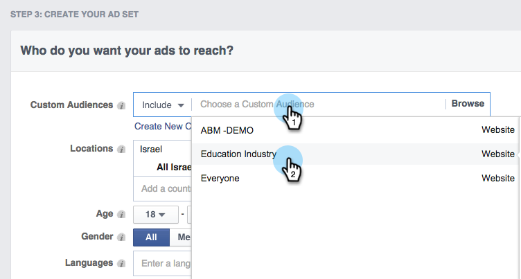
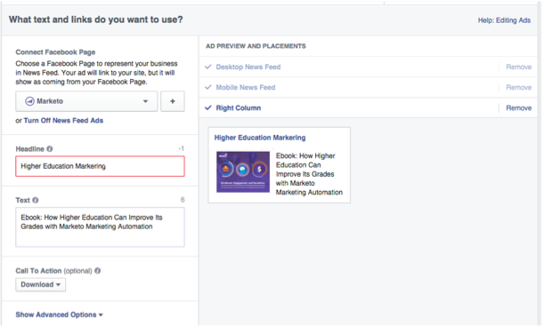

# Remarketing personalizzato in Facebook {#personalized-remarketing-in-facebook}

Il remarketing personalizzato consente di coinvolgere nuovamente gli utenti utilizzando i dati RTP e la potenza del remarketing Facebook.

>[!PREREQUISITES]
>
>* Completa il [Retargeting with Web Personalization Data](/help/marketo/product-docs/web-personalization/website-retargeting/retargeting-with-web-personalization-data.md) setup
>* Consulta la sezione  [Documentazione di facebook sui tipi di pubblico personalizzati](https://developers.facebook.com/docs/ads-for-websites/website-custom-audiences/getting-started#install-the-pixel) e il remarketing.

## Creazione di un pubblico in Facebook {#creating-an-audience-in-facebook}

1. In Facebook, vai al tuo [Scheda Pubblico](https://www.facebook.com/ads/audience_manager) in Ads Manager.

1. Fai clic su **Strumenti** e seleziona **Tipi di pubblico**.

   

1. Fai clic su **Creare un pubblico personalizzato**.

   

1. Seleziona **Traffico sito web**.

   

1. Nell’elenco Traffico sito web, seleziona **Combinazione personalizzata**.

   

1. Nell’elenco Includi, seleziona **Evento**.

   

1. Nell’elenco Evento, seleziona **Remarketing RTP** e seleziona un parametro.

   

1. Per questo esempio, selezionare Settore da contenere **Istruzione**. Invio **Istruzione** e modifica **Nell&#39;ultimo** 180 giorni. Immetti il nome del pubblico: **Industria dell&#39;istruzione**. Fai clic su **Crea pubblico**.

   

1. Ora hai creato un nuovo pubblico personalizzato utilizzando i dati RTP in Facebook.

   

## Punti dati RTP in Facebook {#rtp-data-points-in-facebook}

<table> 
 <tbody> 
  <tr> 
   <th>Nome evento</th> 
   <th> </th> 
  </tr> 
  <tr> 
   <td>Remarketing RTP</td> 
   <td> 
    
 
     <table> 
      <tbody> 
       <tr> 
        <th>Parametro</th> 
        <th>Valore</th> 
       </tr> 
       <tr> 
        <td>Elenco ABM</td> 
        <td>(Nome dell'elenco basato su conto)</td> 
       </tr> 
       <tr> 
        <td colspan="1">Categoria</td> 
        <td colspan="1">
Fortune 500

Fortuna 1000

Globale 2000
</td> 
       </tr> 
       <tr> 
        <td colspan="1">Gruppo</td> 
        <td colspan="1">
Enterprise

SMB
</td> 
       </tr> 
       <tr> 
        <td>Settore</td> 
        <td>
Difesa

Istruzione

Servizi finanziari

Governo

Medicale, Farma, Biotecnologia

Software e Internet

ecc.. (secondo le opzioni del settore RTP)
</td> 
       </tr> 
       <tr> 
        <td colspan="1">Pubblico segmentato</td> 
        <td colspan="1">(Nome del pubblico segmentato creato in RTP)</td> 
       </tr> 
      </tbody> 
     </table> 
    
</td> 
  </tr> 
 </tbody> 
</table>

## Eseguire il targeting del pubblico con un annuncio {#target-your-audience-with-an-ad}

Per ulteriori dettagli, consulta [Documentazione di facebook](https://developers.facebook.com/docs/ads-for-websites/website-custom-audiences/getting-started#target-your-audience).

1. Vai a Gestione annunci, fai clic su **Crea annuncio**.

   

1. Seleziona **Invia persone al tuo sito web** come obiettivo della campagna.

   

1. Inserisci l’URL del sito web.

   

1. Crea il tuo set di annunci. Seleziona un pubblico personalizzato dall’elenco dei tipi di pubblico creati, ad esempio Education Industry.

   

1. Seleziona tutte le altre opzioni di set di annunci, imposta il budget e definisci i creativi degli annunci.

   

1. Ora siete tutti configurati con una campagna di remarketing personalizzata in Facebook.

>[!MORELIKETHIS]
>
>* [Retargeting with Web Personalization Data](/help/marketo/product-docs/web-personalization/website-retargeting/retargeting-with-web-personalization-data.md)
>* [Remarketing personalizzato in Google](/help/marketo/product-docs/web-personalization/website-retargeting/personalized-remarketing-in-google.md)

