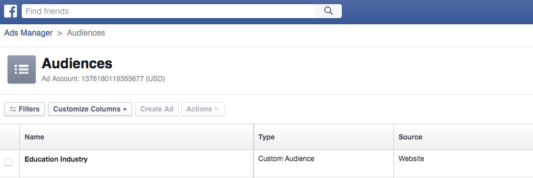

# Remarketing personalizzato in Facebook {#personalized-remarketing-in-facebook}

Il remarketing personalizzato consente di coinvolgere nuovamente gli utenti utilizzando i dati RTP e la potenza del remarketing Facebook.

>[!PREREQUISITES]
>
>* Completare l&#39;installazione di [Retargeting con dati Web Personalization](/help/marketo/product-docs/web-personalization/website-retargeting/retargeting-with-web-personalization-data.md)
>* Rivedi la [&#128279;](https://developers.facebook.com/docs/ads-for-websites/website-custom-audiences/getting-started#install-the-pixel) [documentazione di Facebook su tipi di pubblico personalizzati](https://developers.facebook.com/docs/ads-for-websites/website-custom-audiences/getting-started#install-the-pixel) e remarketing.

## Creazione di un pubblico in Facebook {#creating-an-audience-in-facebook}

1. In Facebook, vai alla [scheda Pubblico](https://www.facebook.com/ads/audience_manager) in Ads Manager.

1. Fai clic su **Strumenti** e seleziona **Tipi di pubblico**.

   

1. Fai clic su **Crea un pubblico personalizzato**.

   

1. Seleziona **Traffico sito Web**.

   

1. Nell&#39;elenco Traffico sito Web selezionare **Combinazione personalizzata**.

   

1. Nell&#39;elenco Includi selezionare **Evento**.

   

1. Nell&#39;elenco Evento, selezionare **Remarketing RTP** e selezionare un parametro.

   

1. Per questo esempio, seleziona Settore per contenere **Istruzione**. Immetti **Istruzione** e modifica **Negli ultimi** in modo che siano 180 giorni. Immetti Nome Pubblico: **Settore Dell&#39;Istruzione**. Fai clic su **Crea pubblico**.

   

1. Ora hai creato un nuovo pubblico personalizzato utilizzando i dati RTP in Facebook.

   

## Punti dati RTP in Facebook {#rtp-data-points-in-facebook}

<table> 
 <tbody> 
  <tr> 
   <th>Nome evento</th> 
   <th> </th> 
  </tr> 
  <tr> 
   <td>Remarketing RTP</td> 
   <td> 
    
 
     <table> 
      <tbody> 
       <tr> 
        <th>Parametro</th> 
        <th>Valore</th> 
       </tr> 
       <tr> 
        <td>Elenco ABM</td> 
        <td>(Nome dell’elenco basato sull’account)</td> 
       </tr> 
       <tr> 
        <td colspan="1">Categoria</td> 
        <td colspan="1">
Fortune 500

Fortune 1000

Globale 2000
</td> 
       </tr> 
       <tr> 
        <td colspan="1">Gruppo</td> 
        <td colspan="1">
Enterprise

PMI
</td> 
       </tr> 
       <tr> 
        <td>Settore</td> 
        <td>
Difesa

Istruzione

Servizi finanziari

Pubblica amministrazione

Sanità, Pharma, Biotech

Software e Internet

ecc... (secondo le opzioni RTP del settore)
</td> 
       </tr> 
       <tr> 
        <td colspan="1">Pubblico segmentato</td> 
        <td colspan="1">(Nome del pubblico segmentato creato in RTP)</td> 
       </tr> 
      </tbody> 
     </table> 
    
</td> 
  </tr> 
 </tbody> 
</table>

## Indirizza il pubblico con un annuncio {#target-your-audience-with-an-ad}

Per ulteriori dettagli, consulta la [documentazione di Facebook](https://developers.facebook.com/docs/ads-for-websites/website-custom-audiences/getting-started#target-your-audience).

1. Vai ad Ads Manager, fai clic su **Crea annuncio**.

   

1. Seleziona **Invia persone al tuo sito Web** come obiettivo della campagna.

   

1. Immetti l’URL del sito web.

   

1. Crea il set di annunci. Seleziona un pubblico personalizzato dall’elenco dei tipi di pubblico creati, ad esempio Settore dell’istruzione.

   

1. Seleziona tutte le altre opzioni per set di annunci, imposta il budget e definisci le creatività degli annunci.

   

1. Ora è tutto pronto per una campagna di remarketing personalizzata in Facebook.

>[!MORELIKETHIS]
>
>* [Retargeting con dati Web Personalization](/help/marketo/product-docs/web-personalization/website-retargeting/retargeting-with-web-personalization-data.md)
>* [Remarketing personalizzato in Google](/help/marketo/product-docs/web-personalization/website-retargeting/personalized-remarketing-in-google.md)
