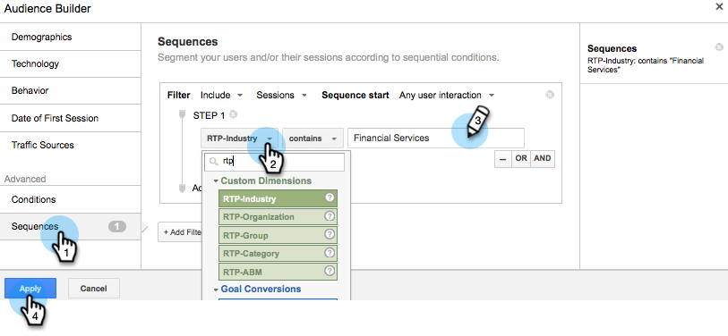
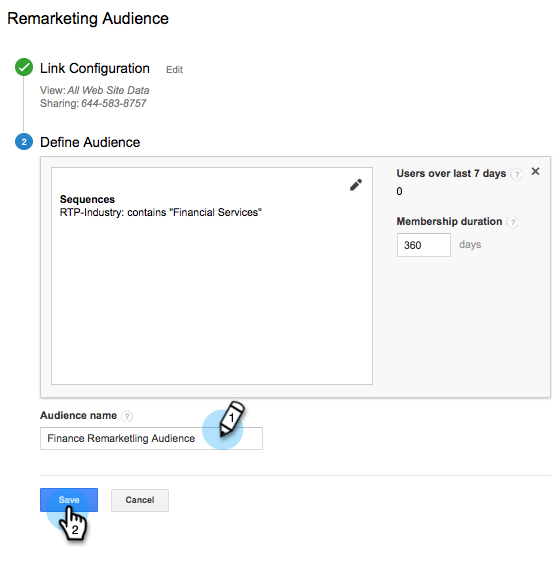
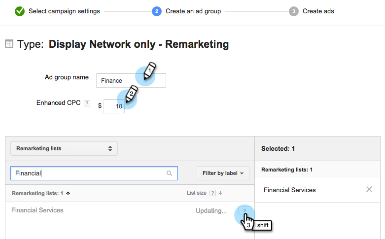

# Remarketing personalizzato in Google {#personalized-remarketing-in-google}

Il remarketing personalizzato consente di coinvolgere nuovamente gli utenti utilizzando i dati RTP e la potenza delle Google Analytics con la portata della rete di visualizzazione Google.

>[!PREREQUISITES]
>
>* Completa il [Retargeting with Web Personalization Data](/help/marketo/product-docs/web-personalization/website-retargeting/retargeting-with-web-personalization-data.md) configurazione
>* Revisione [Note con l’Aiuto di Google Analytics](https://support.google.com/analytics/topic/2611283?hl=en&amp;ref_topic=3413645) documentazione.

## Creazione di un pubblico di remarketing in Google {#creating-a-remarketing-audience-in-google}

1. Accedi alle tue Google Analytics. Fai clic su **Amministratore**, **Account**, **Proprietà**. Fai clic su **Definizioni del pubblico** e **Tipi di pubblico**.

   

1. Fai clic su **+Nuovo pubblico**.

   

1. **Configurazione collegamento**: Collega al tuo account Google Adwords. **Definire il pubblico**: Fai clic su **Crea nuovo**.

   

1. In Audience Builder, fai clic su **Sequenze** e **Trova i dati RTP** in Dimension personalizzati, Variabili personalizzate, Eventi.

>[!TIP]
>
>Come trovare i dati RTP in Analytics per generare il pubblico?
>
>In Google Analytics:
>
>* Variabili personalizzate: Organizzazione, industria
>* Categoria evento: Segmento, Insightera-CTA, RTP-Remarketing
>* Etichetta evento: Nome del segmento, nome della campagna, nome del pubblico segmentato
>
>In Google Universal Analytics:
>
>* Dimension personalizzati: Organizzazione, industria, categoria (Fortune 500.1000, Global 2000), gruppo (Enterprise, SMB), elenco ABM (Named Account List)
>* Categoria evento: Segmento RTP, RTP-Campaign RTP-Remarketing
>* Etichetta evento: Nome del segmento, nome della campagna, nome del pubblico segmentato

**Esempio di pubblico di remarketing da dati di pubblico segmentati RTP**

1. Fai clic su **Sequenze.**
1. Seleziona **Etichetta evento.**
1. Invio **Nome del pubblico segmentato** (come appare in RTP).
1. Fai clic su **Applica**.

**Esempio di pubblico dai dati del settore RTP**

1. Fai clic su **Sequenze**.
1. Seleziona **RTP-Industry**.
1. Invio **Nome dell&#39;industria** (es. Servizi finanziari, istruzione..).
1. Fai clic su **Applica**.
1. Inserisci un **Nome del pubblico**. Fai clic su **Salva**.

## Creare una campagna di remarketing pubblicitario in Google Adwords {#create-a-remarketing-ad-campaign-in-google-adwords}

1. Accedi a **Adwords Google**. Fai clic su **Campagne**, seleziona **Visualizza solo rete**.

   

1. Invio **Nome campagna**, Seleziona **Tipo di remarketing.**

   

1. Invio **Nome gruppo di annunci,** enter **CPC avanzato**, Seleziona **Elenco di remarketing**.

   

1. Fai clic su Salva e continua.
1. Aggiungi l’immagine o l’annuncio di testo e avvia la campagna di remarketing.

   

>[!MORELIKETHIS]
>
>* [Retargeting with Web Personalization Data](/help/marketo/product-docs/web-personalization/website-retargeting/retargeting-with-web-personalization-data.md)
>* [Remarketing personalizzato in Facebook](/help/marketo/product-docs/web-personalization/website-retargeting/personalized-remarketing-in-facebook.md)

