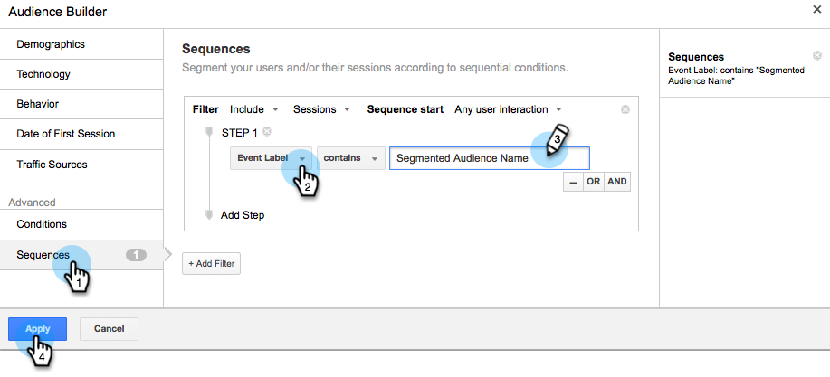

# Osservazioni personalizzate in Google {#personalized-remarketing-in-google}

La funzione di marcatura personalizzata consente di coinvolgere nuovamente gli utenti utilizzando i dati RTP e la potenza delle Google Analytics con la portata di Google Display Network.

>[!NOTE]
>
>**Prerequisiti**
>
>* Completare il [retargeting con la configurazione dei dati](retargeting-with-web-personalization-data.md) di personalizzazione Web
>* Consulta la [sezione Osservazioni con la documentazione della Guida](https://support.google.com/analytics/topic/2611283?hl=en&amp;ref_topic=3413645) sulle Google Analytics

>

## Creazione di un pubblico straordinario in Google {#creating-a-remarketing-audience-in-google}

1. Accedi alle tue Google Analytics. Fate clic su **Amministratore**, **Account**, **Proprietà**. Fate clic su Definizioni **di** pubblico e **pubblico**.

   

1. Fai clic su **+Nuovo pubblico**.

   

1. **Configurazione** collegamento: Collegamento all&#39;account Google Adwords
1. **Definisci pubblico**: Fate clic su **Crea nuovo**.

   

1. In Audience Builder, fai clic su **Sequenze** e **trova i dati** RTP in Dimension personalizzati, variabili personalizzate, eventi.

>[!TIP]
>
>Come trovare i dati RTP in Analytics per creare il pubblico?
>
>Nelle Google Analytics:
>
>* Variabili personalizzate: Organizzazione, Industria
>* Categoria evento: Segmento, Insightera-CTA, RTP-Note
>* Etichetta evento: Nome segmento, Nome campagna, Nome pubblico segmentato

>
>
In Google Universal Analytics:
>
>* Dimension personalizzati: Organizzazione, Industria, Categoria (Fortune 500.1000, Global 2000), Gruppo (Enterprise, SMB), Elenco ABM (Elenco Account Denominato)
>* Categoria evento: RTP-Segment, RTP-Campaign RTP-Note
>* Etichetta evento: Nome segmento, Nome campagna, Nome pubblico segmentato

>

**Esempio di notorietà dell&#39;audience dai dati dell&#39;audience segmentata RTP**

1. Fate clic su **Sequenze.**
1. Selezionate Etichetta **evento.**
1. Immettete il **nome dell’audience** segmentata (così come viene visualizzata in RTP).
1. Fate clic su **Applica**.

**Esempio di pubblico dai dati del settore RTP**

1. Fate clic su **Sequenze**.
1. Selezionare** RTP-Industry**.
1. Immettere il **nome dell&#39;industria** (ad esempio Servizi finanziari, istruzione...)
1. Fate clic su **Applica**.
1. Immettete un nome per **l&#39;audience**. Fate clic su **Salva**.

## Creazione di una campagna pubblicitaria per commenti in Google Adwords {#create-a-remarketing-ad-campaign-in-google-adwords}

1. Accedi a **Google Adwords**. Fate clic su **Campagne**, quindi selezionate **Visualizza solo** rete.

   

1. Immettete Nome **** Campagna, Selezionate **Tipo Di Notazione.**

   

1. Immettere Nome gruppo **annunci,** immettere **Enhanced CPC**, selezionare **Elenco** commenti.

   

1. Fate clic su Salva e continuate.
1. Aggiungi l&#39;immagine o l&#39;annuncio di testo e inizia la tua campagna di remarketing.

   

>[!NOTE]
>
>**Articoli correlati**
>
>* [Ritargeting con dati di personalizzazione Web](retargeting-with-web-personalization-data.md)
>* [Osservazioni personalizzate su Facebook](personalized-remarketing-in-facebook.md)

