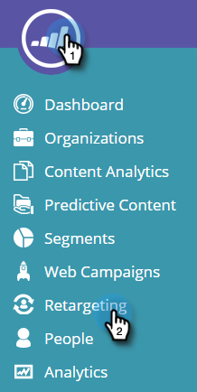
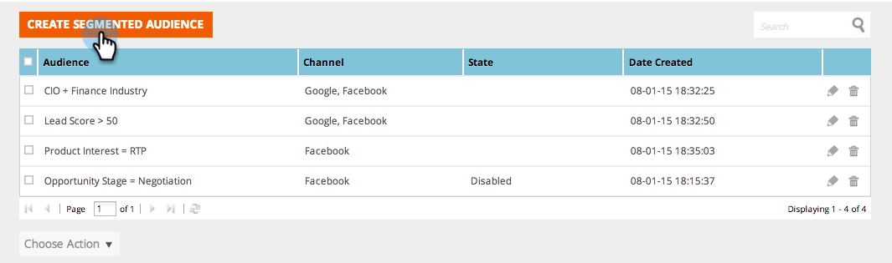
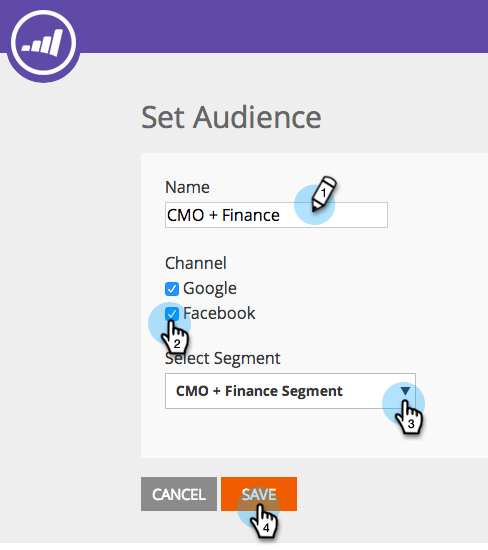

# Retargeting con dati di personalizzazione web {#retargeting-with-web-personalization-data}

>[!AVAILABILITY]
>
>Il retargeting dei siti web ora rientra nel riquadro Personalizzazione web. Se hai acquistato solo il retargeting, visualizzerai questa sezione e accederai al prodotto di personalizzazione web con **solo** Funzioni di retargeting abilitate. In questo modo puoi accedere alle impostazioni dell’account, alla pagina Retargeting, ai segmenti e alle pagine di tracciamento aggiuntive.

Il remarketing è destinato ai potenziali clienti che hanno visitato il tuo sito in passato con display advertising in base a chi sono e a cosa hanno fatto. Il retargeting personalizzato è destinato a tipi di pubblico specifici con annunci pertinenti basati su dati di settore, account denominati e persone note.

La personalizzazione web aggiunge attualmente i dati alle seguenti piattaforme di remarketing:

* [Google](/help/marketo/product-docs/web-personalization/website-retargeting/personalized-remarketing-in-google.md)
* [Facebook](/help/marketo/product-docs/web-personalization/website-retargeting/personalized-remarketing-in-facebook.md)

La personalizzazione web invia i seguenti dati alle piattaforme di remarketing per creare tipi di pubblico ed eseguire campagne pubblicitarie di remarketing:

<table> 
 <tbody> 
  <tr> 
   <th colspan="1">Dati di personalizzazione web</th> 
  </tr> 
  <tr> 
   <th>
Settore
</th> 
  </tr> 
  <tr> 
   <th>
Gruppo (Enterprise, SMB)
</th> 
  </tr> 
  <tr> 
   <th>
Categoria (Fortune 500/1000, Global 2000)
</th> 
  </tr> 
  <tr> 
   <th>
Elenco ABM (elenchi account denominati)
</th> 
  </tr> 
  <tr> 
   <th>
Pubblico segmentato (in base ai segmenti)
</th> 
  </tr> 
  <tr> 
   <th>
Campagne Web selezionate
</th> 
  </tr> 
 </tbody> 
</table>

## Configurazione remarketing {#remarketing-configuration}

1. Vai a **Retargeting**.

   

   >[!NOTE]
   >
   >La configurazione del retargeting è per dominio o sottodominio. Attiva gli altri domini se desideri inviare dati da tali domini alla piattaforma di retargeting.

1. Attiva le impostazioni per Google Analytics o Google Universal Analytics per dominio.

   >[!NOTE]
   >
   >Devi avere il Tag di retargeting Google implementato sul tuo sito web.
   >
   >Se l&#39;integrazione è già stata impostata con Personalizzazione Web e Google Analytics, non è necessario modificare questa parte in quanto si tratta della stessa configurazione in Impostazioni account.

   

1. Attiva la configurazione per Facebook. Fai clic su ed espandi il pannello a soffietto Facebook, quindi fai clic su **On** per inviare i rispettivi Eventi e dati tramite a Facebook Audience Manager. Clic **Salva**.

   >[!NOTE]
   >
   >Devi avere [Pixel pubblico personalizzato facebook](https://developers.facebook.com/docs/ads-for-websites/website-custom-audiences/getting-started#install-the-pixel)ha installato il tuo sito web per far funzionare questa funzione.

   

## Creazione di un pubblico segmentato {#creating-segmented-audience}

Un pubblico segmentato consente di selezionare un segmento esistente come pubblico da utilizzare per le campagne di retargeting. Ad esempio, selezionando i segmenti Persona nota.

>[!TIP]
>
>Non è necessario creare un pubblico segmentato per il settore o altri dati già inviati tramite nella configurazione del dominio. È meglio utilizzare i tipi di pubblico segmentati per segmenti basati su dati di persone note.

1. Clic **Creare un pubblico segmentato**.

   

1. Inserisci il Nome del pubblico, seleziona Canali, quindi seleziona Segmento dall’elenco dei Segmenti esistenti.

   

1. Clic **Salva**.

   Hai completato la configurazione del retargeting in Personalizzazione web, accedi alle piattaforme di retargeting, crea i tipi di pubblico in base a questi dati e configura le campagne pubblicitarie di retargeting.
