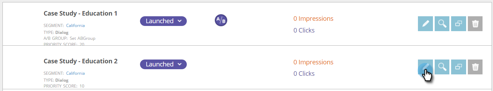

# AB Testa la tua campagna web {#ab-test-your-web-campaign}

Il test è un ottimo modo per ottimizzare le campagne web per un migliore coinvolgimento. Ecco come iniziare.

Per testare A/B le campagne personalizzate, puoi selezionare due o più campagne e associarle alla stessa **Test diviso** e seleziona **Ottimizzazione automatica** per continuare automaticamente con la campagna con le prestazioni migliori.

>[!TIP]
>
>Se preferisci calcolare manualmente e vedere quale campagna funziona meglio, non abilitare la funzione di ottimizzazione automatica.

## Come impostare un test A/B diviso {#how-to-set-up-a-split-a-b-test}

1. Vai a Campagne web.

   

   >[!NOTE]
   >
   >Per trovare più facilmente la campagna desiderata, utilizza la variabile [funzione filtro](/help/marketo/product-docs/web-personalization/working-with-web-campaigns/filter-web-campaigns.md).

1. Seleziona la prima campagna da sottoporre a test A/B. Fai clic su **Modifica**.

   

1. Nella pagina della campagna, seleziona **Test di divisione** e fai clic su **Crea nuovo**.

   

1. Inserisci il **Nome gruppo di test diviso**, fai clic su **Crea**. Seleziona **Ottimizzazione automatica**.

   

1. **Salva** o **Launch** la campagna.

   >[!TIP]
   >
   >Selezione **Ottimizzazione automatica** consente alla piattaforma di personalizzazione web di riconoscere automaticamente la campagna di test con più prestazioni e continua con la campagna di conversione più elevata, mettendo in pausa le altre.

1. Ripeti il processo precedente con la seconda campagna.

1. Seleziona la seconda campagna da sottoporre a test A/B. Fai clic su **Modifica**.

   

1. In **Imposta campagna** pagina, seleziona **Test di divisione** e scegli la **Gruppo** dal menu a discesa. Seleziona **Ottimizzazione automatica**.

   

1. **Salva** o **Launch** la campagna.

1. Ripeti questo processo per una terza o quarta campagna da testare.

1. In **Campagne web** puoi vedere le campagne di test suddivisi identificate dall’icona A/B .

   

>[!TIP]
>
>1. Puoi testare tutte le campagne che desideri. Procedure consigliate: da due a tre campagne
>1. Assicurati che ogni gruppo di test diviso sia associato allo stesso segmento. Vuoi eseguire il test verso lo stesso pubblico.
>1. Prova diverse parti di contenuto (Case Study A vs. Case Study B), cambia messaggi e creativi, colori, dimensioni o invito ad azioni.
>1. Ottimizza e godi i tuoi contenuti personalizzati!

>[!MORELIKETHIS]
>
>* [Creare una campagna di dialogo](/help/marketo/product-docs/web-personalization/working-with-web-campaigns/create-a-new-dialog-web-campaign.md)
>* [Creare una RTP in una campagna di zona](/help/marketo/product-docs/web-personalization/working-with-web-campaigns/create-a-new-in-zone-web-campaign.md)
>* [Creare una campagna Widget RTP](/help/marketo/product-docs/web-personalization/working-with-web-campaigns/create-a-new-widget-web-campaign.md)

