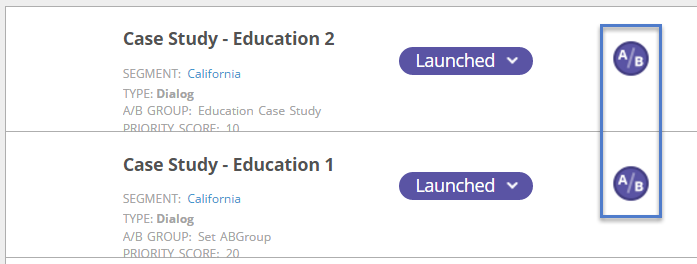

# AB Test Your Web Campaign {#ab-test-your-web-campaign}

Il test è un ottimo modo per ottimizzare le campagne Web per un migliore coinvolgimento. Ecco come iniziare.

Per sottoporre a test A/B le campagne personalizzate, potete selezionare due o più campagne, associarle allo stesso gruppo **Split Test** (Test **diviso) e selezionare** Auto-Tuneper continuare automaticamente con la campagna con le prestazioni migliori.

>[!TIP]
>
>Se preferite calcolare manualmente e vedere quale campagna funziona meglio, non attivate Auto-Tuning.

## Come impostare un test A/B diviso {#how-to-set-up-a-split-a-b-test}

1. Vai a Campagne Web.

   

   >[!NOTE]
   >
   >Per trovare più facilmente la campagna desiderata, utilizzate la funzione filtro.

1. Selezionate la prima campagna da sottoporre a test A/B. Fate clic su **Modifica**.

   

1. Nella pagina della campagna, selezionate **Dividi test** e fate clic su **Crea nuovo**.

   

1. Immettete il nome **del gruppo di test** divisa e fate clic su **Crea.** Selezionate **Regola automatica.**

   

1. **Salvare **o** avviare **la campagna.

   >[!TIP]
   >
   >Selezionando **Auto-Tune** la piattaforma Web Personalization (Personalizzazione Web) riconosce automaticamente la campagna di test con suddivisione più performante e continua con la campagna di conversione più elevata, mettendo in pausa gli altri.

1. Ripetete la procedura descritta sopra con la seconda campagna.
1. Selezionate la seconda campagna da sottoporre a test A/B. Fate clic su **Modifica**.

   ** 

   **

1. Nella pagina **Imposta campagna** , selezionate **S****plit Testing** e scegliete il **gruppo** dall&#39;elenco a discesa. Selezionare** Auto-Tune**.

   

1. **Salvare **o **Avviare **la campagna.
1. Ripetete questo processo per una terza o quarta campagna da sottoporre a test.
1. In **Web** **Campaigns** è possibile visualizzare le campagne di test divise indicate dall&#39;icona A/B.

   

>[!TIP]
>
>1. Potete sottoporre a test tutte le campagne desiderate. Best practice: da due a tre campagne
>1. Accertatevi che ogni gruppo di test con suddivisione sia associato allo stesso segmento. Desiderate eseguire il test per lo stesso pubblico.
>1. Provate contenuti diversi (Case Study A e Case Study B), modificate i messaggi e le creatività, i colori, le dimensioni o le chiamate alle azioni.
>1. Ottimizzate e fruite dei vostri contenuti personalizzati!

>

>[!MORELIKETHIS]
>
>* [Creazione di una campagna di dialogo](create-a-new-dialog-web-campaign.md)
>* [Creazione di una campagna RTP nella zona](create-a-new-in-zone-web-campaign.md)
>* [Creare una campagna Widget RTP](create-a-new-widget-web-campaign.md)

>

