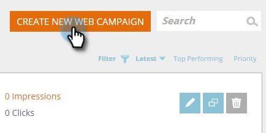

# Aggiunta di un URL Target a una campagna Web {#adding-a-target-url-to-a-web-campaign}

Un URL di destinazione si trova nella pagina Imposta campagna e definisce l&#39;URL o gli URL specifici sui quali verrà visualizzata una campagna Web.

## Aggiunta di un URL Target per la finestra di dialogo o per le campagne Web Widget {#adding-a-target-url-for-dialog-or-widget-web-campaigns}

1. Vai a Campagne **Web**.

   

1. Selezionate **Crea nuova campagna** Web.

   

1. Aggiungi un nome **** campagna. Selezionate un segmento **** di destinazione. Aggiungi URL **** Target.

   

<table> 
 <thead> 
  <tr> 
   <th colspan="1" rowspan="1">Nome</th> 
   <th colspan="1" rowspan="1">Descrizione</th> 
  </tr> 
 </thead> 
 <tbody> 
  <tr> 
   <td colspan="1" rowspan="1"><strong>Qualsiasi pagina</strong></td> 
   <td colspan="1" rowspan="1">
Consenti la visualizzazione della campagna su qualsiasi pagina.
</td> 
  </tr> 
  <tr> 
   <td colspan="1" rowspan="1">
<strong>Includi parametro URL nella corrispondenza</strong>
</td> 
   <td colspan="1" rowspan="1">Aggiungete il parametro URL per far corrispondere e mostrare la campagna sugli URL, incluso questo parametro. Esempio campaign=cpc</td> 
  </tr> 
 </tbody> 
</table>

## Aggiunta di più URL all&#39;URL di Target {#adding-multiple-urls-to-target-url}

Facendo clic sull’icona più () si aprirà la finestra di dialogo Immissione più valori per aggiungere più URL. Aggiungete un URL per riga.

>[!NOTE]
>
>
>* Le campagne Web per la finestra di dialogo e i widget possono utilizzare le opzioni Qualsiasi pagina e Carattere jolly (*).
* In casi di utilizzo avanzati, le campagne Web In Zone possono utilizzare caratteri jolly alla fine del percorso URL. Esempio: [www.marketo.com/software/personalization/*](http://www.marketo.com/software/personalization/*)
* L’URL fa distinzione tra maiuscole e minuscole

## Aggiunta di un URL Target per campagne Web In Zone {#adding-a-target-url-for-in-zone-web-campaigns}

1. Vai a **Web** **Campaigns**.

   

1. Selezionate **Crea nuova campagna** Web.

   

1. Aggiungi un** Nome campagna**. Selezionate un segmento **** di destinazione. Aggiungi URL **** Target.

   >[!NOTE]
   L’URL di destinazione con Nelle aree deve definire un URL o URL specifici. In casi di utilizzo avanzati, le campagne Web In Zone possono utilizzare caratteri jolly alla fine del percorso URL. Esempio: [www.marketo.com/software/personalization/*](http://www.marketo.com/software/personalization/*)

   

>[!MORELIKETHIS]
* [Creazione di una nuova finestra di dialogo Web Campaign](create-a-new-dialog-web-campaign.md)
* [Creare una nuova campagna Web nella zona](create-a-new-in-zone-web-campaign.md)
* [Creare una nuova campagna Web Widget](create-a-new-widget-web-campaign.md)

