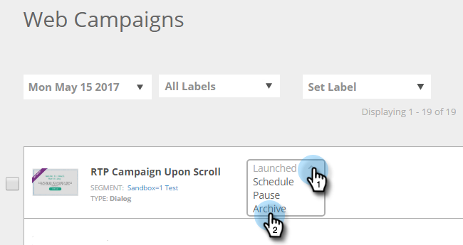

# Archiviare una campagna web {#archive-a-web-campaign}

1. Vai a **Campagne web**.

   

1. Fai clic sull’elenco a discesa dello stato della campagna web desiderata e seleziona **Archivia**.

   

   >[!NOTE]
   >
   >Le campagne web archiviate non verranno visualizzate nel filtro predefinito. Per visualizzarli, fai clic sull’icona Filtro e sotto **Stato**, seleziona **Archiviato** seleziona e fai clic su **Applica**.

>[!MORELIKETHIS]
>
>[Eliminare una campagna web](/help/marketo/product-docs/web-personalization/working-with-web-campaigns/delete-a-web-campaign.md)
