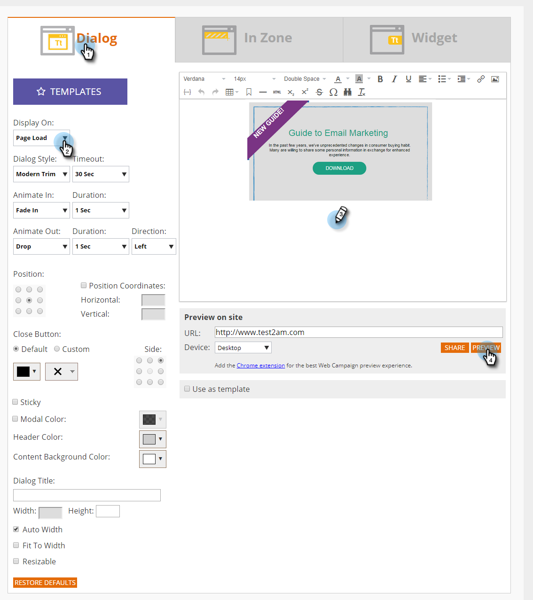

# Creare una nuova campagna web per finestre di dialogo {#create-a-new-dialog-web-campaign}

## Creare una campagna web per finestre di dialogo {#create-a-dialog-web-campaign}

Crea una campagna web per personalizzare i contenuti web in tempo reale e fornire all’utente giusto al momento giusto il messaggio giusto.

Una campagna web è una reazione personalizzata associata a un segmento specifico. La reazione può essere una finestra di dialogo sul sito Web, e [nella zona di sostituzione](/help/marketo/product-docs/web-personalization/working-with-web-campaigns/create-a-new-in-zone-web-campaign.md), a [funzione widget](/help/marketo/product-docs/web-personalization/working-with-web-campaigns/create-a-new-widget-web-campaign.md) o un avviso e-mail.

1. Vai a **Campagne web**.

   

1. Seleziona **Crea nuova campagna web**.

   

1. Seleziona la **Finestra di dialogo** tipo di campagna web. Progetta e aggiungi il tuo contenuto creativo nell’editor. Clic **Anteprima** per vedere come reagirà la campagna web sul tuo sito.

   

<table> 
 <thead> 
  <tr> 
   <th colspan="1" rowspan="1">Nome</th> 
   <th colspan="1" rowspan="1">Descrizione</th> 
  </tr> 
 </thead> 
 <tbody> 
  <tr> 
   <td colspan="1"><strong>Visualizza su</strong></td> 
   <td colspan="1">Ti consente di: <a href="/help/marketo/product-docs/web-personalization/working-with-web-campaigns/set-how-your-web-campaign-displays.md" rel="nofollow">personalizzare quando e come</a> viene visualizzata la campagna web.</td> 
  </tr> 
  <tr> 
   <td colspan="1" rowspan="1"><strong>Stile finestra di dialogo</strong></td> 
   <td colspan="1" rowspan="1"> 
    <ul> 
     <li>Modern Trim - Un dialogo elegante e distintivo con un trim nero semitrasparente e angoli arrotondati</li> 
     <li>Modern Trim II - Un dialogo elegante e distintivo con un bordo ombreggiatura chiaro e angoli arrotondati e pulsante di chiusura</li> 
     <li>Trasparente: una finestra di dialogo completamente trasparente, ideale per immagini trasparenti (png) per gli inviti all’azione. </li> 
     <li>Base: una finestra di dialogo di stile semplice, con uno spazio di intestazione del titolo più spesso che soddisfa le esigenze di base della finestra di dialogo.</li> 
    </ul></td> 
  </tr> 
  <tr> 
   <td colspan="1"><strong>Animazione in/out</strong></td> 
   <td colspan="1">Impostato all’ingresso e/o all’uscita della finestra di dialogo. Selezionare effetto (rilascio, cieco, scorrimento, dissolvenza, nessun effetto), durata (in secondi) e direzione (su, giù, sinistra, destra).</td> 
  </tr> 
  <tr> 
   <td colspan="1" rowspan="1">
<strong>Posizione</strong>
</td> 
   <td colspan="1" rowspan="1">Selezionate una delle 9 opzioni per la posizione della finestra di dialogo sulla pagina. Se ad esempio si seleziona la casella centrale, la finestra di dialogo viene visualizzata al centro dello schermo.</td> 
  </tr> 
  <tr> 
   <td colspan="1" rowspan="1">
<strong>Per coordinate</strong>

 
</td> 
   <td colspan="1" rowspan="1">Per ulteriori opzioni di posizionamento della finestra di dialogo, selezionare la casella di controllo "Coordinate posizione" e immettere le coordinate esatte dello schermo (Orizzontale, Verticale) in cui si desidera visualizzare la finestra di dialogo.</td> 
  </tr> 
  <tr> 
   <td colspan="1"><strong>Riempimento pulsante</strong></td> 
   <td colspan="1">Personalizza il pulsante di chiusura del modale utilizzando colore, stile e posizione. Puoi anche utilizzare un pulsante personalizzato collegandolo nella casella URL immagine.</td> 
  </tr> 
  <tr> 
   <td colspan="1"><strong>Sticky</strong></td> 
   <td colspan="1">Selezionando la casella di controllo persistente, la finestra di dialogo rimane in posizione, senza alcun limite di tempo, fino alla chiusura da parte dell’utente e viene visualizzata in tutte le pagine della sessione del visitatore.</td> 
  </tr> 
  <tr> 
   <td colspan="1"><strong>Modale</strong></td> 
   <td colspan="1">Consente di attivare la finestra di dialogo e di avviarla con uno sfondo scuro dietro la finestra di dialogo, in modo da aumentare la visibilità della finestra di dialogo.</td> 
  </tr> 
  <tr> 
   <td colspan="1"><strong>Colore modale</strong></td> 
   <td colspan="1">Personalizza il colore e l’opacità del modale.</td> 
  </tr> 
  <tr> 
   <td colspan="1"><strong>Timeout del </strong></td> 
   <td colspan="1">Il numero di secondi in cui la finestra di dialogo viene attivata prima che scompaia.</td> 
  </tr> 
  <tr> 
   <td colspan="1"><strong>Colore intestazione</strong></td> 
   <td colspan="1">Imposta la barra dell’intestazione della finestra di dialogo sul colore desiderato. Il colore può essere scelto da una tabella colori o immesso come codice colore esadecimale. </td> 
  </tr> 
  <tr> 
   <td colspan="1"><strong>Colore di sfondo contenuto </strong></td> 
   <td colspan="1">Impostare il colore di sfondo della finestra di dialogo sul colore desiderato. Il colore può essere scelto da una tabella colori o immesso come codice colore esadecimale. </td> 
  </tr> 
  <tr> 
   <td colspan="1"><strong>Titolo finestra di dialogo</strong></td> 
   <td colspan="1">Aggiungete un titolo alla barra del titolo dell'intestazione della finestra di dialogo.</td> 
  </tr> 
  <tr> 
   <td colspan="1"><strong>Larghezza e altezza</strong></td> 
   <td colspan="1">Selezionate le dimensioni in pixel della finestra di dialogo.</td> 
  </tr> 
  <tr> 
   <td colspan="1"><strong>Larghezza automatica</strong></td> 
   <td colspan="1">Selezionando questa casella di controllo, la finestra di dialogo viene adattata automaticamente alla larghezza del contenuto.</td> 
  </tr> 
  <tr> 
   <td colspan="1"><strong>Ridimensionabile </strong></td> 
   <td colspan="1">La selezione della casella di controllo ridimensionabile consente all'utente di ridimensionare la finestra di dialogo.</td> 
  </tr> 
  <tr> 
   <td colspan="1"><strong>Editor Rich Text</strong></td> 
   <td colspan="1">
L’editor Rich Text consente la formattazione del testo, il collegamento e l’inserimento di immagini. <a href="/help/marketo/product-docs/web-personalization/working-with-web-campaigns/using-the-web-personalization-rich-text-editor.md">Fai clic qui per ulteriori informazioni</a>.
</td> 
  </tr> 
  <tr> 
   <td colspan="1"><strong>Anteprima sul sito</strong></td> 
   <td colspan="1">Visualizza l’anteprima delle campagne prima che vengano avviate.  
    <ul> 
     <li>URL: immetti un URL di esempio in cui eseguire la campagna per visualizzare un esempio di anteprima dell’aspetto della campagna dal vivo.</li> 
     <li>Dispositivo: visualizza in anteprima come verrà visualizzata la campagna per dispositivo: Desktop, Verticale mobile, Orizzontale mobile, Verticale tablet, Orizzontale verticale. </li> 
     <li>Anteprima - Clic <strong>Anteprima </strong>per aprire una nuova finestra dell’URL di esempio per vedere come reagisce la campagna. </li> 
     <li>Condividi: utilizza il pulsante Condividi per inviare un’e-mail a un collega con un collegamento per visualizzare la campagna proxy.</li> 
    </ul></td> 
  </tr> 
 </tbody> 
</table>

>[!TIP]
>
>Accelera e semplifica il processo di creazione delle campagne utilizzando [modelli incorporati](/help/marketo/product-docs/web-personalization/using-templates/using-templates-to-create-web-campaigns.md) o da [salvataggio della campagna esistente](/help/marketo/product-docs/web-personalization/using-templates/using-templates-to-create-web-campaigns.md) come modello da riutilizzare.

## Modificare una campagna web {#edit-a-web-campaign}

1. Dalla sezione **Campagne web** pagina, fai clic su **Modifica** nella campagna web.

>[!NOTE]
>
>Per trovare più facilmente la campagna Web desiderata, utilizza [funzione filtro](/help/marketo/product-docs/web-personalization/working-with-web-campaigns/filter-web-campaigns.md).

## Visualizzare l’anteprima di una campagna web {#preview-a-web-campaign}

1. Dalla sezione **Campagne web** pagina, fai clic su **Anteprima** nella campagna web che desideri visualizzare.

## Clonare una campagna web {#clone-a-web-campaign}

Consulta [Clonare una campagna web](/help/marketo/product-docs/web-personalization/working-with-web-campaigns/clone-a-web-campaign.md).

## Eliminare una campagna web {#delete-a-web-campaign}

1. Dalla sezione **Campagne web** pagina, fai clic su **Elimina** nella campagna web che desideri eliminare.

   

1. Viene visualizzato un messaggio di conferma per confermare se desideri eliminare la campagna web.

>[!MORELIKETHIS]
>
>* [Creare una campagna RTP in zona](/help/marketo/product-docs/web-personalization/working-with-web-campaigns/create-a-new-in-zone-web-campaign.md)
>* [Creare una campagna widget RTP](/help/marketo/product-docs/web-personalization/working-with-web-campaigns/create-a-new-widget-web-campaign.md)
