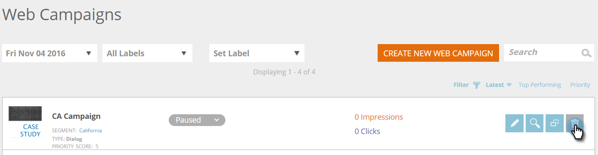

# Creare una nuova campagna Web finestra di dialogo {#create-a-new-dialog-web-campaign}

## Creazione di una campagna Web finestra di dialogo {#create-a-dialog-web-campaign}

Create una campagna Web per personalizzare il contenuto Web in tempo reale e fornire il messaggio giusto all&#39;utente giusto al momento giusto.

Una campagna Web è una reazione personalizzata associata a un segmento specifico. La reazione può essere una finestra di dialogo sul sito Web, un [nella zona sostitutiva](/help/marketo/product-docs/web-personalization/working-with-web-campaigns/create-a-new-in-zone-web-campaign.md), una [funzione widget](/help/marketo/product-docs/web-personalization/working-with-web-campaigns/create-a-new-widget-web-campaign.md) o un avviso e-mail.

1. Vai a **Campagne Web**.

   

1. Selezionare **Crea nuova campagna Web**.

   

1. Selezionare il tipo di campagna Web **Dialog**. Progettate e aggiungete contenuti creativi nell&#39;editor. Fate clic su **Anteprima** per vedere come reagirà la campagna Web sul sito.

   

<table> 
 <thead> 
  <tr> 
   <th colspan="1" rowspan="1">Nome</th> 
   <th colspan="1" rowspan="1">Descrizione</th> 
  </tr> 
 </thead> 
 <tbody> 
  <tr> 
   <td colspan="1"><strong>Visualizza su</strong></td> 
   <td colspan="1">Consente di <a href="/help/marketo/product-docs/web-personalization/working-with-web-campaigns/set-how-your-web-campaign-displays.md" rel="nofollow">personalizzare quando e come viene visualizzata la campagna Web.</a></td> 
  </tr> 
  <tr> 
   <td colspan="1" rowspan="1"><strong>Stile finestra di dialogo</strong></td> 
   <td colspan="1" rowspan="1"> 
    <ul> 
     <li>Taglio moderno - Un dialogo elegante e distinto con rifinitura in nero semi-trasparente e angoli arrotondati</li> 
     <li>Taglio moderno II - Un dialogo elegante e distinto con un taglio dell'ombra leggera e angoli arrotondati e pulsante di chiusura</li> 
     <li>Trasparente - Una finestra di dialogo completamente trasparente, ideale per le immagini trasparenti (png) per la chiamata alle azioni. </li> 
     <li>Base - Una finestra di dialogo di stile semplice, con uno spazio di intestazione del titolo più spesso che soddisfa le esigenze della finestra di dialogo di base.</li> 
    </ul></td> 
  </tr> 
  <tr> 
   <td colspan="1"><strong>Animate In/Out</strong></td> 
   <td colspan="1">Impostare la voce e/o l’uscita della finestra di dialogo. Selezionate l’effetto (caduta, cieca, diapositiva, dissolvenza, nessun effetto), la durata (in secondi) e la direzione (su, giù, sinistra, destra).</td> 
  </tr> 
  <tr> 
   <td colspan="1" rowspan="1">
<strong>Posizione</strong>
</td> 
   <td colspan="1" rowspan="1">Selezionare una delle 9 opzioni per la posizione della finestra di dialogo sulla pagina. Ad esempio, selezionando la casella centrale viene visualizzata la finestra di dialogo al centro dello schermo.</td> 
  </tr> 
  <tr> 
   <td colspan="1" rowspan="1">
<strong>Per coordinate</strong>

 
</td> 
   <td colspan="1" rowspan="1">Per ulteriori opzioni di posizionamento nella finestra di dialogo, selezionate la casella di controllo "Coordinate posizione" e immettete le coordinate esatte dello schermo (Orizzontale, Verticale) in cui desiderate visualizzare la finestra di dialogo.</td> 
  </tr> 
  <tr> 
   <td colspan="1"><strong>Riempimento pulsante</strong></td> 
   <td colspan="1">Personalizzare il pulsante di chiusura modale utilizzando colore, stile e posizione. Potete anche usare il vostro pulsante collegandolo alla casella URL immagine.</td> 
  </tr> 
  <tr> 
   <td colspan="1"><strong>Sticky</strong></td> 
   <td colspan="1">Selezionando la casella di controllo fissa, la finestra di dialogo rimane in posizione, senza limiti di tempo, fino alla chiusura da parte dell'utente e viene visualizzata su tutte le pagine durante l'intera sessione del visitatore.</td> 
  </tr> 
  <tr> 
   <td colspan="1"><strong>Modal</strong></td> 
   <td colspan="1">Consente di rendere più visibile la finestra di dialogo e di avviarla con uno sfondo più scuro dietro la finestra di dialogo, migliorando la conoscenza da parte dell’utente della finestra di dialogo.</td> 
  </tr> 
  <tr> 
   <td colspan="1"><strong>Colore modale</strong></td> 
   <td colspan="1">Potete personalizzare il colore e l’opacità del modale.</td> 
  </tr> 
  <tr> 
   <td colspan="1"><strong>Timeout </strong></td> 
   <td colspan="1">Il numero di secondi di attivazione della finestra di dialogo prima della dissolvenza.</td> 
  </tr> 
  <tr> 
   <td colspan="1"><strong>Colore intestazione</strong></td> 
   <td colspan="1">Impostate la barra dell’intestazione della finestra di dialogo sul colore desiderato. Il colore può essere scelto da una tavola colori o immesso come codice di colore esadecimale. </td> 
  </tr> 
  <tr> 
   <td colspan="1"><strong>Colore di sfondo del contenuto </strong></td> 
   <td colspan="1">Impostate il colore di sfondo della finestra di dialogo sul colore desiderato. Il colore può essere scelto da una tavola colori o immesso come codice di colore esadecimale. </td> 
  </tr> 
  <tr> 
   <td colspan="1"><strong>Titolo finestra di dialogo</strong></td> 
   <td colspan="1">Aggiungete un titolo alla barra del titolo dell’intestazione della finestra di dialogo.</td> 
  </tr> 
  <tr> 
   <td colspan="1"><strong>Larghezza e altezza</strong></td> 
   <td colspan="1">Selezionare il ridimensionamento in pixel della finestra di dialogo.</td> 
  </tr> 
  <tr> 
   <td colspan="1"><strong>Larghezza automatica</strong></td> 
   <td colspan="1">Selezionando questa casella di controllo, la finestra di dialogo si adatta automaticamente alla larghezza del contenuto.</td> 
  </tr> 
  <tr> 
   <td colspan="1"><strong>Ridimensionabile </strong></td> 
   <td colspan="1">Selezionando la casella di controllo ridimensionabile, l'utente può ridimensionare la finestra di dialogo.</td> 
  </tr> 
  <tr> 
   <td colspan="1"><strong>Editor Rich Text</strong></td> 
   <td colspan="1">
L’editor Rich Text consente la formattazione del testo, il collegamento e l’inserimento di immagini. <a href="/help/marketo/product-docs/web-personalization/working-with-web-campaigns/using-the-web-personalization-rich-text-editor.md">Leggi tutto qui</a>.
</td> 
  </tr> 
  <tr> 
   <td colspan="1"><strong>Anteprima sul sito</strong></td> 
   <td colspan="1">Visualizzare l'anteprima delle campagne prima del loro avvio.  
    <ul> 
     <li>URL - Immettete un URL di esempio in cui verrebbe eseguita la campagna per visualizzare un esempio di anteprima dell'aspetto della campagna in diretta.</li> 
     <li>Dispositivo - Anteprima dell'aspetto della campagna in base al dispositivo: Desktop, Verticale Mobile, Orizzontale Mobile, Verticale Tablet, Orizzontale Verticale. </li> 
     <li>Anteprima - Fare clic su <strong>Anteprima </strong>per aprire una nuova finestra dell'URL di esempio per vedere come reagisce la campagna. </li> 
     <li>Condivisione - Utilizzate il pulsante Condividi per inviare un'e-mail a un collega con un collegamento per visualizzare la campagna proxy.</li> 
    </ul></td> 
  </tr> 
 </tbody> 
</table>

>[!TIP]
>
>Velocizzate e semplificate il processo di creazione delle campagne utilizzando i nostri [modelli integrati](/help/marketo/product-docs/web-personalization/using-templates/using-templates-to-create-web-campaigns.md) o [salvando la campagna esistente](/help/marketo/product-docs/web-personalization/using-templates/using-templates-to-create-web-campaigns.md) come modello da riutilizzare.

## Modifica di una campagna Web {#edit-a-web-campaign}

1. Dalla pagina **Campagne Web**, fare clic su **Modifica** nella campagna Web.

>[!NOTE]
>
>Per trovare più facilmente la campagna Web desiderata, utilizzate la [funzionalità filtro](/help/marketo/product-docs/web-personalization/working-with-web-campaigns/filter-web-campaigns.md).

## Anteprima di una campagna Web {#preview-a-web-campaign}

1. Dalla pagina **Campagne Web**, fare clic su **Anteprima** nella campagna Web che si desidera visualizzare.

## Clona una campagna Web {#clone-a-web-campaign}

Vedere [Clonare una campagna Web](/help/marketo/product-docs/web-personalization/working-with-web-campaigns/clone-a-web-campaign.md).

## Eliminare una campagna Web {#delete-a-web-campaign}

1. Dalla pagina **Campagne Web**, fare clic su **Elimina** nella campagna Web da eliminare.

   

1. Viene visualizzato un messaggio di conferma per confermare se si desidera eliminare la campagna Web.

>[!MORELIKETHIS]
>
>* [Creazione di una campagna RTP nella zona](/help/marketo/product-docs/web-personalization/working-with-web-campaigns/create-a-new-in-zone-web-campaign.md)
>* [Creare una campagna Widget RTP](/help/marketo/product-docs/web-personalization/working-with-web-campaigns/create-a-new-widget-web-campaign.md)

