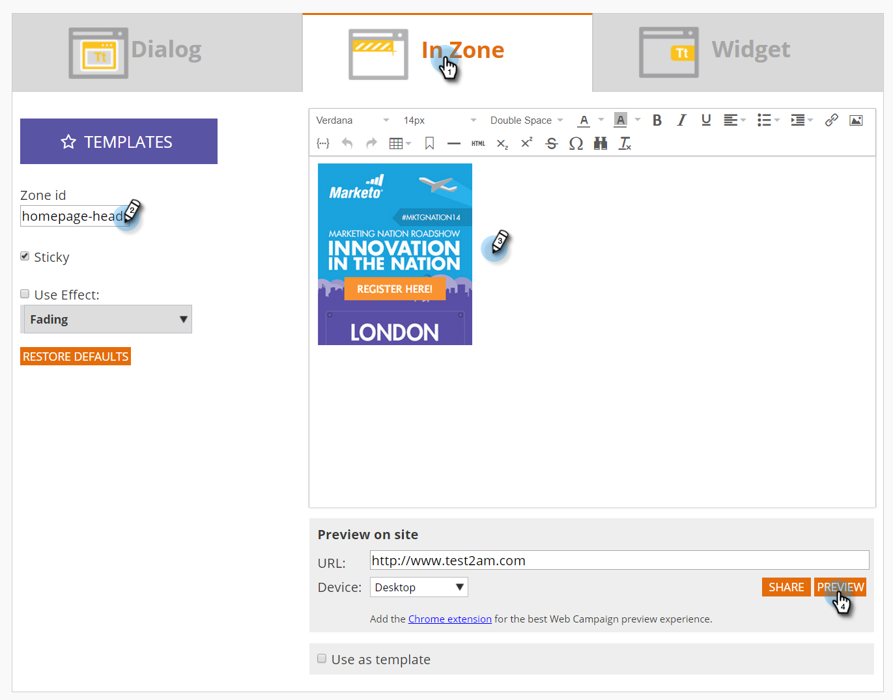
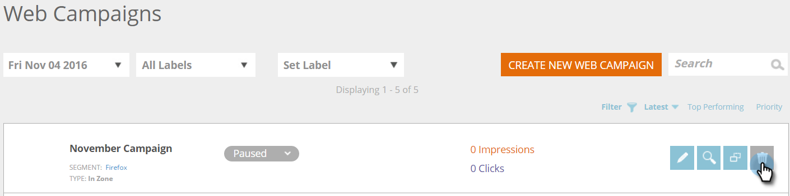

# Creare una nuova campagna Web nella zona {#create-a-new-in-zone-web-campaign}

Una campagna web è una reazione personalizzata associata a un segmento specifico e può essere una [finestra di dialogo](/help/marketo/product-docs/web-personalization/working-with-web-campaigns/create-a-new-dialog-web-campaign.md) sul tuo sito web, una sostituzione in zona, un [funzione widget](/help/marketo/product-docs/web-personalization/working-with-web-campaigns/create-a-new-widget-web-campaign.md) o un avviso e-mail. Una campagna web In Zone sostituisce un elemento del sito web basato sull’ID area con contenuti o banner grafici.

## Creare una campagna Web in area {#create-an-in-zone-web-campaign}

1. Vai a **Campagne web**.

   

1. Seleziona **Crea nuova campagna web.**

   

1. Seleziona la **Nella zona** tipo di campagna. Personalizza e aggiungi un **ID della zona.** Imposta la campagna su **Fisso** e aggiungi il tuo creativo nell&#39;editor. Aggiungi l’URL della pagina da visualizzare in anteprima e fai clic su **Anteprima** per vedere come reagirà la campagna sul sito.

   

   >[!NOTE]
   >
   >**Che cos’è un ID zona?**
   >
   >L’ID di zona è il punto in cui desideri che la campagna web &quot;In Zone&quot; sia disponibile sul sito. Per trovare un &quot;Zone ID&quot;, visita il tuo sito web e seleziona l’area da sostituire con una campagna web, quindi fai clic con il pulsante destro del mouse su di esso. In Chrome, l&#39;opzione è &quot;Inspect Element&quot;, negli altri browser può variare.
   >
   >Quindi, vuoi trovare l&#39;&quot;id&quot; associato a questa sezione del sito web, che viene evidenziato perché stai ispezionando quell&#39;elemento. Ad esempio, se fai clic con il pulsante destro del mouse in Chrome, il testo evidenziato riporta `
` allora &quot;featured-slider&quot; è ciò che dovresti digitare nella sezione &quot;zone id&quot;. In genere viene utilizzato &quot;div id&quot;, ma può essere utilizzato anche qualsiasi ID, come h1 id, p id, ecc.

<table> 
 <thead> 
  <tr> 
   <th colspan="1" rowspan="1">Nome</th> 
   <th colspan="1" rowspan="1">Descrizione</th> 
  </tr> 
 </thead> 
 <tbody> 
  <tr> 
   <td colspan="1" rowspan="1"><strong> ID zona </strong></td> 
   <td colspan="1" rowspan="1">
Immetti il nome dell’id trovato nel codice HTML dell’elemento del sito web che la campagna sostituisce.
</td> 
  </tr> 
  <tr> 
   <td colspan="1" rowspan="1">
<strong> Fisso </strong>
</td> 
   <td colspan="1" rowspan="1">Per impostazione predefinita, la casella di controllo Sticky è selezionata per la campagna In Zone e mantiene la campagna In Zone nella sua posizione Zone ID per tutta la sessione del visitatore sul sito web. Si consiglia di impostare sempre un campo In Zone su Adesivo.</td> 
  </tr> 
  <tr> 
   <td colspan="1" rowspan="1">
<strong> Dissolvenza</strong> 
</td> 
   <td colspan="1" rowspan="1">Selezionando la casella di controllo Usa effetto e Dissolvenza si crea un effetto di dissolvenza nell'area ID area del sito web. Se la sezione In è un banner grafico, la pagina viene prima caricata e la campagna viene attivata con un effetto di dissolvenza.</td> 
  </tr> 
  <tr> 
   <td colspan="1"><strong>Scorrevole</strong></td> 
   <td colspan="1">Selezionando la casella di controllo Usa effetto e l'opzione Scorrimento (Sliding) , si ottiene un effetto scorrevole sull'area ID area del sito web. Se l’area in è un banner grafico, la pagina viene prima caricata e quindi la campagna si attiva con un effetto scorrevole da sinistra a destra.</td> 
  </tr> 
  <tr> 
   <td colspan="1"><strong> Editor Rich Text  </strong></td> 
   <td colspan="1">L'editor Rich Text consente la formattazione del testo, il collegamento e l'inserimento di immagini. <a href="/help/marketo/product-docs/web-personalization/working-with-web-campaigns/using-the-web-personalization-rich-text-editor.md">Ulteriori informazioni qui</a> .</td> 
  </tr> 
  <tr> 
   <td colspan="1"><strong> Anteprima sul sito   </strong></td> 
   <td colspan="1">Visualizza l’anteprima delle campagne prima del loro avvio.   
    <ul> 
     <li> URL: immetti un URL di esempio in cui la campagna verrebbe eseguita per visualizzare un esempio di anteprima di come la campagna apparirebbe live.</li> 
     <li>Dispositivo - Anteprima dell’aspetto della campagna in base al dispositivo: Desktop, Verticale Mobile, Orizzontale Mobile, Verticale Tablet, Orizzontale Verticale.</li> 
     <li> Anteprima - Fai clic su <strong>Anteprima</strong> per aprire una nuova finestra dell’URL dell’esempio per vedere come reagisce la campagna.</li> 
     <li> Condividi : utilizza il pulsante Condividi per inviare un’e-mail a un collega con un collegamento per visualizzare la campagna proxy.</li> 
    </ul></td> 
  </tr> 
 </tbody> 
</table>

>[!TIP]
>
>Accelerare e semplificare il processo di creazione delle campagne utilizzando [modelli incorporati](/help/marketo/product-docs/web-personalization/using-templates/using-templates-to-create-web-campaigns.md) o [salvataggio della campagna esistente](/help/marketo/product-docs/web-personalization/using-templates/using-templates-to-create-web-campaigns.md) come modello da riutilizzare.

>[!NOTE]
>
>**Vuoi testare A/B le tue campagne web?** Una o più campagne web possono essere [Test A/B per risultati ottimali](/help/marketo/product-docs/web-personalization/working-with-web-campaigns/ab-test-your-web-campaign.md). Con la funzione di ottimizzazione automatica, la piattaforma riconosce automaticamente le campagne con prestazioni migliori, continua con le campagne di conversione più elevate e mette in pausa le altre.

## Modificare una campagna web {#edit-a-web-campaign}

Da **Campagne web** pagina, fai clic su **Modifica** nella campagna.

>[!NOTE]
>
>Per trovare più facilmente la campagna desiderata, utilizza la variabile [funzione filtro](/help/marketo/product-docs/web-personalization/working-with-web-campaigns/filter-web-campaigns.md).

## Anteprima di una campagna web {#preview-a-web-campaign}

1. Dalla pagina Campagne web, fai clic su **Anteprima** nella campagna web che desideri visualizzare.

   

## Clonare una campagna web {#clone-a-web-campaign}

Vedi [Clonare una campagna web](/help/marketo/product-docs/web-personalization/working-with-web-campaigns/clone-a-web-campaign.md).

## Eliminare una campagna web {#delete-a-web-campaign}

1. Dalla pagina Campagne web, fai clic su **Elimina** nella campagna da eliminare.

   

1. Viene visualizzato un messaggio di conferma per confermare l’eliminazione della campagna.

>[!MORELIKETHIS]
>
>* [Creare una nuova campagna web per i Widget](/help/marketo/product-docs/web-personalization/working-with-web-campaigns/create-a-new-widget-web-campaign.md)
>* [Creare una nuova finestra di dialogo Campagna web](/help/marketo/product-docs/web-personalization/working-with-web-campaigns/create-a-new-dialog-web-campaign.md)

