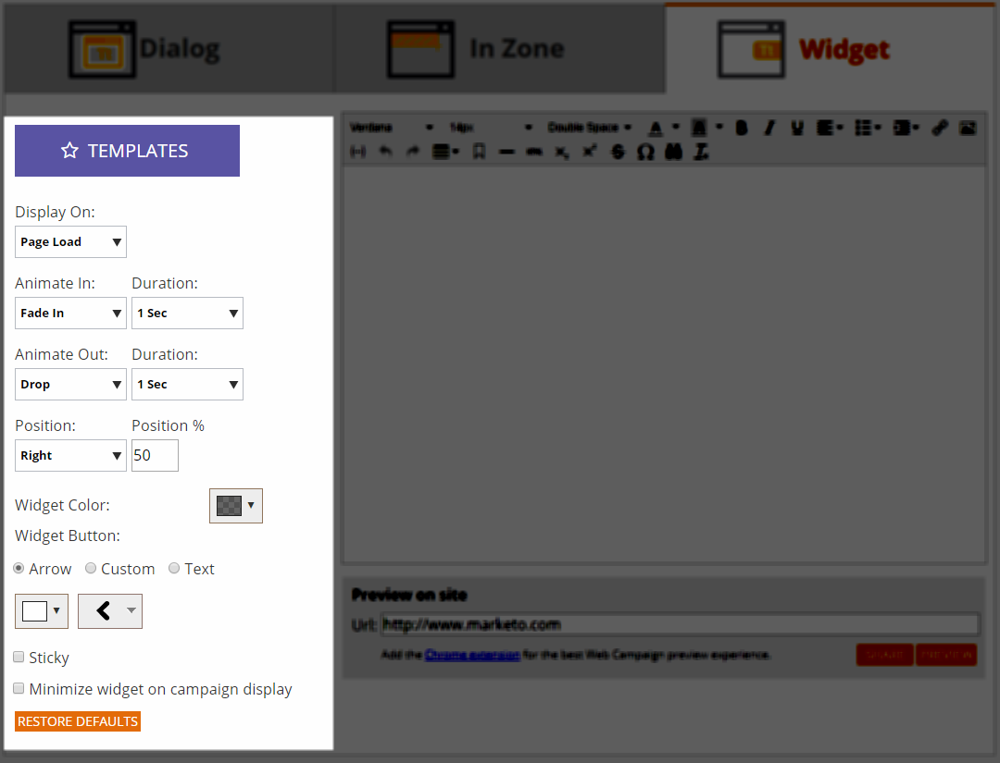

# Crea una nuova campagna web widget {#create-a-new-widget-web-campaign}

Una campagna web è una reazione personalizzata associata a un segmento specifico e può essere una [finestra di dialogo](/help/marketo/product-docs/web-personalization/working-with-web-campaigns/create-a-new-dialog-web-campaign.md) sul sito web, un [nella zona di sostituzione](/help/marketo/product-docs/web-personalization/working-with-web-campaigns/create-a-new-in-zone-web-campaign.md), un widget o un avviso e-mail. La campagna web Widget è un testo o un banner che viene visualizzato sul lato verticale della pagina web, con la possibilità di espandersi e contrarsi, pur rimanendo fisso sulla pagina web durante la visita.

## Creare una campagna web widget {#create-a-widget-web-campaign}

1. Vai a **Campagne web**.

   

1. Seleziona **Crea nuova campagna web**.

   

1. Seleziona la **Widget** tipo di campagna.

   

1. Utilizza le opzioni multiple per personalizzare il widget.

   

1. Clic **Anteprima** per vedere come reagirà la campagna web sul tuo sito.

   

<table> 
 <thead> 
  <tr> 
   <th colspan="1" rowspan="1">Nome</th> 
   <th colspan="1" rowspan="1">Descrizione</th> 
  </tr> 
 </thead> 
 <tbody> 
  <tr> 
   <td colspan="1"><strong>Modelli</strong></td> 
   <td colspan="1">Scegli uno dei diversi modelli predefiniti.</td> 
  </tr> 
  <tr> 
   <td colspan="1"><strong>Visualizza su</strong></td> 
   <td colspan="1">Ti consente di: <a href="/help/marketo/product-docs/web-personalization/working-with-web-campaigns/set-how-your-web-campaign-displays.md" rel="nofollow">personalizzare quando e come</a> viene visualizzata la campagna web.</td> 
  </tr> 
  <tr> 
   <td colspan="1"><strong>Animazione in/out</strong></td> 
   <td colspan="1">Impostato all’ingresso e/o all’uscita della finestra di dialogo. Selezionare effetto (rilascio, cieco, scorrimento, dissolvenza, nessun effetto), durata (in secondi) e direzione (su, giù, sinistra, destra).</td> 
  </tr> 
  <tr> 
   <td colspan="1"><strong>Posizione</strong></td> 
   <td colspan="1">Selezionate una delle quattro opzioni per la posizione del widget sulla pagina: Destra, Sinistra, Superiore, Inferiore. % posizione è la percentuale del posizionamento in base al punto in cui il widget verrà visualizzato nella pagina del browser (ad esempio, "Inferiore al 50%" causerà la visualizzazione del widget a metà della parte inferiore della pagina, "Sinistra al 10%" causerà la visualizzazione del widget vicino alla parte superiore sinistra della pagina, ecc.). </td> 
  </tr> 
  <tr> 
   <td colspan="1" rowspan="1"><strong>Colore widget</strong></td> 
   <td colspan="1" rowspan="1">
Selezionate il colore del widget da un grafico a colori o immettetelo come codice colore RGB. Potete anche selezionare il livello di trasparenza dello sfondo del widget spostando la barra nella parte inferiore in entrambe le direzioni.
</td> 
  </tr> 
  <tr> 
   <td colspan="1" rowspan="1">
<strong>Pulsante widget</strong> 
</td> 
   <td colspan="1" rowspan="1">Personalizzare il pulsante del widget stesso. Freccia: consente di scegliere tra più icone diverse nel menu a discesa a destra. Il colore viene determinato dal menu a discesa a sinistra. Personalizzato: inserisci l’URL di qualsiasi immagine in hosting. Tipi di file accettati: .JPEG, .GIF (incluso animato), .PNG, .APNG, .SVG, .BMP. Testo: il widget può essere testo e personalizzarne colore, dimensione e font.</td> 
  </tr> 
  <tr> 
   <td colspan="1"><strong>Sticky</strong></td> 
   <td colspan="1">Selezionando questa opzione il widget viene visualizzato su tutte le pagine web durante tutta la sessione del visitatore.</td> 
  </tr> 
  <tr> 
   <td colspan="1"><strong>Riduci a icona widget sulla visualizzazione della campagna</strong></td> 
   <td colspan="1">Inserisce un widget ma lo mantiene ridotto a icona, richiedendo all'utente di fare clic su di esso per ingrandirlo.</td> 
  </tr> 
  <tr> 
   <td colspan="1"><strong>Ripristina predefinito </strong></td> 
   <td colspan="1">Ripristina l'impostazione predefinita originale per il widget, impostando il colore del widget sull'opzione predefinita grigio trasparente.</td> 
  </tr> 
  <tr> 
   <td colspan="1"><strong>Anteprima sul sito </strong></td> 
   <td colspan="1">Visualizza l’anteprima delle campagne prima che vengano avviate.  
    <ul> 
     <li>URL: immetti un URL di esempio in cui eseguire la campagna per visualizzare un esempio di anteprima dell’aspetto della campagna dal vivo.</li> 
     <li>Anteprima - Clic <strong>Anteprima </strong>per aprire una nuova finestra dell'URL di esempio per vedere come reagisce la campagna (Aggiungi il <a href="https://chrome.google.com/extensions/detail/ldiddonjplchallbngbccbfdfeldohkj?hl=en" rel="nofollow">Estensione Chrome</a> per una migliore esperienza di anteprima di Campaign Web.) </li> 
     <li>Condividi: utilizza il pulsante Condividi per inviare un’e-mail a un collega con un collegamento per visualizzare la campagna proxy.</li> 
    </ul></td> 
  </tr> 
 </tbody> 
</table>

>[!NOTE]
>
>**Vuoi testare A/B le tue campagne web?** Una o più campagne web possono essere [Test A/B per risultati ottimali](/help/marketo/product-docs/web-personalization/working-with-web-campaigns/ab-test-your-web-campaign.md). Con la funzione di ottimizzazione automatica, la piattaforma riconosce automaticamente le campagne con prestazioni migliori, continua con le campagne di conversione più elevate e mette in pausa le altre.

## Modificare una campagna web {#edit-a-web-campaign}

Dalla pagina Campagne web, fai clic su **Modifica** nella campagna.

>[!NOTE]
>
>Per trovare più facilmente la campagna desiderata, utilizza [funzione filtro](/help/marketo/product-docs/web-personalization/working-with-web-campaigns/filter-web-campaigns.md).

## Clonare una campagna web {#clone-a-web-campaign}

Consulta [Clonare una campagna web](/help/marketo/product-docs/web-personalization/working-with-web-campaigns/clone-a-web-campaign.md).

## Visualizzare l’anteprima di una campagna web {#preview-a-web-campaign}

Dalla pagina Campagne web, fai clic su **Anteprima** nella campagna web che desideri visualizzare in anteprima

## Eliminare una campagna web {#delete-a-web-campaign}

1. Dalla pagina Campagne web, fai clic su **Elimina** nella campagna web che desideri eliminare.

   

1. Viene visualizzato un messaggio di conferma per confermare se desideri eliminare la campagna web.

>[!MORELIKETHIS]
>
>* [Crea una nuova campagna web nell’area](/help/marketo/product-docs/web-personalization/working-with-web-campaigns/create-a-new-in-zone-web-campaign.md)
>* [Creare una nuova campagna web per finestre di dialogo](/help/marketo/product-docs/web-personalization/working-with-web-campaigns/create-a-new-dialog-web-campaign.md)
