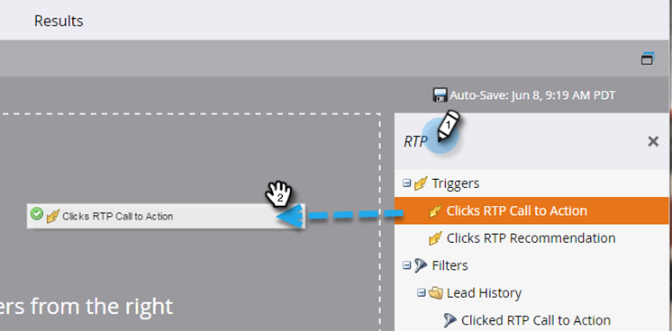

# Definire un elenco avanzato per le attività di personalizzazione web {#define-a-smart-list-for-web-personalization-activities}

Puoi utilizzare le attività di personalizzazione web nei filtri e nei trigger quando definisci un elenco avanzato in una campagna avanzata. In questo caso, vuoi acquisire chiunque abbia fatto clic su un invito all’azione di personalizzazione web (campagna).

Utilizza un trigger per inviare un’e-mail o un avviso, oppure per modificare un valore o un punteggio in base ai visitatori che hanno fatto clic e sono coinvolti in un invito all’azione di Personalizzazione web. Puoi anche filtrare e visualizzare i lead che hanno fatto clic su un invito all’azione di Personalizzazione web.

1. Nella tua campagna avanzata, fai clic su **Elenco avanzato** scheda.

   

   >[!NOTE]
   >
   >Gli elenchi avanzati possono fare cose straordinarie. Per ulteriori informazioni, consulta [Approfondimento elenco avanzato](/help/marketo/product-docs/core-marketo-concepts/smart-campaigns/understanding-smart-campaigns.md).

1. Cerca il trigger, quindi trascina e rilascia il trigger sull’area di lavoro.

   

   >[!NOTE]
   >
   >Una campagna avanzata con trigger viene eseguita in modalità Trigger. Viene eseguito su una persona alla volta in base agli eventi attivati e ai filtri aggiunti.

1. Fai clic sull’elenco a discesa e scegli un operatore.

   

   >[!CAUTION]
   >
   >Le linee rosse ondulate indicano un errore. Se non viene corretta, la campagna non sarà valida e non verrà eseguita.

1. Definisci il trigger.

   

1. Aggiungi i filtri necessari.

   

   >[!TIP]
   >
   >In una campagna intelligente con trigger e filtri, i trigger si trovano in alto. Quando viene attivato, solo le persone che soddisfano i criteri di filtro passeranno attraverso il flusso.

   >[!NOTE]
   >
   >Con più trigger, una persona passa al flusso se viene attivato UNO QUALSIASI dei trigger.

   Per eseguire la campagna su un set di persone contemporaneamente, scopri come [Definire un elenco avanzato per Smart Campaign | Lotto](/help/marketo/product-docs/core-marketo-concepts/smart-campaigns/creating-a-smart-campaign/define-smart-list-for-smart-campaign-batch.md).

   >[!MORELIKETHIS]
   >
   >* [Definire un elenco avanzato per Smart Campaign | Lotto](/help/marketo/product-docs/core-marketo-concepts/smart-campaigns/creating-a-smart-campaign/define-smart-list-for-smart-campaign-batch.md)
   >* [Aggiungere un passaggio di flusso a una campagna avanzata](/help/marketo/product-docs/core-marketo-concepts/smart-campaigns/flow-actions/add-a-flow-step-to-a-smart-campaign.md)
   >* [Definire un elenco avanzato per le attività di contenuti predittivi](/help/marketo/product-docs/predictive-content/define-a-smart-list-for-predictive-content-activities.md)
