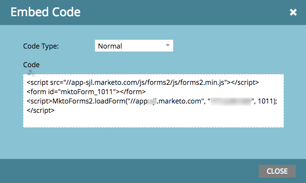
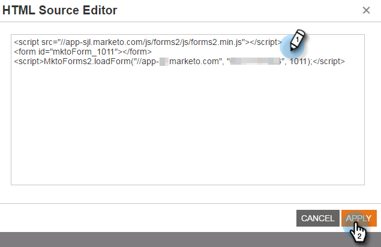
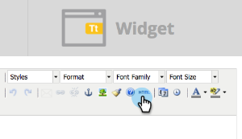

# Incorporare un modulo in una campagna Web {#embed-a-form-into-a-web-campaign}

Scopri come incorporare un modulo Marketo in una campagna Web (Dialog, In Zone o Widget).

1. Fare clic con il pulsante destro del mouse su un modulo approvato. Selezionare **Incorpora codice**.

   ** 

   **

1. Copia il Codice.

   

1. In Personalizzazione Web, andate a **Campagne Web**.

   

1. Fare clic su **Crea nuova campagna**.

   ** 

   **

1. Nell’editor Rich Text, fate clic sull’icona HTML.

   

1. Incollare il codice da incorporare del modulo nell&#39;Editor origine HTML. Fare clic su **Aggiorna**.

   

1. Il modulo non verrà visualizzato nella vista dell&#39;editor, ma sarà possibile visualizzarlo in anteprima per vedere come verrà visualizzato in una campagna.
1. Fare clic su **Avvia** per avviare la campagna.

   >[!NOTE]
   >
   >Eventuali modifiche ai campi del modulo devono essere apportate all&#39;interno delle attività di marketing di Marketo in Modifica bozza del modulo.

## Tre modi per aggiungere un&#39;immagine di sfondo a un modulo {#three-ways-to-add-a-background-image-to-a-form}

Per aggiungere un&#39;immagine di sfondo al modulo è possibile:

* Modificare il CSS di un tema modulo
* Modifica dei colori della finestra di dialogo o del widget in Imposta campagna
* Aggiunta di codice CSS allo script

Per modificare il CSS di un tema modulo, consultare [questo articolo](../../../product-docs/demand-generation/forms/form-design/edit-the-css-of-a-form-theme.md).

Per modificare i colori della finestra di dialogo o del widget in Imposta campagna:

1. Nell&#39;Editor Rich Text, selezionare un tipo di campagna Finestra di dialogo e uno stile di dialogo, colore dell&#39;intestazione e colore dello sfondo per personalizzare i colori di sfondo del modulo. Fare clic su **Salva**.

   

1. Di seguito è riportato un esempio dell’aspetto di uno stile di finestra di dialogo Rifila moderno con un’intestazione e un colore di sfondo viola chiari.

   

Per aggiungere il codice CSS allo script:

1. Nell’editor Rich Text, fate clic sull’icona HTML.

   

1. Incollare il codice da incorporare del modulo con il codice dello stile di sfondo nell&#39;Editor origine HTML. Fare clic su **Aggiorna**.

   

1. Fare clic su **Anteprima** per vedere come verrà eseguito il rendering in una campagna (il modulo non verrà visualizzato nella visualizzazione editor). Di seguito è riportato un esempio del modo in cui il codice del modulo riportato sopra viene rappresentato in una campagna con un&#39;immagine di sfondo.

   

>[!MORELIKETHIS]
>
>* [Modificare il CSS di un tema modulo](https://docs.marketo.com/display/public/DOCS/Edit+the+CSS+of+a+Form+Theme)
>* [Mostra messaggio di ringraziamento senza una pagina di destinazione di follow-up](https://developers.marketo.com/blog/show-thank-you-message-without-a-follow-up-landing-page/)
>* [Forms 2.0](https://developers.marketo.com/documentation/websites/forms-2-0/)

>

